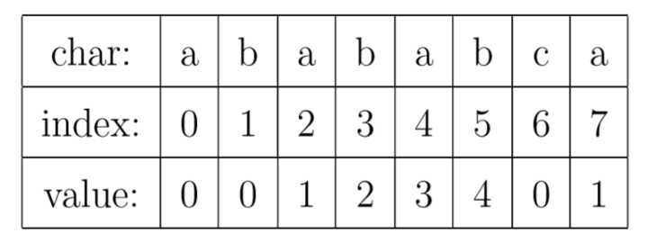

---
​---
title: 'KMP匹配算法(非原创)'
date: 2019-7-5 19:37:10
tags: 
- 算法
categories: 
- 算法笔记
​---
---


捣鼓了一天多时间的字符串匹配算法，从啥都不懂，到有点理解了。

[博客]: https://blog.csdn.net/v_july_v/article/details/7041827	"感谢这个博客内容，还有博客下面一些网友的互动，都让我对KMP匹配算法有了更深的理解。"

> 现在理解也是勉勉强强，理解可能还不够透彻。网上是有不少资料可以直接获取，但是网上的资料分布比较混乱，东一块，西一块，很零散。我还是觉得自己整理一份。

首先感谢下 `从头到尾彻底理解KMP` 与 知乎 `海纳`的回答。我所整理的资料主要也是来源于他两的博客与回答 ，加上一些我自己的理解。

## 1. 暴力匹配算法【最无脑】

假设现在我们面临这样一个问题：有一个文本串S，和一个模式串P，现在要查找P在S中的位置，怎么查找呢？
如果用暴力匹配的思路，并假设现在文本串S匹配到 i 位置，模式串P匹配到 j 位置，则有：
如果当前字符匹配成功（即S[i] == P[j]），则 i++，j++，继续匹配下一个字符；
如果失配（即S[i]! = P[j]），令i = i - (j - 1)，j = 0。相当于每次匹配失败时，i 回溯，j 被置为0。

### 双指针模式

通常包含有一个匹配失败时候的指针回溯问题；

```C++
int ViolentMatch(char* s, char* p)
{
	int sLen = strlen(s);
	int pLen = strlen(p);
 
	int i = 0;
	int j = 0;
	while (i < sLen && j < pLen)
	{
		if (s[i] == p[j])
		{
			//①如果当前字符匹配成功（即S[i] == P[j]），则i++，j++    
			i++;
			j++;
		}
		else
		{
			//②如果失配（即S[i]! = P[j]），令i = i - (j - 1)，j = 0    
			i = i - j + 1;
			j = 0;
		}
	}
	//匹配成功，返回模式串p在文本串s中的位置，否则返回-1
	if (j == pLen)
		return i - j;
	else
		return -1;
}
```


## 2.暴力匹配过程存在的问题

暴力匹配过程：

  举个例子，如果给定文本串S“BBC ABCDAB ABCDABCDABDE”，和模式串P“ABCDABD”，现在要拿模式串P去跟文本串S匹配，整个过程如下所示：


   *6*. 由上图，我们可以看到，如果按照暴力匹配算法的思路，尽管之前 S串 和 P串 已经分别匹配到了S[9]、P[5]，但因为S[10]跟P[6]不匹配，所以文本串回溯到S[5]，模式串回溯到P[0]，从而让S[5]跟P[0]匹配。


但是根据我们之前获取的字符串信息，而S[5]与P[0]是肯定失配的。为什么呢？因为在之前第4步匹配中，我们已经得知S[5] = P[1] = B，而P[0] = A，即P[1] != P[0]，故S[5]必定不等于P[0]，所以回溯过去必然会导致失配。那有没有一种算法，让i 不往回退，只需要移动j 即可呢？

> 答案是肯定的。这种算法就是本文的主旨KMP算法，它利用之前已经部分匹配这个有效信息，保持i 不回溯，通过修改j 的位置，让模式串尽量地移动到有效的位置。

------


## 3.KMP算法的核心【PMT】（同3）

KMP算法的核心，是一个被称为部分匹配表(Partial Match Table)的数组。我觉得理解KMP的最大障碍就是很多人在看了很多关于KMP的文章之后，仍然搞不懂PMT中的值代表了什么意思。这里我们抛开所有的枝枝蔓蔓，先来解释一下这个数据到底是什么。

对于字符串“abababca”，它的PMT如下表所示：



就像例子中所示的，如果待匹配的模式字符串有8个字符，那么PMT就会有8个值。

我先解释一下字符串的前缀和后缀。如果字符串A和B，存在A=BS，其中S是任意的非空字符串，那就称B为A的前缀。例如，”Harry”的前缀包括{”H”, ”Ha”, ”Har”, ”Harr”}，我们把所有前缀组成的集合，称为字符串的前缀集合。同样可以定义后缀A=SB， 其中S是任意的非空字符串，那就称B为A的后缀，例如，”Potter”的后缀包括{”otter”, ”tter”, ”ter”, ”er”, ”r”}，然后把所有后缀组成的集合，称为字符串的后缀集合。要注意的是，字符串本身并不是自己的后缀。

有了这个定义，就可以说明PMT中的值的意义了。**PMT中的值是字符串的前缀集合与后缀集合的交集中最长元素的长度**。例如，对于”aba”，它的前缀集合为{”a”, ”ab”}，后缀 集合为{”ba”, ”a”}。两个集合的交集为{”a”}，那么长度最长的元素就是字符串”a”了，长 度为1，所以对于”aba”而言，它在PMT表中对应的值就是1。再比如，对于字符串”ababa”，它的前缀集合为{”a”, ”ab”, ”aba”, ”abab”}，它的后缀集合为{”baba”, ”aba”, ”ba”, ”a”}， 两个集合的交集为{”a”, ”aba”}，其中最长的元素为”aba”，长度为3。

## 4.前后缀最大公共元素长度与next数组。

 由上文，我们已经知道，字符串“ABCDABD”各个前缀后缀的最大公共元素长度分别为：


  而且，根据这个表可以得出下述结论

- 失配时，模式串向右移动的位数为：已匹配==字符数== - 失配字符的上一位字符所对应的最大长度值

  上文利用这个表和结论进行匹配时，我们发现，当匹配到一个字符失配时，其实没必要考虑当前失配的字符，更何况我们每次失配时，都是看的失配字符的上一位字符对应的最大长度值。如此，便引出了next 数组。

​    给定字符串“ABCDABD”，可求得它的next 数组如下：


 	把next 数组跟之前求得的最大长度表对比后，不难发现，==next 数组相当于“最大长度值” 整体向右移动一位，然后初始值赋为-1==。意识到了这一点，你会惊呼原来next 数组的求解竟然如此简单：就是找最大对称长度的前缀后缀，然后整体右移一位，初值赋为-1（当然，你也可以直接计算某个字符对应的next值，就是看这个字符之前的字符串中有多大长度的相同前缀后缀）。

换言之，对于给定的模式串：ABCDABD，它的最大长度表及next 数组分别如下：


如何获取next数组

下面的问题是：已知next [0, ..., j]，如何求出next [j + 1]呢？
    对于P的前j+1个序列字符：

- 若p[k] == p[j]，则next[j + 1 ] = next [j] + 1 = k + 1；
- 若p[k ] ≠ p[j]，如果此时p[ next[k] ] == p[j ]，则next[ j + 1 ] =  next[k] + 1，否则继续递归前缀索引k = next[k]，而后重复此过程。 相当于在字符p[j+1]之前不存在长度为k+1的前缀"p0 p1, …, pk-1 pk"跟后缀“pj-k pj-k+1, …, pj-1 pj"相等，那么是否可能存在另一个值t+1 < k+1，使得长度更小的前缀 “p0 p1, …, pt-1 pt” 等于长度更小的后缀 “pj-t pj-t+1, …, pj-1 pj” 呢？如果存在，那么这个t+1 便是next[ j+1]的值，此相当于利用已经求得的next 数组（next [0, ..., k, ..., j]）进行P串前缀跟P串后缀的匹配。
  一般的文章或教材可能就此一笔带过，但大部分的初学者可能还是不能很好的理解上述求解next 数组的原理，故接下来，我再来着重说明下。

如下图所示，假定给定模式串ABCDABCE，且已知 next [j] = k（相当于“p0 pk-1” = “pj-k pj-1” = AB，可以看出k为2），现要求next [j + 1]等于多少？因为pk = pj = C，所以next[j + 1] = next[j] + 1 = k + 1（可以看出next[j + 1] = 3）。代表字符E前的模式串中，有长度k+1 的相同前缀后缀。


## 5.通过代码递推计算next 数组

 接下来，咱们来写代码求下next 数组。

1.基于之前的理解，可知计算next 数组的方法可以采用递推：

1. 如果对于值k，已有p0 p1, ..., pk-1 = pj-k pj-k+1, ..., pj-1，相当于next[j] = k。
    此意味着什么呢？究其本质，next[j] = k 代表p[j] 之前的模式串子串中，有长度为k 的相同前缀和后缀。有了这个next 数组，在KMP匹配中，当模式串中j 处的字符失配时，下一步用next[j]处的字符继续跟文本串匹配，相当于模式串向右移动j - next[j] 位。

2. 下面的问题是：已知next [0, ..., j]，如何求出next [j + 1]呢？

  若p[k] == p[j]，则next[j + 1 ] = next [j] + 1 = k + 1；

  若p[k ] ≠ p[j]，如果此时p[ next[k] ] == p[j ]，则next[ j + 1 ] =  next[k] + 1，否则继续递归前缀索引k = next[k]，而后重复此过程。 相当于在字符p[j+1]之前不存在长度为k+1的前缀"p0 p1, …, pk-1 pk"跟后缀“pj-k pj-k+1, …, pj-1 pj"相等，那么是否可能存在另一个值t+1 < k+1，使得长度更小的前缀 “p0 p1, …, pt-1 pt” 等于长度更小的后缀 “pj-t pj-t+1, …, pj-1 pj” 呢？如果存在，那么这个t+1 便是next[ j+1]的值，此相当于利用已经求得的next 数组（next [0, ..., k, ..., j]）进行P串前缀跟P串后缀的匹配。

  

  ​      一般的文章或教材可能就此一笔带过，但大部分的初学者可能还是不能很好的理解上述求解next 数组的原理，故接下来，我再来着重说明下。

  

  如下图所示，假定给定模式串ABCDABCE，且已知next [j] = k（相当于“p0 pk-1” = “pj-k pj-1” = AB，可以看出k为2），现要求next [j + 1]等于多少？因为pk = pj = C，所以next[j + 1] = next[j] + 1 = k + 1（可以看出next[j + 1] = 3）。代表字符E前的模式串中，有长度k+1 的相同前缀后缀。

  

​       但如果pk != pj 呢？说明“p0 pk-1 pk”  ≠ “pj-k pj-1 pj”。换言之，当pk != pj后，字符E前有多大长度的相同前缀后缀呢？很明显，因为C不同于D，所以ABC 跟 ABD不相同，即字符E前的模式串没有长度为k+1的相同前缀后缀，也就不能再简单的令：next[j + 1] = next[j] + 1 。所以，咱们只能去寻找长度更短一点的相同前缀后缀。

​    结合上图来讲，若能在前缀“ p0 pk-1 pk ” 中不断的递归前缀索引k = next [k]，找到一个字符pk’ 也为D，代表pk’ = pj，且满足p0 pk'-1 pk' = pj-k' pj-1 pj，则最大相同的前缀后缀长度为k' + 1，从而next [j + 1] = k’ + 1 = next [k'] + 1。否则前缀中没有D，则代表没有相同的前缀后缀，next [j + 1] = 0。

​      那为何递归前缀索引k = next[k]，就能找到长度更短的相同前缀后缀呢？这又归根到next数组的含义。我们拿前缀 p0 pk-1 pk 去跟后缀pj-k pj-1 pj匹配，如果pk 跟pj 失配，下一步就是用p[next[k]] 去跟pj 继续匹配，如果p[ next[k] ]跟pj还是不匹配，则需要寻找长度更短的相同前缀后缀，即下一步用p[ next[ next[k] ] ]去跟pj匹配。此过程相当于模式串的自我匹配，所以不断的递归k = next[k]，直到要么找到长度更短的相同前缀后缀，要么没有长度更短的相同前缀后缀。如下图所示：


> 引用下一读者wudehua55555于本文评论下留言，以辅助大家从另一个角度理解：“ 一直以为博主在用递归求next数组时没讲清楚，为何要用k = next[k],仔细看了这个红黄蓝分区图才突然恍然大悟，就是找到p[k]对应的next[k]，根据对称性，只需再判断p[next[k]]与p[j]是否相等即可，于是令k = next[k],这里恰好就使用了递归的思路。其实我觉得不要一开始就陷入递归的方法中，换一种思路，直接从考虑对称性入手，可直接得出k = next[k]，而这正好是递归罢了。以上是一些个人看法，非常感谢博主提供的解析，非计算机的学生也能看懂，虽然从昨晚9点看到了现在。高兴。”

这是博客互动的留言，这个留言给我的启发很大，将自己的理解给大家分享，会有不少好处，一是帮助大家理解，二是通过大家互动各自表达自己的看法，可以帮助自己更好的理解。

