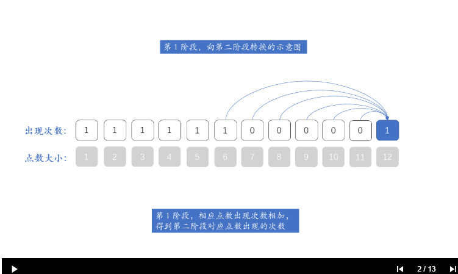

# 【n个骰子的点数】：详解动态规划及其优化方式(转载)

文章原始出处：https://leetcode-cn.com/problems/nge-tou-zi-de-dian-shu-lcof/solution/nge-tou-zi-de-dian-shu-dong-tai-gui-hua-ji-qi-yo-3/

作者： [路漫漫我不畏](https://leetcode-cn.com/u/huwt/)发布于 2 个月前9.3kC++动态规划

> 文章可能没有很清晰的讲述代码中的一些细节，但这些细节大多都可在评论中找到，我都进行了详细的解释，希望对大家有帮助！ 推荐阅读：[动态规划初级试炼场](https://mp.weixin.qq.com/s/Ef73zZv6wiaXwiJRnCLpoQ)

### 解题思路

题目需要我们求出所有点数出现的概率，根据概率的计算公式，点数 k*k* 出现概率就算公式为：

P_{(k)} = k出现的次数 / 总次数*P*(*k*)=*k*出现的次数/总次数

投掷 n*n* 个骰子，所有点数出现的总次数是 6^n6*n* ，因为一共有 n*n* 枚骰子，每枚骰子的点数都有 66 种可能出现的情况。

我们的目的就是 **计算出投掷完 n\*n\* 枚骰子后每个点数出现的次数**。

### 使用递归造成的重复计算问题

> 感谢 [@bakezq](https://leetcode-cn.com/u/bakezq/) 对此部分提出了更容易理解的讲解方式。

单纯使用递归搜索解空间的时间复杂度为 6^n6*n* ，会造成超时错误，因为存在重复子结构。解释如下：

我们使用递归函数 getCount(n, k)*g**e**t**C**o**u**n**t*(*n*,*k*) 来表示投掷 n*n* 枚骰子，点数 k*k* 出现的次数。

为了简化分析，我们以投掷 22 枚骰子为例。

我们来模拟计算点数 44 和 点数 66 ，这两种点数各自出现的次数。也就是计算 getCount(2, 4)*g**e**t**C**o**u**n**t*(2,4) 和 getCount(2, 6)*g**e**t**C**o**u**n**t*(2,6)。

它们的计算公式为：

`getCount(2, 4) = getCount(1, 1) + getCount(1, 2) + getCount(1, 3)`

`getCount(2, 6) = getCount(1, 1) + getCount(1, 2) + getCount(1, 3) + getCount(1, 4) + getCount(1, 5)`

我们发现递归统计这两种点数的出现次数时，重复计算了

`getCount(1, 1) , getCount(1, 2) , getCount(1, 3)`

这些子结构，计算其它点数的次数时同样存在大量的重复计算。

### 动态规划

使用动态规划解决问题一般分为三步：

1. 表示状态
2. 找出状态转移方程
3. 边界处理

下面我们一步一步分析，相信你一定会有所收获！

#### 表示状态

分析问题的状态时，不要分析整体，只分析最后一个阶段即可！因为动态规划问题都是划分为多个阶段的，各个阶段的状态表示都是一样，而我们的最终答案在就是在最后一个阶段。

对于这道题，最后一个阶段是什么呢？

通过题目我们知道一共投掷 n 枚骰子，那最后一个阶段很显然就是：**当投掷完 n枚骰子后，各个点数出现的次数。

> 注意，这里的点数指的是前 n 枚骰子的点数和，而不是第 n 枚骰子的点数，下文同理。

找出了最后一个阶段，那状态表示就简单了。

- 首先用数组的第一维来表示阶段，也就是投掷完了几枚骰子。
- 然后用第二维来表示投掷完这些骰子后，可能出现的点数。
- 数组的值就表示，该阶段各个点数出现的次数。

所以状态表示就是这样的：dp[i][j]*d**p*[*i*][*j*] ，表示投掷完 i*i* 枚骰子后，点数 j*j* 的出现次数。

#### 找出状态转移方程

找状态转移方程也就是找各个阶段之间的转化关系，同样我们还是只需分析最后一个阶段，分析它的状态是如何得到的。

最后一个阶段也就是投掷完` n` 枚骰子后的这个阶段，我们用` dp[n][j]` 来表示最后一个阶段点数 `j` 出现的次数。

单单看第` n` 枚骰子，它的点数可能为 `1 , 2, 3, ... , 6`，因此投掷完 `n`枚骰子后点数 `j `出现的次数，可以由投掷完 `n-1`枚骰子后，对应点数 `j-1, j-2, j-3, ... , j-6` 出现的次数之和转化过来。

```
for (第n枚骰子的点数 i = 1; i <= 6; i ++) {
    dp[n][j] += dp[n-1][j - i]
}
```

写成数学公式是这样的：

$dp[n][j] = \sum_{i=1}^6 dp[n-1][j-i] $

`n `表示阶段，`j`表示投掷完 `n`枚骰子后的点数和，`i `表示第 `n`枚骰子会出现的六个点数。

#### 边界处理

这里的边界处理很简单，只要我们把可以直接知道的状态初始化就好了。

我们可以直接知道的状态是啥，就是第一阶段的状态：投掷完 11 枚骰子后，它的可能点数分别为 1, 2, 3, ... , 61,2,3,...,6 ，并且每个点数出现的次数都是 11 .

```c++
for (int i = 1; i <= 6; i ++) {
    dp[1][i] = 1;
}
```

#### 代码

```c++
class Solution {
public:
    vector<double> twoSum(int n) {
        int dp[15][70];
        memset(dp, 0, sizeof(dp));
        for (int i = 1; i <= 6; i ++) {
            dp[1][i] = 1;
        }
        for (int i = 2; i <= n; i ++) {
            for (int j = i; j <= 6*i; j ++) {
                for (int cur = 1; cur <= 6; cur ++) {
                    if (j - cur <= 0) {
                        break;
                    }
                    dp[i][j] += dp[i-1][j-cur];
                }
            }
        }
        int all = pow(6, n);
        vector<double> ret;
        for (int i = n; i <= 6 * n; i ++) {
            ret.push_back(dp[n][i] * 1.0 / all);
        }
        return ret;
    }
}; 
```

### 空间优化

我们知道，每个阶段的状态都只和它前一阶段的状态有关，因此我们不需要用额外的一维来保存所有阶段。

用一维数组来保存一个阶段的状态，然后对下一个阶段可能出现的点数 j*j* 从大到小遍历，实现一个阶段到下一阶段的转换。



#### 优化代码

```
class Solution {
public:
    vector<double> twoSum(int n) {
        int dp[70];
        memset(dp, 0, sizeof(dp));
        for (int i = 1; i <= 6; i ++) {
            dp[i] = 1;
        }
        for (int i = 2; i <= n; i ++) {
            for (int j = 6*i; j >= i; j --) {
                dp[j] = 0;
                for (int cur = 1; cur <= 6; cur ++) {
                    if (j - cur < i-1) {
                        break;
                    }
                    dp[j] += dp[j-cur];
                }
            }
        }
        int all = pow(6, n);
        vector<double> ret;
        for (int i = n; i <= 6 * n; i ++) {
            ret.push_back(dp[i] * 1.0 / all);
        }
        return ret;
    }
};
```

### 最后

感谢您的观看！欢迎大家留言，一起讨论交流