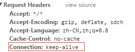
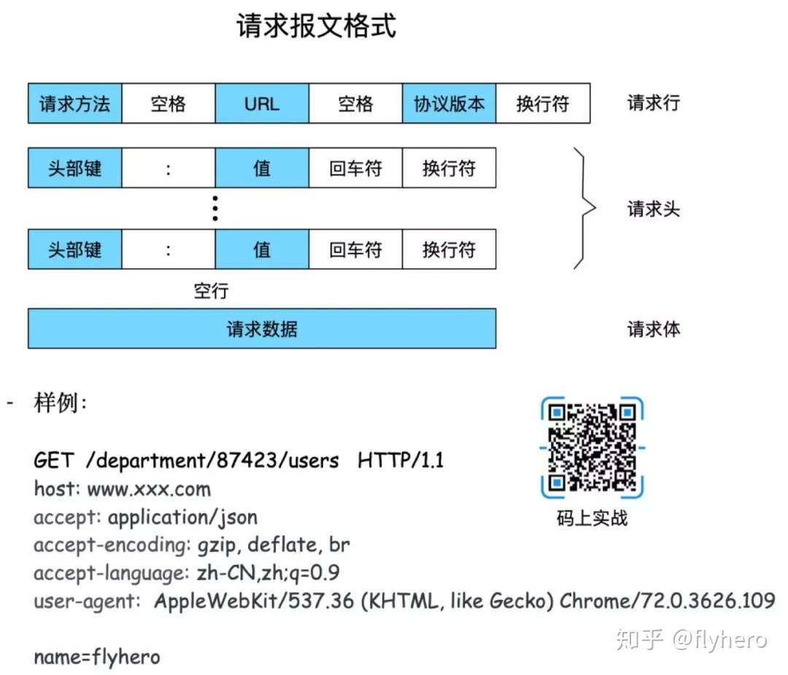
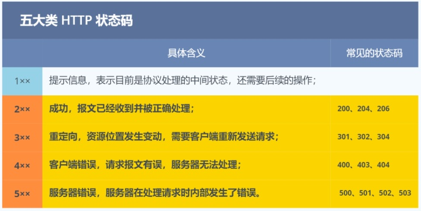
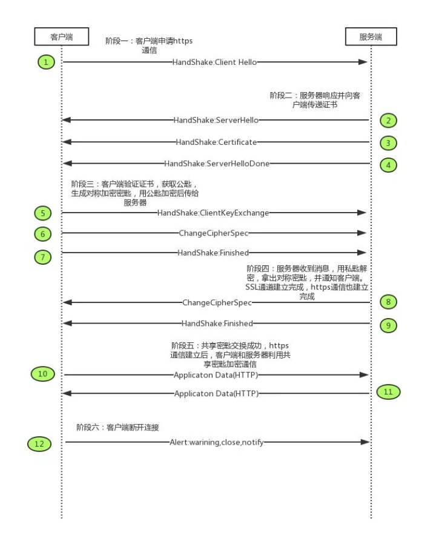
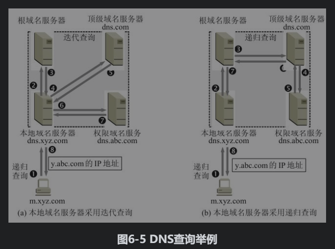
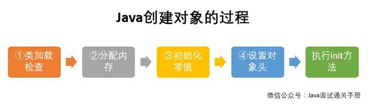
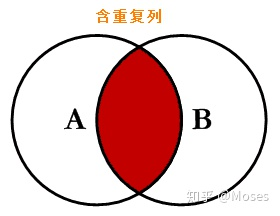

1 计算机网络

## OSI七层模型 与 TCP/IP协议4层模型


OSI七层模型从上到下依次为：

**应用层**：为应用程序提供网络服务；

**表示层**：数据格式转换、数据压缩和数据加密；

**会话层**：建立、断开和维护通信链接；

传输层：为上层协议提供端到端的可靠传输；

网络层：寻址和路由；

数据链路层：定义通过通信媒介互连的设备之间传输的规范；

物理层：利用物理传输介质为数据链路层提供物理连接。

**TCP五层模型**相比**OSI七层模型**，将OSI的会话层,表示层和应用层合为一层：应用层，其它不变。


常见的协议：

ARP协议：

ICMP协议：


## 1.1.TCP/UP


### UDP特点概括：

用户数据报协议，**User Datagram Protocol**

**UDP特点：** 

  (1)**是无连接的。**

  (2)**尽最大努力交付，不保证可靠性。**

（3）**面向报文**（UDP对于应用程序交下来的报文，不合并，也不拆分，只是添加 UDP 首部，就向下交付给IP层） （应用层交给UDP多长的报文，UDP就照样发送，即一次发送一个报文）

（4）**没有拥塞控制，**不管当前网路是否处于拥塞状态，发送速率都不会改变；

（5）**支持一对一、一对多、多对一和多对多的交互通信** 

（6）**首部开销小, 只占8个字节**


### TCP特点概括：

**传输控制协议 TCP（Transmission Control Protocol）**

**TCP特点**

  （1）是**面向连接的**  传输层协议

  （2）每条TCP连接**只能用于**两个端点，~~每条TCP连接~~**只能是**点对点的（一对一）。 

  （3）提供**可靠的交付服务**，**保证**传输数据**无差错**、**不丢失**、不重复且有序。 

  （4）提供**全双工通信**：TCP允许通信双方的应用进程在任何时候都能发送数据，为此TCP连接的两端都设有发送缓存和接受缓存，用来临时存放；

发送缓存用来暂时存储以下下数据：1.发送应用程序传输给发送方TCP准备发送的数据；2. TCP已经发送，但是尚未收到确认的的数据；

接受缓存用来暂时存放以下数据： 1.按时到达但尚未被应用程序接受的数据；2.不按序到达的数据；

  （5）**面向字节流**   TCP与应用程序的交互式是通过一次一块（大小不等）数据块，但是 TCP把应用程序交下来的数据看成仅仅是一连串无结构的字节流。


三次握手（Three-way Handshake）其实就是指建立一个TCP连接时，需要客户端和服务器总共发送3个包。进行三次握手的主要作用就是为了确认双方的接收能力和发送能力是否正常、指定自己的初始化序列号为后面的可靠性传送做准备。实质上其实就是连接服务器指定端口，建立TCP连接，并同步连接双方的序列号和确认号，交换TCP窗口大小信息。


作者：老刘
链接：https://zhuanlan.zhihu.com/p/86426969
来源：知乎
著作权归作者所有。商业转载请联系作者获得授权，非商业转载请注明出处。


### TCP建立： 三次握手

三次握手：是指TCP建立连接的三个步骤。

#### 简单的回答：


#### 详细回答：

刚开始客服端处于`Closed` 状态， 服务端处于`Listen`状态。

第一次握手： 客户端首先向服务器发送一个**SYN报文段**（~~带有SYN标志位的连接请求报文~~），并且指明了客户端的**初始化序列号ISN**（c）【Initial Sequence Number】。客服端此时处于**`SYN_SEND`状态**；

> 连接请求报文：同部位SYN = 1, 初始序号seq = x,  SYN = 1的报文段不能携带数据，但是要消耗一个序号； 

第二次握手: 服务器收到 客服端 的 **SYN报文段**（ ~~连接请求报文~~）之后，以自己的**SYN报文**作为应答，并且也指定了自己初始化序列号ISN(s)。同时会把客服端的**ISN（c） + 1**作为**ack的值**，表示自己已经收到了客服端的**SYN报文**。此时服务端处于**`SYN_REVD`状态**。

> 确认报文： SYN = 1, ACK = 1,  初始序列号为seq  =  y，确认号ack = x+1,

第三次握手：客服端收到了**SYN报文**之后，就会发送一个**ACK报文**，当然，也是一样把服务器的**ISN (s)+ 1**作为**ack的值**，表示已经收到了服务端的SYN报文，此时客服端处于`ESTABLISHED`状态。

服务器收到了ACK报文之后，也处于`ESTABLISHED`状态，此时，双方已建立起了连接。

> 确认报文中，ACK = 1, 确认号 ack = y +  1, 序号 seq = x + 1. ACK报文可以携带数据，如果不携带数据则不消耗序列号。

发送首个SYN的一方， 被认为是主动打开一个连接，称为客服端。

接收这个SYN并发回下一个SYN的一方，被称为被动打开一个连接，称为服务器。

**在socket编程中，客户端执行connect()时，将触发三次握手。**


### **该TCP分配缓存 与 变量时间：**

服务器：在第二次握手时分配的；（使得服务器容易受到SYN洪泛攻击）；

客户端： 在第三次握手收分配的；


### **1.1 为什么需要三次握手，两次不行吗？**

**简单的一句话概括就是：**需要三次握手才能确认双方的接收与发送能力是否正常。

**详细分析：** 

弄清这个问题，我们需要先弄明白三次握手的目的是什么，能不能只用两次握手来达到同样的目的。

第一次握手：客户端发送网络包，服务端收到了。

这样服务端就能得出结论：客户端的发送能力、服务端的接收能力是正常的。

第二次握手：服务端发包，客户端收到了。

这样客户端就能得出结论：服务端的接收、发送能力，客户端的接收、发送能力是正常的。不过此时服务器并不能确认客户端的接收能力是否正常。

第三次握手：客户端发包，服务端收到了。

这样服务端就能得出结论：客户端的接收、发送能力正常，服务器自己的发送、接收能力也正常。


可以精简的回答：

-  需要三次握手才能确认双方（服务器与客户端）的接收与发送能力是否正常。
-  防止失效的SYN报文（连接请求报文）突然又传送到了服务端, 造成一些错误，造成服务端资源浪费。


#### 试想如果是用两次握手，则会出现下面这种情况：

> 正常情况下：如果客户端发出连接请求（SYN报文段），但因连接请求报文丢失而未收到确认，于是客户端再重传一次连接请求（SYN报文段）。后来收到了确认，建立了连接。数据传输完毕后，就释放了连接，客户端共发出了两个连接请求报文段，其中第一个丢失，第二个到达了服务端，
>
> => **但是第一个丢失的报文段只是在某些网络结点长时间滞留了**，**延误到连接释放以后的某个时间才到达服务端**，此时服务端误认为客户端又发出一次新的连接请求，于是就向客户端发出确认报文段，同意建立连接，不采用三次握手，只要服务端发出确认，就建立新的连接了，此时客户端忽略服务端发来的确认，也不发送数据，则服务端一直等待客户端发送数据，浪费资源。


### 什么是半连接队列？

服务器第一次收到客户端的 SYN 之后，就会处于 SYN_RCVD 状态，此时双方还没有完全建立其连接，服务器**会把此种状态下请求连接放在一个队列里**，我们把这种队列称之为**半连接队列**。

当然还有一个**全连接队列**，就是已经**完成三次握手**，**建立起连接的就会放在全连接队列中**。如果队列满了就有可能会出现丢包现象。

这里在补充一点关于SYN-ACK 重传次数的问题：

服务器发送完SYN-ACK包，如果未收到客户确认包，服务器进行首次重传，等待一段时间仍未收到客户确认包，进行第二次重传。如果重传次数超过系统规定的最大重传次数，系统将该连接信息**从半连接队列中删除**。

注意，每次**重传等待的时间不一定相同，一般会是指数增长**，例如间隔时间为 1s，2s，4s，8s…

###  ISN(Initial Sequence Number)是固定的吗？

当一端为建立连接而发送它的SYN时，它为连接选择一个初始序号。ISN随时间而变化，因此每个连接都将具有不同的ISN。ISN可以看作是一个32比特的计数器，每4ms加1 。这样选择序号的目的在于防止在网络中被延迟的分组在以后又被传送，而导致某个连接的一方对它做错误的解释。

三次握手的其中一个重要功能是客户端和服务端交换 ISN(Initial Sequence Number)，以便让对方知`道接下来接收数据的时候如何按序列号组装数据。如果 ISN 是固定的，攻击者很容易猜出后续的确认号，因此 ISN 是动态生成的。


###  三次握手过程中可以携带数据吗？

其实第三次握手的时候，是可以携带数据的。但是，第一次、第二次握手不可以携带数据

为什么这样呢?大家可以想一个问题，假如第一次握手可以携带数据的话，如果有人要恶意攻击服务器，那他每次都在第一次握手中的 SYN 报文中放入大量的数据。因为攻击者根本就不理服务器的接收、发送能力是否正常，然后疯狂着重复发 SYN 报文的话，这会让服务器花费很多时间、内存空间来接收这些报文。

也就是说，第一次握手不可以放数据，其中一个简单的原因就是会让服务器更加容易受到攻击了。而对于第三次的话，此时客户端已经处于 ESTABLISHED 状态。对于客户端来说，他已经建立起连接了，并且也已经知道服务器的接收、发送能力是正常的了，所以能携带数据也没啥毛病。


### **SYN攻击是什么？**

服务器端的资源分配是在二次握手时分配的，而客户端的资源是在完成三次握手时分配的，所以**服务器容易受到SYN洪泛攻击。**

SYN攻击就是Client在短时间内伪造大量不存在的IP地址，并向Server不断地发送SYN包，Server则回复确认包，并等待Client确认，由于源地址不存在，因此Server需要不断重发直至超时，这些伪造的SYN包将长时间占用未连接队列，导致正常的SYN**请求因为队列满而被丢弃**，**从而引起网络拥塞甚至系统瘫痪**。

**SYN 攻击是一种典型的 DoS/DDoS 攻击。**


检测 SYN 攻击非常的方便，当你在服务器上看到大量的半连接状态时，特别是源IP地址是随机的，基本上可以断定这是一次SYN攻击。在 Linux/Unix 上可以使用系统自带的 netstats 命令来检测 SYN 攻击。

```java
netstat -n -p TCP | grep SYN_RECV
```

常见的防御 SYN 攻击的方法有如下几种：

- **缩短超时（SYN Timeout）时间**
- **增加最大半连接数**
- 过滤网关防护
- SYN cookies技术


## 2. TCP连接释放：四次挥手


 建立一个连接需要三次握手，而终止一个连接要经过四次挥手（也有将四次挥手叫做四次握手的）。这由TCP的**半关闭（half-close）**造成的。所谓的**半关闭**，其实就是**TCP提供了连接的一端在结束它的发送后还能接收来自另一端数据的能力。**

TCP 的连接的拆除（释放）**需要发送四个包**，因此称为**四次挥手(Four-way handshake)**，客户端**或服务器均可主动发起挥手动作**。

刚开始双方都处于 **ESTABLISHED 状态**，假如是客户端先发起关闭请求。四次挥手的过程如下：

FIN报文：连接释放报文

**第一次挥手**：客户端数据传输完毕之后，主动主动关闭连接。客服端会发送 **FIN 报文**，报文中会指定一个**序列号u**（u等于前面已传送过的数据的最后一个字节的序号加1）。此时客户端处于 **FIN-WAIT-1（终止等待1）状态**，并等待服务端进行确认。

即客户端发出连接释放报文段（FIN=1，序号seq=u，u等于前面已传送过的数据的最后一个字节的序号加1。），并停止再发送数据，主动关闭TCP连接，进入FIN_WAIT1（终止等待1）状态，等待服务端的确认。

**第二次挥手**：服务端收到 **FIN 报文**之后，会**发送 ACK 报文**，指定**序列号为v**, 且把客户端的**序列号值u +1** 作为 **ACK 报文的确认号的值，表明已经收到客户端的**FIN报文**了，此时服务端处于 **CLOSE_WAIT 状态**。

**客户端收到服务端的确认后**，进入**FIN_WAIT2（终止等待2）状态**，等待服务端发出的**FIN-ACK报文段**。

> 此时的**TCP处于半关闭状态** half-shutdown状态，**客户端到服务端的连接释放**。

即**服务端**收到**连接释放报文段**后即发出**确认报文段**（ACK=1，确认号ack=u+1，序号seq=v），服务端进入**CLOSE_WAIT（关闭等待）状态**

**第三次挥手**：若服务端数据发送完毕，和客户端的第一次挥手一样，发给 **FIN -ACK报文**，且指定一个**序列号W**。此时服务端处于 **LAST_ACK 的状态**。

即服务端没有要向客户端发出的数据了（服务端数据发送完毕），服务端发出**连接释放报文段**（FIN=1，ACK=1，序号seq=w，确认号ack=u+1），服务端进入LAST_ACK（最后确认）状态，等待客户端的确认。

**第四次挥手**：客户端收到 **FIN** 之后，发送一个 **ACK 报文**作为应答，且把服务端的**序列号值u +1** 作为自己 **ACK 报文的序列号值**，此时客户端处于 **TIME_WAIT 状态。**需要等待2MSL (最长报文寿命)过一阵子以确保服务端收到自己的 ACK 报文之后才会进入 **CLOSED 状态**，服务端收到 ACK 报文之后，就处于关闭连接了，处于 CLOSED 状态。

即客户端收到服务端的连接释放报文段后，对此发出确认报文段（ACK=1，seq=u+1，ack=w+1），客户端进入TIME_WAIT（时间等待）状态。此时TCP未释放掉，需要经过时间等待计时器设置的时间2MSL后，客户端才进入CLOSED状态。

收到一个FIN只意味着在这一方向上没有数据流动。客户端执行主动关闭并进入TIME_WAIT是正常的，服务端通常执行被动关闭，不会进入TIME_WAIT状态。

在socket编程中，任何一方执行close()操作即可产生挥手操作。


### TCP如何提供可靠性的连接： 

TCP主要提供了检验和、序列号/确认应答、超时重传、最大消息长度、滑动窗口控制等方法实现了可靠性传输。

-  **校验和：**（首部字段，数据字段，伪首部）的校验和，是端到端的检测，目的是检测数据在传输过程中的任何变化。 如果受到段的检验和有差错，TCP将丢弃这个报文段并且不确认收到这个报文段。

- **序列号 + 确认应答机制（ACK）:** TCP将每个字节的数据都进行了编号，这些编号就是序列号。	每个ACK报文都有对应的**确认序列号**，意思是告诉发送者已经收到了数据，下一个数据应该从哪儿开始发送。

- **超时重传机制**:   TCP发出一个报文后，会启动定时器，等待目的端受发送的确认报文。如果不能及时收到这个确认报文，则重发一个报文。

- **流量控制**:  TCP连接双方维护有固定大小的缓冲区，TCP接受段只允许发送端发送接收端缓冲区能够接纳的数据。TCP接收方通过控制TCP发送方的发送窗口大小，

- **拥塞控制：**当网络发生拥塞后，减少数据发送。 发送方维护有拥塞控制窗口，当前的发送窗口取（拥塞控制窗口 与 接口方发送过来的窗口）两者最小值。慢启动，拥塞避免；快重传，快恢复。

  

  

### 可靠传输的原理：

停止等待协议： 发送方每发送一个分组就停止发送， 等待对方的确认。 在收到确认后，再发下一个分组。（没有使用）

ARQ自动重传请求：（Automatic Reqeat Request）

采用流水线方式传输，发送方可以连续发送多个分组，

连续ARQ协议：

发送方维护发送窗口： 每次收到一个分组确认，发送窗口就往前移动一个分组。

接收方采累积确认的方式： 接收方不必对收到个分组，逐个进行发送确认，而是在受到几个分组之后，对按序到达的最后一个分组进行确认。表示到这分组为止，所有分组都收到了确认。


### TCP流量控制：

**TCP 利⽤滑动窗⼝实现流量控制。流量控制是为了控制发送⽅发送速率，保证接收⽅来得及接收。**接收方发送的确认报文中的窗口字段可以用来控制发送方窗口大小，从而影响发送方的发送速率。将窗口字段设置为0， 则发送方不能发送数据。

### TCP拥塞控制：

#### 什么是拥塞控制？

是为了防止过多的数据注入网络，使得网络中的路由器或者链路不至于过载。

为了进行拥塞控制，TCP发送方要维护一个拥塞控制窗口（cwnd）的状态变量。 拥塞控制窗口的大小取决于网络的拥塞程度，并且是动态变化的。发送方让自己的发送窗口取值为拥塞控制 和 接收方的接受窗口中的较小值。


TCP的拥塞控制采⽤了四种算法，即 **慢开始** 、 **拥塞避免** 、**快重传** 和 **快恢复**。在⽹络层也可以使路 由器采⽤适当的分组丢弃策略（如主动队列管理   AQM），以减少⽹络拥塞的发⽣。


**慢开始：** 慢开始算法的思路是当主机开始发送数据时，如果⽴即把⼤量数据字节注⼊到⽹络， 那么可能会引起⽹络阻塞，因为现在还不知道⽹络的符合情况。经验表明，较好的⽅法是先探测 ⼀下，即由⼩到⼤逐渐增⼤发送窗⼝，也就是由⼩到⼤逐渐增⼤拥塞窗⼝数值。

​	cwnd初始值为1，每经过⼀个**传播轮次**(往返时延RTT)，cwnd加倍，以指数形式增大。

**拥塞避免：**    拥塞避免算法的思路是让拥塞窗⼝cwnd缓慢增⼤，即每经过⼀个往返时间RTT就把发送放的cwnd加1;

**（3）网络拥塞处理上：**

当出现网络拥塞的时候，无论是慢开始阶段，还是用拥塞避免阶段，只要发送方检测到超时时间发生：

就把**慢开始门限ssthresh**设置为出现拥塞时发送方**拥塞控制窗口cwnd的一半**，然后把拥塞控制窗口cwnd重新设置为1，执行慢开始算法。


**快重传与快恢复：** 在 TCP/IP 中，快速重传和恢复（fast retransmit and recovery，FRR）是

⼀种拥塞控制算法，它能快速恢复丢失的数据包。没有 FRR，如果数据包丢失了，TCP 将会使⽤

定时器来要求传输暂停。在暂停的这段时间内，没有新的或复制的数据包被发送。

有了FRR，如果接收机接收到⼀个不按顺序的数据段，它会⽴即给发送机发送⼀个重复确认。

如果发送机接收到三个重复确认，它会假定确认件指出的数据段丢失了，并⽴即重传这些丢失的数据段。

有了FRR，就不会因为重传时要求的暂停被耽误。   当有单独的数据包丢失时，快速重传和恢复

（FRR）能最有效地⼯作。当有多个数据信息包在某⼀段很短的时间内丢失时，它则不能很有效

地⼯作。

> **快重传与快恢复** 是对慢开始和拥塞避免的改进

实际情况下：**四种拥塞避免算法** 是一起使用的，当发送方检测到超时时候，就采用慢开始和拥塞避免算法；

当发送方检测到重复确认（冗余ACK）的时候，就采用快重传和快恢复。

**快重传：**当发送端接收到连续三个冗余的ACK(重复确认)时，直接重传对方尚未收到的报文，不必等待那个报文设置的超时计时器超时。

**快恢复：**当发送端接收到连续三个冗余的ACK(重复确认)时，就执行"乘法减小",把**慢开始门限ssthresh**设置为出现拥塞时发送方**拥塞控制窗口cwnd**的一半。将**拥塞控制窗口**的值设置为慢开始门限的值，然后指向加法增大算法，使得拥塞控制窗口缓慢线性增大。（因为跳过了慢开始过程，所有称为快恢复）；


### 流量控制和拥塞控制区别

拥塞控制：拥塞控制有个前提，是让网络能够承受现有的网络负荷。拥塞控制是一个全局性控制，涉及所有的主机，路由器，以及与降低网络传输性能有关的所有因素。

而流量控制：主要是点对点通信量的控制，就是接收端控制发送端，目的是抑制发送端的发送数据的速率，使得接收端能够来的及接收。

相同点：  两个都是控制发送方的发送速率来达到效果的。


### 浏览器输入URL具体发生了什么


#### HTTP1.0和HTTP1.1区别

HTTP1.0和HTTP1.1最主要的区别就是：

- HTTP1.1默认是**持久化连接**！
- 在HTTP1.0默认是**短连接**：

非持久化连接（短连接）：网页中的每个元素传输都需要建立一个单独的TCP链接。 HTTP协议是基于TCP的，TCP每次都要经过**三次握手，四次挥手，慢启动**，这个过程非常慢，且消耗资源。


持久化连接：


持久化连接又可以分为流水线 和 非流水线。Pipelining 管线化。

非流水线方式：客户端在收到前一个响应之后，才能发送下一个请求。每个引用对象都有一个RTT时延。

流水线方式：客户端每遇到一个对象引用，就可以立即发送一个请求。所有的请求与响应都是连续发送的。所有的引用对象共同经历一个RTT时延。


#### Http/1.1特点：

简单来说就是：

- 持久连接
- 管道的方式

**1）持久连接**

每个TCP连接开始都有三次握手，要经历一次客户端与服务器间完整的往返，而开启了持久化连接就能不必每次都要握手。



在连接中有这个属性的就是打开了持久化连接。下图展示了通过持久 TCP 连接取得 HTML 和 CSS 文件：


2）HTTP管线化

持久HTTP多次请求必须严格满足先进先出（**FIFO**）的队列顺序：发送请求，等待响应完成，再发送客户端队列中的下一个请求。

HTTP管道可以让我们把FIFO队列从客户端（请求队列）**迁移到服务器**（响应队列）。


这样的话在第一个请求完成后，能马上开始处理第二个请求。

> 但HTTP 1.x不允许一个连接上的多个响应数据交错到达（多路复用），因而一个响应必须完全返回后，下一个响应才会开始传输。
>
> 也就是说即使客户端同时发送了两个请求，而且CSS资源先准备就绪，服务器也会**先发送HTML**响应，然后**再交付CSS**。
>
> 而HTTP2.0就可以多路复用，并可以按优先级返回响应。


#### http/2.0 特点：

简单回答：

- 二进制分帧，HTTP1.X以纯文本的形式，HTTP 2.0 使用二进制格式进行编码。**二进制格式更容易进行压缩**。

- **多路复用**解决了线头阻塞问题：

- 头部压缩

- 服务端推送

  

**1）二进制分帧层**

HTTP 2.0性能增强的核心，全在于新增的二进制分帧层，它定义了如何封装HTTP消息并在客户端与服务器之间传输。


接下来说的几个特点都是基于这个机制来实现的。

**2）流、消息和帧**


所有HTTP 2.0通信都在一个连接上完成，**这个连接可以承载任意数量的双向数据流**。

每个数据流**以消息的形式发送**，而消**息由一或多个帧组成**，这些**帧可以乱序发送**，然后再根据每个帧首部的流标识符重新组装。


简言之，HTTP 2.0把HTTP协议通信的基本单位缩小为一个一个的帧，这些帧对应着逻辑流中的消息。

相应地，很多流可以并行地在同一个TCP连接上交换消息。

**3）多向请求与响应**

在HTTP 1.x中，如果客户端想发送多个并行的请求以及改进性能，那么必须使用多个TCP连接。

HTTP 2.0中的二进制分帧层突破了限制：**客户端和服务器可以把HTTP消息分解为互不依赖的帧，然后乱序发送，最后再在另一端把它们重新组合起来。**


 

**4）请求优先级**

把HTTP消息分解为很多独立的帧之后，就可以通过优化这些帧的交错和传输顺序，进一步提升性能。

为了做到这一点，每个流都可以带有一个31比特的优先值。

如果服务器不理睬优先值，可能导致应用响应变慢：浏览器明明在等关键的CSS和JavaScript，服务器却在发送图片，从而造成渲染阻塞。

 

**5）每个来源一个连接**

大多数HTTP连接的时间都很短，而且是突发性的，但TCP只在长时间连接传输大块数据时效率才最高。

HTTP 2.0通过让所有数据流共用同一个连接，可以更有效地使用TCP连接。

HTTP 2.0不仅能够减少网络延迟，还有助于提高吞吐量和降低运营成本！


**6）服务器推送**

服务器除了对最初请求的响应外，**服务器还可以额外向客户端推送资源，而无需客户端明确地请求。**


 

**7）首部压缩**

在HTTP1.x中，首部元数据都是以纯文本形式发送的，通常会给每个请求增加500~800字节的负荷。

为减少这些开销并提升性能，HTTP 2.0会压缩首部元数据。

HTTP 2.0连接的两端都知道已经发送了哪些首部，这些首部的值是什么，从而可以针对之前的数据只编码发送差异数据。


#### [http1.1管线话 vs htttp2.0 多路复用](https://www.cnblogs.com/shangyueyue/p/11041998.html)


- 图中第一种请求方式，就是单次发送request请求，收到response后再进行下一次请求，显示是很低效的。
- 于是http1.1提出了**管线化(pipelining)技术**，就是如图中第二中请求方式，**一次性发送多个request**请求。
- 然而pipelining在接收response返回时，也必须依顺序接收，如果前一个请求遇到了阻塞，后面的请求即使已经处理完毕了，仍然需要等待阻塞的请求处理完毕。这种情况就如图中第三种，第一个请求阻塞后，后面的请求都需要等待，这也就是队头阻塞(Head of line blocking)。
- 为了解决上述阻塞问题，http2中提出了多路复用(Multiplexing)技术，Multiplexing是通信和计算机网络领域的专业名词。http2中**将多个请求复用同一个tcp链接中**，将一个TCP连接分为若干个流（Stream），每个流中可以传输若干消息（Message），每个消息由若干最小的二进制帧（Frame）组成。也就是将每个request-response拆分为了细小的二进制帧Frame，这样即使一个请求被阻塞了，也不会影响其他请求，如图中第四种情况所示。


## http协议

超文本传输协议：无状态的，**两次连接通信之间没有任何关系，每次都是新的连接，服务端不会记录前后的请求信息；**


**请求（Request）**

客户端发送一个HTTP请求到服务端的格式：

- 请求行
- 请求头
- 请求体




**响应（Response）**

服务端响应客户端格式：

- 状态行
- 响应头
- 响应体


### Session 和 Cookie区别


### 常见的http返回码有哪些？



- **200：请求被正常处理**
- 204：请求被受理但没有资源可以返回
- 206：客户端只是请求资源的一部分，服务器只对请求的部分资源执行GET方法，相应报文中通过Content-Range指定范围的资源。
- **301：永久性重定向**
- 302：临时重定向  (请求重定向会用到这个应该)
- 303：与302状态码有相似功能，只是它希望客户端在请求一个URI的时候，能通过GET方法重定向到另一个URI上
- 304：发送附带条件的请求时，条件不满足时返回，与重定向无关
- 307：临时重定向，与302类似，只是强制要求使用POST方法
- **400：请求报文语法有误，服务器无法识别** （客户端错误）
- **401：请求需要认证**
- **403：请求的对应资源禁止被访问**
- **404：服务器无法找到对应资源**
- **500：服务器内部错误**（服务器错误，服务器在处理过程发送错误）
- 503：服务器正忙 


### get和post方法区别：

从报文角度来看： 两者报文格式略有不同。

如果没有参数，那么两者区别，就是第一行，方法不同。

带有参数的时候，get请求的参数在url里面，post请求的参数在body里面。

举个例子，如果参数是 name=qiming.c, age=22。

GET 方法简约版报文是这样的

```http
GET /index.php?name=qiming.c&age=22 HTTP/1.1
Host: localhost
```

POST 方法简约版报文是这样的

```http
POST /index.php HTTP/1.1
Host: localhost
Content-Type: application/x-www-form-urlencoded

name=qiming.c&age=22
```

从安全性角度来看：get参数会出现在地址栏上，post不会，所以post比get相对安全一点。但是http协议是明文传输的，两者也是半斤八两。主要抓包就能，完整获取到报文。

**主要区别：**

- GET 用于获取信息，是无副作用的，是幂等的，且可缓存。
- POST 用于修改服务器上的数据，有副作用，非幂等，不可缓存。


## https:

### HTTP 存在三个弊端：

- **无法保证消息的保密性**  （数据传输过程中，数据容易被中间人窃取）
- **无法保证消息的完整性和准确性** （数据被中间人拿到后，中间人可能读数据进行修改）
- **无法保证消息来源的可靠性** （来源）

Https采用了一些加密，数字证书，数字签名来实现。

对称加密 和非对称加密：

### 对称加密

**①对称加密（共享密匙加密）：**客户端和服务器公用一个密匙用来对消息加解密，这种方式称为对称加密。

客户端和服务器约定好一个加密的密匙。客户端在发消息前用该密匙对消息加密，发送给服务器后，服务器再用该密匙进行解密拿到消息。


**对称加密的优点：**一定程度上解决了 HTTP 中消息保密性的问题。

**对称加密的缺点：**但是因为客户端和服务器共享一个密匙，密匙在传输过程中非常容易泄露。

所以很难保证消息来源的可靠性、消息的完整性和准确性。


### 非对称加密

**②非对称加密（公有密匙加密）：**

采用非对称加密时，客户端和服务端均拥有一个公有密匙和一个私有密匙。公有密匙可以对外暴露，而私有密匙只有自己可见。

使用公有密匙加密的消息，只有对应的私有密匙才能解开。反过来，使用私有密匙加密的消息，只有公有密匙才能解开。

这样客户端在发送消息前，先用服务器的公匙对消息进行加密，服务器收到后再用自己的私匙进行解密。


### **非对称加密的优点：**

- 非对称加密采用公有密匙和私有密匙的方式，解决了 HTTP 中消息保密性问题，而且使得私有密匙泄露的风险降低。
- 因为公匙加密的消息只有对应的私匙才能解开，所以较大程度上保证了消息的来源性以及消息的准确性和完整性。


**非对称加密的缺点：**

- 非对称加密时需要使用到接收方的公匙对消息进行加密，但是公匙不是保密的，任何人都可以拿到，中间人也可以。
  那么中间人可以做两件事**，第一件是中间人可以在客户端与服务器交换公匙的时候，将客户端的公匙替换成自己的**。
  这样服务器拿到的公匙将不是客户端的，而是服务器的。服务器也无法判断公匙来源的正确性。**第二件是中间人可以不替换公匙，但是他可以截获客户端发来的消息，然后篡改**，然后用服务器的公匙加密再发往服务器，服务器将收到错误的消息。
- 非对称加密的性能相对对称加密来说会**慢上几倍甚至几百倍，比较消耗系统资源**。正是因为如此，HTTPS 将两种加密结合了起来。

总结起来就：（1）无法保证非对称加密中公钥来源的不安全性。 （2）非对称对称加密相对于对称加密来说，速度会慢上几倍，甚至几百倍，比较消耗资源。


### 数字证书与数字签名

为了解决非对称加密中公匙来源的不安全性。我们可以使用数字证书和数字签名来解决。

**①数字证书的申请**

在现实中，有一些专门的权威机构用来颁发数字证书，我们称这些机构为**认证中心（CA，Certificate Authority**）。

我们（服务器）可以向这些 CA 来申请数字证书。申请的过程大致是：自己**本地先生成一对密匙**，然后**拿着自己的公匙**以及**其他信息（比如说企业名称**啊什么的）去 CA 申请数字证书。

**CA** 在拿到这些信息后，会选择一种**单向 Hash 算法**（比如说常见的 MD5）**对这些信息进行加密**，加密之后的东西我们称之为**摘要**。

单向 Hash 算法有一种特点就是单向不可逆的，只要原始内容有一点变化，加密后的数据都将会是千差万别（当然也有很小的可能性会重复，有兴趣的小伙伴了解一下鸽巢原理），这样就防止了信息被篡改。

生成摘要后还不算完，**CA 还会用自己的私匙对摘要进行加密**，摘要加密后的数据我们称之为**数字签名**。

最后，CA 将会把我们的**申请信息（包含服务器的公匙）和数字签名整合在一起**，由此而生成数字证书。然后 CA 将数字证书传递给我们。


**②数字证书怎么起作用**

服务器在获取到数字证书后，服务器会将数字证书发送给客户端，客户端就需要用 CA 的公匙解密数字证书并验证数字证书的合法性。

>  那我们如何能拿到 CA 的公匙呢？我们的电脑和浏览器中已经内置了一部分权威机构的根证书，这些根证书中包含了 CA 的公匙。
>
> 之所以是根证书，是因为现实生活中，认证中心是分层级的，也就是说有顶级认证中心，也有下面的各个子级的认证中心，是一个树状结构，计算机中内置的是最顶级机构的根证书，不过不用担心，根证书的公匙在子级也是适用的。


客户端用 CA 的公匙解密数字证书，如果解密成功则说明证书来源于合法的认证机构。解密成功后，客户端就拿到了摘要。

此时，**客户端**会按照和 CA 一样的 Hash 算法将**申请信息生成一份摘要**，并和**解密出来的那份做对比**，如果相同则说明内容完整，没有被篡改。

最后，**客户端安全的从证书中拿到服务器的公匙就可以和服务器进行安全的非对称加密通信了**。服务器想获得客户端的公匙也可以通过相同方式。

### HTTPS原理

HTTPS 没有采用单一的技术去实现，而是根据  对称加密， 非对称加密， 数字证书与数字签名  特点，充分的将这些技术整合，以达到性能与安全最大化。

这套整合的技术我们称之为 SSL（Secure Scoket Layer，安全套接层）




这里把 HTTPS 建立到断开分为 6 个阶段，12 个过程。下面将对 12 个过程一 一做解释：

- 客户端通过发送 Client Hello 报文开始 SSL 通信。报文中包含客户端支持的 SSL 的指定版本、加密组件（Cipher Suite）列表（所使用的加密算法及密匙长度等）。
- 服务器可进行 SSL 通信时，会以 Server Hello 报文作为应答。和客户端一样，在报文中包含 SSL 版本以及加密组件。服务器的加密组件内容是从接收到的客户端加密组件内筛选出来的。
- 服务器发送证书报文。报文中包含公开密匙证书。
- 最后服务器发送 Server Hello Done 报文通知客户端，最初阶段的 SSL 握手协商部分结束。
- SSL 第一次握手结束之后，客户端以 Client Key Exchange 报文作为回应。报文包含通信加密中使用的一种被称为 Pre-master secret 的随机密码串。该报文已用步骤 3 中的公开密匙进行加密。
- 接着客户端继续发送 Change Cipher Spec 报文。该报文会提示服务器，在此报文之后的通信会采用 Pre-master secret 密匙加密。
- 客户端发送 Finished 报文。该报文包含连接至今全部报文的整体校验值。这次握手协商是否能够成功，要以服务器是否能够正确解密该报文作为判定标准。
- 服务器同样发送 Change Cipher Spec 报文。
- 服务器同样发送 Finished 报文。
- 服务器和客户端的 Finished 报文交换完毕之后，SSL 连接就算建立完成。当然，通信会受到 SSL 的保护。从此处开始进行应用层协议的通信，即发送 HTTP 请求。
- 应用层协议通信，即发送 HTTP 响应。
- 最后由客户端断开连接。断开连接时，发送 close_notify 报文。上图做了一些省略，这步之后再发送 TCP FIN 报文来关闭与 TCP 的通信。


下面再用图解来形象的说明一下，此图比上面数字证书的图更加的详细一些（图片来源于《图解 HTTP》）：


​		

​	，我们可以看出 HTTPS 先是利用数字证书保证服务器端的公匙可以安全无误的到达客户端。 然后再用非对称加密安全的传递共享密匙，最后用共享密匙安全的交换数据。


访问一个HTTPS 的网站的大致流程如下，

( I ）浏览器向服务器发送请求，请求中包括浏览器自身支持的协议，并附带一个随机数。
( 2 ）服务器收到请求后，选择某种**非对称加密算法**，把数字证书（签有公钥、身份信息）发送给浏览器，同时也附带一个随机数。
( 3 ）浏览器收到后、验证证书的真实性，用服务器的公钥发送握手信息给服务器。
( 4 ） 服务器解密后， 使用主前的 随机数计算出，一个对称加密的密钥， 以此作为 **加密信息**并发送。
( 5 ） 后续所有的信息发送都是以对称加密方式进行的。


## DNS系统

**运行在UDP之上， 使用53号端口。**

- 层级域名空间
- 域名服务器
  - 根域名服务器
  - 顶级域名服务器
  - 授权域名服务器
  - 本地域名服务器
- 解析器

域名解析流程

域名解析是指把域名解析成IP地址，或者把IP地址映射成域名的过程。（正向解析与反向解析）

解析方式主要分为： （1）递归查询 （2）递归与迭代相结合的查询。

所谓 递归查询过程 就是 “查询的递交者” 更替, 而 迭代查询过程 则是 “查询的递交者”不变。

第一，主机向本地域名服务器的查询一般都是采用递归查询(recursive query)。所谓递归查询就是：如果主机所询问的本地域名服务器不知道被查询域名的IP地址，那么本地域名服务器就以DNS客户的身份，向其他根域名服务器继续发出查询请求报文（即替该主机继续查询），而不是让该主机自己进行下一步的查询。因此，递归查询返回的查询结果或者是所要查询的IP地址，或者是报错，表示无法查询到所需的IP地址。


第二，本地域名服务器向根域名服务器的查询通常是采用迭代查询(iterativequery)。迭代查询的特点是这样的：当根域名服务器收到本地域名服务器发出的迭代查询请求报文时，要么给出所要查询的IP地址，要么告诉本地域名服务器：“你下一步应当向哪一个域名服务器进行查询”。然后让本地域名服务器进行后续的查询（而不是替本地域名服务器进行后续的查询）。根域名服务器通常是把自己知道的顶级域名服务器的IP地址告诉本地域名服务器，让本地域名服务器再向顶级域名服务器查询。顶级域名服务器在收到本地域名服务器的查询请求后，要么给出所要查询的IP地址，要么告诉本地域名服务器下一步应当向哪一个权限域名服务器进行查询，本地域名服务器就这样进行迭代查询。最后，知道了所要解析的域名的IP地址，然后把这个结果返回给发起查询的主机。当然，本地域名服务器也可以采用递归查询，这取决于最初的查询请求报文的设置是要求使用哪一种查询方式。



假定域名为m.xyz.com的主机想知道另一个主机（域名为y.abc.com）的IP地址。例如，主机m.xyz.com打算发送邮件给主机y.abc.com。这时就必须知道主机y.abc.com的IP地址。**下面是图6-5(a)的几个查询步骤：**

❶ 主机m.xyz.com先**向其本地域名服务器**dns.xyz.com**进行递归查询**。

❷ **本地域名服务器采用迭代查询**。它**先**向一个根域名服务器查询。

❸ 根域名服务器告诉本地域名服务器，**下一次应查询的顶级域名服务器dns.com的IP地址**。

❹ 本地域名服务器向顶级域名服务器dns.com进行查询。

❺顶级域名服务器dns.com告诉本地域名服务器，**下一次应查询的权限域名服务器dns.abc.com的IP地**址。

❻ 本地域名服务器向权限域名服务器dns.abc.com进行查询。

❼ 权限域名服务器dns.abc.com告诉本地域名服务器，**所查询的主机的IP地址**。

❽ 最后，本地域名服务器最后把查询结果告诉主机m.xyz.com


### SQL注入攻击

SQL 注入是注入式攻击中的常见类型。

SQL 注入式攻击是未将**代码**与**数据进行严格的隔离**，**导致在读取用户数据的时候， 错误地把数据作为代码的一部分执行， 从 而导致一些安全问题**。SQL 注入自诞生以来以其巨大的杀伤力闻名。典型的SQL 注入的例子是当**对SQL 语旬进行字符串拼接操作时， 直接使用未加转义的用户输入内容作为变量**，比如

#### 预防:

( I ）**过滤**用户输入参数中的**特殊字符**，从而降低被SQL 注入入的风险。
( 2 ）禁止通过**字符串拼装的SQL 语句**，严恪使用**参数绑定**传人的SQL 参数。
( 3 ）合理使用数据库框架提供的防注入机制。`${}`

### XSS：跨站脚本攻击

XSS 是指黑客通过技术手段，向正常用户请求的HTML 页面中插入恶意脚本， 从而可以执行任意脚本。

### CSRF攻击

跨站请求伪造（ Cross-Site Request Forgery ） ， 简称CSRF ， 也被称为One-clickAttack 。

在用户并不知情的情况下， 冒充用户发起请求， 在当前已经登录的Web 应用程序上执行恶意操作，如恶意发帖、修改密码、发邮件等。


### 常见的协议：

#### ARP协议：

每个主机都设有ARP高速缓存（ARP cache）, 是本地局域网上各个主机和其ip地址映射表，存活时间。

当主机A要想本地局域网上某个主机B发送IP数据报时， 先在其ARP高速缓存中有无主机B的IP地址。如果有，直接使用缓存中查出对应的硬件地址。

如果ARP高速缓存中没有，则

（1）主机A在本地局域网上广播发送一个ARP请求分组发送。（报文内容包括，主机A的ip地址，mac地址，主机B的ip地址）

（2）在本局域网上所有的主机都会收到这个ARP请求分组。

（3）主机B收到这个ARP请求分组之后，发现这个分组中要查询的IP地址与自身的IP地址一致，则接受这个ARP请求，并且向A发送ARP响应分组，写入自己的MAC地址。其余主机的ip地址与 这个ARP请求中要查询的ip地址不一致，都会忽略这个请求。

（4）主机A受到主机B的ARP响应之后，就在其高数缓存中写入主机B的IP地址到MAC地址的映射。


# 2 操作系统

## 进程和线程

### *** 进程和线程有什么区别

- 进程（Process）是系统进行**资源分配**和**调度的基本单位**，线程（Thread）是**CPU调度**和**分派**的**基本单位**；
- **1.进程与线程关系角度**：线程依**赖于**进程而存在，一个进程**至少有**一个线程；
- **2.地址空间角度**：进程有自己的**独立地址空间**，线程共享**所属进程的地址空间**；
- **3.拥有资源角度**：进程是**拥有系统资源的一个基本单位**，而**线程**自己基本上不拥有系统资源，只拥有一点在运行中必不可少的资源(如程序计数器,一组寄存器和栈)，和其他线程共享本进程的相关资源如内存、I/O、cpu等；
- **4.系统开销角度**：在**进程切换**时，涉及到整个当前**进程CPU环境的保存环境的设置**以及**新被调度进程运行的CPU环境**的设置，而**线程切换**只需保存和设置少量的寄存器的内容，并**不涉及存储器管理**方面的操作，可见，**进程切换的开销远大于线程切换的开销**；
- **5.通信角度**： 线程之间的通信更方便，同一进程下的线程**共享全局变量**等数据，而**进程之间的通信**需要以**进程间通信(IPC)的方式**进行；
- **6.稳定性角度：****多线程程序**只要有一个线程崩溃，整个程序就崩溃了，但多进程程序中一个**进程崩溃**并不会对其它进程造成影响，因为进程有自己的**独立地址空间**，因此**多进程  更加健壮


### *** 进程间通信方式有哪些

每个进程各自有不同的用户地址空间，任何一个进程的全局变量在另一个进程中都看不到，所以**进程之间要交换数据必须通过内核**，在内核中开辟一块缓冲区，进程1把数据从用户空间拷到内核缓冲区，进程2再从内核缓冲区把数据读走，内核提供的这种机制称为**进程间通信（IPC）**；

1. **管道（Pipe）**
   可用于具有亲缘关系的父子进程间的通信

- 管道是半双工的，数据只能向一个方向流动；需要双方通信时，需要建立起两个管道；
- 一个进程向管道中写的内容被管道另一端的进程读出。写入的内容每次都添加在管道缓冲区的末尾，并且每次都是从缓冲区的头部读出数据；
- 只能用于父子进程或者兄弟进程之间（具有亲缘关系的进程）


2. **命名管道（FIFO）**
   有名管道除了具有管道所具有的功能外，它还**允许无亲缘关系进程间的通信；**

- 有名管道的名字存在于**文件系统中**，内容存放在内存中。不支持定位读写。
- 匿名管道是**单向的**，只能在有亲缘关系的进程间通信；有名管道以**磁盘文件的方式存在**，可以**实现本机任意两个进程通信。**


3. **消息（Message）队列**
   消息队列是消息的链接表，它克服了上两种通信方式中**信号量有限**的缺点，具有写权限得进程可以按照一定得规则向消息队列中添加新信息；对消息队列有读权限得进程则可以从消息队列中读取信息；

- 消息队列存放在内核中，只有在内核重启(即，操作系统重启)或者显示地删除一个消息队列时，该消息队列才会被真正的删除。
- 消息队列允许**一个或多个进程向它写入与读取消息.**
- 管道和消息队列的通信数据都是先进先出的原则。
- 消息队列可以实现消息的随机查询,消息不一定要以先进先出的次序读取,也可以按消息的类型读取.比FIFO更有优势。


4. **信号（Signal）**
   信号是一种比较复杂的通信方式，用于通知接收进程某个事件已经发生；

- 信号是Linux系统中用于进程间互相通信或者操作的一种机制，信号可以在任何时候发给某一进程，而无需知道该进程的状态。

- 如果该进程当前并未处于执行状态，则该信号就由内核保存起来，直到该进程恢复执行并传递给它为止。

- 如果一个信号被进程设置为阻塞，则该信号的传递被延迟，直到其阻塞被取消是才被传递给进程。

  

5. **共享内存**
   可以说这是**最有用**的进程间通信方式。它使得多个进程可以访问同一块内存空间，不同进程可以及时看到对方进程中对共享内存中数据得更新。这种方式需要依靠某种同步操作，如互斥锁和信号量等；

- 为了在多个进程间交换信息，**内核专门留出了一块内存区**，可以由需要访问的进程将其映射到自己的私有地址空间。进程就可以直接读写这一块内存而不需要进行数据的拷贝，从而大大提高效率。


6. **信号量（Semaphore)**
   主要作为进程之间及同一种进程的不同线程之间得同步和互斥手段；

> 初始化操作、P操作、V操作；P操作：信号量-1，检测是否小于0，小于则进程进入阻塞状态；V操作：信号量+1，若小于等于0，则从队列中唤醒一个等待的进程进入就绪

7. **套接字（Socket）**
   这是一种更为一般得进程间通信机制，它可用于网络中不同机器之间的进程间通信，应用非常广泛。
   套接字的特性由3个属性确定，它们分别是：**域、端口号、协议类型。**

   

### 什么是用户态和内核态

为了限制不同程序的访问能力（对象与内存），防止一些程序访问其它程序的内存数据，

CPU划分了用户态和内核态两个权限等级。

- 用户态 只能受限地访问内存，且不允许访问外围设备，没有占用CPU的能力，CPU资源可以被其它程序获取；
- 内核态：可以访问内存所有数据以及外围设备，也可以进行程序的切换。（内核态下执行的都是，操作系统的代码）

> 所以操作系统设计上会使用各种各样的巧妙手段，配合CPU的功能，保障应用程序只能通过跳转到操作系统代码的方式来切换到内核态上，这样也就间接保障了内核态下执行的都是操作系统（包括驱动）的代码。

所有用户程序都运行在用户态，但有时需要进行一些内核态的操作，比如从硬盘或者键盘读数据，这时就需要进行系统调用，使用陷阱指令，CPU切换到内核态，执行相应的服务，再切换为用户态并返回系统调用的结果。


1. 为什么要分用户态和内核态？

- 安全性：防止用户程序恶意或者不小心破坏系统/内存/硬件资源；
- 封装性：用户程序不需要实现更加底层的代码；
- 利于调度：如果多个用户程序都在等待键盘输入，这时就需要进行调度；统一交给操作系统调度更加方便。

2. 如何从用户态切换到内核态？

- 系统调用：比如读取命令行输入。本质上还是通过中断实现
- 用户程序发生异常时：比如缺页异常   （当CPU在执行运行在用户态下的程序时，发生了某些事先不可知的异常，这时会触发由当前运行进程切换到处理此异常的内核相关程序中，也就转到了内核态，比如缺页异常。）
- 外围设备的中断：外围设备完成用户请求的操作之后，会向CPU发出中断信号，这时CPU会转去处理对应的中断处理程序


### 进程状态有哪些？

### *** 进程调度策略有哪些

调度算法影响的是**等待时间**（进程在就绪队列中等待调度的时间总和）；

- **先来先服务调度算法FCFS**： **FCFS每次从就绪队列选择最先进入队列的进程，然后一直运行，直到进程退出或被阻塞，才会继续从队列中选择下一个进程运行。**这是：适用于 CPU 繁忙型作业，而不适用于 I/O 繁忙型作业

非抢占式算法。对长作业有利，不利于短作业。

- **最短作业优先调度算法SJF:**  对短作业优先调度算法。 在就绪队列中选择一个估计运算时间最短的进程，分配CPU资源，直到完成或者被阻塞。

缺陷：对长作业不利，可能会导致长作业长期不被调度，产生“饥饿”现象， 估计运行时间难以确定。

**SJF: 平均等待时间最少。**

- 高响应比调度算法： **主要是权衡了短作业和长作业。**每次进行进程调度时，先计算「响应比优先级」，然后把「响应比优先级」最高的进程投入运行，「响应比优先级」的计算公式：

  

  如果两个进程的「等待时间」相同时，「运行时间」越短，「响应比」就越高，这样短作业的进程容易被选中运行；

  进程的响应比可以随着等待时间的增加而提升，当等待的时间足够长的时候，响应比可以升到很高，从而获得运行机会。

- **时间片轮换调度算法**

  **每个进程被分配一个时间段，称为时间片，即允许该进程在该时间段中运行。**

  （1）如果时间片用完，进程还在运行，那么将会把此进程从 CPU 释放出来，并把 CPU 分配另外一个进程；

  （2）如果该进程在时间片结束前阻塞或结束，则cpu立即进行切换。

  **时间片的长度**就是一个很关键的点：

  - 如果时间片设得太短会导致过多的进程上下文切换，降低了 CPU 效率；
  - 如果设得太长又可能引起对短作业进程的响应时间变长；

- **最高优先级调度算法**： **从就绪队列中选择最高优先级的进程进行运行，这称为最高优先级调度算法**

  进程的优先级可以分为，**静态优先级**或**动态优先级**：

  - 静态优先级：创建进程时候，就已经确定了优先级了，然后整个运行时间优先级都不会变化；
  - 动态优先级：根据进程的动态变化调整优先级，比如如果进程运行时间增加，则降低其优先级，如果进程等待时间（就绪队列的等待时间）增加，则升高其优先级，也就是**随着时间的推移增加等待进程的优先级**。

  该算法也有两种**处理优先级高**的方法，**非抢占式**和**抢占式：**

  - 非抢占式：当就绪队列中出现优先级高的进程，运行完当前进程，再选择优先级高的进程。
  - 抢占式：当就绪队列中出现优先级高的进程，当前进程挂起，调度优先级高的进程运行。

  缺陷：低优先级的进程可能无法获得运行机会。

  - **多级队列反馈调度算法**（结合最高优先级调度策略 + 时间片轮换策略）


来看看，它是如何工作的：

- 设置了多个就绪队列，赋予每个队列不同的优先级；
-  每个**队列优先级从高到低**，同时**优先级越高时间片越短**；
- 新的进程会被放入到第一级队列的末尾，按先来先服务的原则排队等待被调度，如果在第一级队列规定的时间片没运行完成，则将其转入到第二级队列的末尾，以此类推，直至完成；
- 当较高优先级的队列为空，才调度较低优先级的队列中的进程运行。如果进程运行时，有新进程进入较高优先级的队列，则停止当前运行的进程并将其移入到原队列末尾，接着让较高优先级的进程运行；（**抢占式**）

​      可以发现，对于**短作业可能可以在第一级队列很快被处理完**。对于长作业，如果在第一级队列处理不完，可以移入下次队列等待被执行，虽然等待的时间变长了，但是运行时间也会更长了，所以该算法很好的**兼顾了长短作业，同时有较好的响应时间。**


## 死锁

### 什么是死锁

在两个或者多个并发进程中，每个进程持有某种资源而又等待其它进程释放它们现在保持着的资源，在未改变这种状态之前都不能向前推进，称这一组进程产生了死锁(deadlock)。

### ***死锁产生的必要条件（必须要满足一下四个条件，任意一个条件不满足，死锁就不会产生）

- **互斥条件**：一个资源，一段时间内，只能被一个进程所占有；若此时有其它进程请求资源，则请求进程只能等待；
- **不剥夺条件（非抢占）**：已经分配给一个进程的资源不能被强制性抢占，只能由进程完成任务之后主动释放；
- **请求和保持条件（占有并等待）**：一个进程至少占有一个资源，并在等待另一个被其它进程占用的资源；
- **循环等待**条件：若干进程之间形成一种头尾相接的环形等待资源关系，该环路中的每个进程都在等待下一个进程所占有的资源。

**5.1 互斥条件：**

进程要求**对所分配的资源**（如打印机）进行**排他性**控制，即在一段时间内某资源仅**为一个进程所占有**。此时若有其他进程请求该资源，则**请求进程**只能等待。

**5.2 不可剥夺条件（非抢占）:**

进程所**获得的资源**在未使用完毕之前，不能被其他进程**强行夺走**，即只能由获得该资源的进程自己~~来释放~~（只能是主动释放)。

**5.3 请求和保持条件：**

进程**已经保持了至少一个资源**，但又提出了**新的资源请求**，而**该资源已被其他进程占有**；此时**请求进程被阻塞**，但**对自己已获得的资源保持不放**。

**5.4 循环等待条件:**

​       存在一种进程资源的循环等待链，链中每一个进程已获得的资源同时被链中下一个进程所请求。即存在一个处于等待状态的进程集合{Pl, P2, …, pn}，其中Pi等待的资源被P(i+1)占有（i=0, 1, …, n-1)，Pn等待的资源被P0占有，如图2-15所示。

​      直观上看，循环等待条件似乎和死锁的定义一样，其实不然。按死锁定义构成等待环所 要求的条件更严，它要求Pi等待的资源必须由P(i+1)来满足，而循环等待条件则无此限制。 例如，系统中有两台输出设备，P0占有一台，PK占有另一台，且K不属于集合{0, 1, …, n}。

Pn等待一台输出设备，它可以从P0获得，也可能从PK获得。因此，虽然Pn、P0和其他 一些进程形成了循环等待圈，但PK不在圈内，若PK释放了输出设备，则可打破循环等待, 如图2-16所示。因此**循环等待只是死锁的必要条件**。


资源分配图含圈而系统又不一定有死锁的原因是同类资源数大于1。但若系统中每类资 源都只有一个资源，则资源分配图含圈就变成了系统出现死锁的充分必要条件。、


循环等待条件简单描述：指在发生死锁时，必然存在一个进程——资源的(循环等待)环形链，即进程集合{A，B，C，···，Z} 中的A正在等待一个B占用的资源；B正在等待C占用的资源，……，Z正在等待已被A占用的资源

发生死锁时，必然存在一个进程--资源的循环等待链，链中每个进程获得的资源，同时被下一个进程所请求；

就是说，存在一个处于等待状态的进程集合P={}， 进程Pi等待的资源被Pi+1占有，Pn等待的资源被P0占有；


**以上这四个条件是死锁的必要条件，只要系统发生死锁，这些条件必然成立，而只要上述条件之一不满足，就不会发生死锁。**

## ***死锁处理策略包括三种：死锁预防，死锁避免，死锁检测和解除

- 鸵鸟策略
  直接忽略死锁。因为解决死锁问题的代价很高，因此鸵鸟策略这种不采取任务措施的方案会获得更高的性能。当发生死锁时不会对用户造成多大影响，或发生死锁的概率很低，可以采用鸵鸟策略。
- 死锁预防
  基本思想是破坏形成死锁的四个必要条件：

### 死锁预防1

**破坏互斥条件**

允许某些资源同时被多个进程访问。但是有些资源本身（如打印机）并不具有这种属性，因此这种方案实用性有限；

**破坏不可剥夺条件**

> 只允许进程在没有占用资源的时候才能申请资源（申请资源前先释放占有的资源）

当一个进程保持了某些不可剥夺的资源之后，去申请新的资源得不到满足时，就必须释放已保持的资源，待有需要时重新申请。 

允许进程强行抢占被其它进程占有的资源。会降低系统性能；

**破坏请求和保持条件**

实行资源预先分配策略 （当一个进程开始运行之前，必须一次性向系统申请它所需要的全部资源，否则不运行）； 

缺点：很多时候无法预知一个进程所需的全部资源；同时，会降低资源利用率，降低系统的并发性

**破坏循环等待条件**

顺序资源分配法，**对所有资源统一编号，所有进程对资源的请求必须按照序号递增的顺序提出**，即只有占有了编号较小的资源才能申请编号较大的资源。这样避免了占有大号资源的进程去申请小号资源。


### 死锁避免  2

**允许进程动态申请资源**，但在进行资源分配之前，应计算此次资源分配安全性，以确保进行此次资源分配后，系统仍处于安全状态，才会进行资源的分配。

所谓**安全状态**是指：存在某种对进程的资源分配顺序，使得每一个进程运行完毕。

只要系统处于安全状态，就可以避免死锁；

银行家算法，是著名的死锁避免算法：

### 死锁检测与解除3

> 如何检测死锁：检测有向图是否存在环；或者使用类似死锁避免的检测算法。

- 利用抢占：挂起某些进程，并抢占它的资源。但应防止某些进程被长时间挂起而处于饥饿状态；
- 利用回滚：让某些进程回退到足以解除死锁的地步，进程回退时自愿释放资源。要求系统保持进程的历史信息，设置还原点；
- 利用杀死进程：强制杀死某些进程直到死锁解除为止，可以按照优先级进行。


**什么是IO多路复用？**

单线程或者单进程。同时检测若干个文件描述符是否有执行IO操作能力。

因此IO多路复用解决的本质问题是在**用更少的资源完成更多的事**。


### 多路复用IO模型

select函数

创建Socket服务端;

for 创建n个文件描述符、也就说socket可以接受n个客服端连接。

文件描述符会存在fds[i] 数组中，并且保存文件描述符的最大值。

`select(max+1, &rset, NULL, NULL, NULL);`

FD的set rset 结构是bitmap 默认大小时1024位：

需要监听的fd 会被置 1 ， 不需要监听的置0；

select 在执行的时候，会把（rset）bitmap 全部拷贝到内核，

由内核进行判断哪个FD有数据；

而不需要由用户一个FD一个FD的判断，每次判断实际上都是在询问内核，

都是要进行由用户态切换到内核态，这会非常耗时。

因此有内核负责判断会效率高很多。

select将 rset全部拷贝到了内核，由内核进行判断。

- 如果没有数据，内核就是一直在这判断，内核就会阻塞到这一行。
- 如果有数据，内核会将有数据的FD置位，select函数会返回。

程序中将会遍历FD集合，判断哪个位置被置位了？ 然后读出这个数据。


poll函数：

- 有数据的时候，我们会对pollfds 进行置位


epoll函数：

- 没有数据的时候，会一直阻塞。
- 有数据，会对fd进行重排，将触发了事件的fd个数进行返回。


遍历的时间复杂度：O(1)

Redis， Nginx ， NIO linux下 都是使用NIO进行处理的。

多路IO使用的优势，DMA 


### 连续内存管理： 动态分区分配策略：

- 首次适应
- 最佳适应
- 最坏适应
- 邻接适应


# 3 数据结构


# 4 Java

### OOP有什么特性?

- 封装
- 继承
- 多态

### 


### 基本语法问题:


#### 方法重写/方法覆写

**子类重写父类的方法**

总结成记忆口诀"一大 + 两小 + 两同"

- 一大： 子类的方法访问权限修饰符只能相同或者变大。
- 两小： 抛出异常和返回值只能变小，能够转型成父类对象。子类的返回值、抛出异常类型必须与父类的返回值，抛出异常类型，存在继承关系。
- 两同：方法名 ， 参数类型，参数个数，必须相同。

#### 方法重载Overload

**一个类中**有多个 方法名相同，不同参数类型，参数个数，参数顺序，称为重载。

比如`String.valueOf()` 比较著名重载案例： 

在编译器眼里： 方法名称 + 参数列表，组成唯一的键，称为方法签名。

注意： 返回值，不是方法签名中的一员，重载机制的时候，不能有两个方法完全相同，参数类型和个数也完全相同，但是返回值类型不同的方法。

> 访问控制符，静态标志符，final标识符也不行。


#### 方法匹配流程

1. 精确匹配
2. 如果是基本数据类型，自动转换成更大表示范围的基本类型。
3. 通过自动装箱 与 拆箱。
4. 通过子类向上转型，依靠继承路线依次匹配。
5. 通过可变参数匹配。

假设输入为7 ， 类中有两个方法:

`methodForOverload(Object param); `

`methodForOverload(Integer...param);`

更具方法匹配顺序，`methodForOverload(7); ` 会先自动装箱，然后向上转型，遇到Object.


### static方法可以被重写

在子类中，可以定义与父类同名的静态方法，不过并不存在“多态”

严格的说，方法间没有多态就不能称作“覆盖”。所以说，子类的静态方法，并没有覆盖父类的方法。

> 除了final static private 修饰的方法都能重写；


### 类中各种代码块

### static{}静态代码块

 静态块，形式为“static{...}”，静态块里的内容在类被加载的时候就执行，存在方法区（静态区）中，能被线程共享。


**static代码块执行时间：也就是类加载的时候回触发执行。**

- 1.类第一次创建对象（比构造方法先执行）：  

- 2.调用该类的**静态方法**时（静态块代码 要比 静态函数先执行）。 

- 3.调用类的静态成员变量。（非静态常量变量）；

- 4.使用反射加载类对象

- 5.初始化该类的子类（首先执行父类静态内容，然后执行子类静态内容，然后依次执行父类构造函数，子类构造函数） （也就是先加载父类，然后加载子类）

>  有多个静态代码块的时候，从上往下顺序执行。

### {}构造代码块

**构造代码块**会在创建对象时被调用，**每次创建时都会被调用**，比类构造函数先执行。


### 静态内部类与普通内部类

静态内部类的作用：只是为了降低包的深度，方便类的使用，静态内部类适用于包含类当中，但又不依赖于外在的类，不用使用外在类的非静态属性和方法，只是为了方便管理类结构而定义。在创建静态内部类的时候，不需要外部类对象的引用。


非静态内部类有一个很大的优点：可以自由使用外部类的所有变量和方法


### 一、非静态内部类：

1、变量和方法不能声明为静态的。(类的编译顺序：外部类--静态方法或属性--内部类)

2、实例化的时候需要依附在外部类上面。比如：B是A的非静态内部类，实例化B，则：A.B b = new A().new B();

3、内部类可以引用外部类的静态或者非静态属性或者方法。

 ```java
public class InnerClassDemo1 {
    public static void main(String[] args) {
        OutClass outClass = new OutClass();
        OutClass.InnerClass innerClass = new OutClass().new InnerClass();
        outClass.static_fun();
    }
}
class OutClass{
    private  int k  =1;
    private  static  int static_k  =1;
    static void static_fun() {
        System.out.println("static_fun");
    }
    void fun(){
        System.out.println("fun");
    }

    class InnerClass{
        // 不能有静态变脸
        private int inner_k = 1;
        // 不能有静态方法
        public void print(){
            System.out.println(" private  int k " + k);
            System.out.println(" private  static  int static_k  =" + static_k);
            fun();
            static_fun();
        }

        public InnerClass(){
            
        }
    }
}
 ```

### 二、静态内部类:

1、属性和方法可以声明为静态的或者非静态的。

2、实例化静态内部类：比如：B是A的静态内部类，A.B b = new A.B();

3、内部类只能引用外部类的静态的属性或者方法。

4、如果属性或者方法声明为静态的，那么可以直接通过类名直接使用。比如B是A的静态内部类，b（）是B中的一个静态属性，则可以：A.B.b();

```java
public class StaticInnerClassDemo {
    private  int k  =1;
    private  static  int static_k  =1;

    static class Static_InnerClass{
        private static int inner_static_k = 100;
        private int inner_k = 1;

        public void print(){
            // 静态内部类， 普通方法，也不能范围外部的非静态变量;
            System.out.println(" private  int k ");
            System.out.println(" private  static  int static_k  =" + static_k);
        }
        static void static_method(){
            System.out.println(" private  static  int static_k  =" + static_k);
            System.out.println("static_method");

        }
    }
    Static_InnerClass  static_InnerClass =new Static_InnerClass();

    public void func(){
        System.out.println(" private  static  int static_k  =" + Static_InnerClass.inner_static_k);
        System.out.println(" private  int k " + static_InnerClass.inner_k);
    }

    public static void main(String[] args) {
        StaticInnerClassDemo item = new StaticInnerClassDemo();
        item.func();
    }
}

```


### 接口与抽象类有什么区别？

|             | 抽象类 abstract class                                        | 接口 interface                                               |
| ----------- | :----------------------------------------------------------- | ------------------------------------------------------------ |
| 实现        | 子类使用extends关键字来继承抽象类。如果子类不是抽象类的话，需要实现抽象类中所有声明的方法的实现。 | 子类使用关键字implements来实现接口。它需要实现接口中所有声明的方法的 |
| 构造器      | 抽象类可以有构造器                                           | 接口不能有构造器                                             |
| 实例化      | 不能直接实例化                                               | 不能直接实例化                                               |
| 1.方法      | 抽象类中可以包含抽象方法与非抽象方法                         | 接口中所有的方法默认都是public abstract；它只能声明，不存在方法的实现 |
| 2.变量      | 抽象类中的变量可以是各种类型的                               | 接口中变量只能是public static final(公共的静态的常量)        |
| 3.多继承    | 一个类可以实现多个接口，只能继承一个抽象类                   | 接口本身可以多继承拓展多个接口                               |
| 4访问修饰符 | 抽象类中的抽象方法修饰符public，protected， default，但是不能是private | 接口只能有public修饰符                                       |
| 5从设计层面 | 抽象是对类的抽象，是一种模板                                 | 接口是对行为抽象，是一种行为规范。                           |

相同点：

都不能直接实例化对象，都包含抽象方法，抽象方法需要被（继承或者实现）类全部实现。

抽象类里的抽象方法**必须全部被子类所实现**，如果子类不能全部实现父类抽象方法，那么该子类只能是**抽象类**。同样，一个实现接口的时候，如不能全部实现接口方法，那么该类也只能为**抽象类**。


### Java中线程状态转换：


·**新建**（New）：创建后尚未启动的线程处于这种状态。

·**运行**（Runnable）：包括操作系统线程状态中的Running和Ready，也就是处于此状态的线程有可能正在执行，也有可能正在等待着操作系统为它分配执行时间。

**无限期等待**（Waiting）：处于这种状态的线程不会被分配处理器执行时间，它们要等待被**其他线程显式唤醒**。以下方法会让线程陷入无限期的等待状态：

**限期等待**（Timed Waiting）：处于这种状态的线程也不会被分配处理器执行时间，不过**无须等待被其他线程显式唤醒**，在一定时间之后它们会**由系统自动唤醒**。以下方法会让线程进入限期等待状态：

·**阻塞（Blocked）**：线程被阻塞了，“阻塞状态”与“等待状态”的区别是“阻塞状态”在**等待着获取到一个排它锁**，这个事件将在另外一个线程放弃这个锁的时候发生；而 “等待状态”  则是在等待一段时间，或者唤醒动作的发生。在程序等待进入同步区域的时候，线程将进入这种状态。

·**结束**（Terminated）：已终止线程的线程状态，线程已经结束执行。


### hashCode 和 equals方法

`hashCode()` 和` equals()`方法 用于标识对象，两个方法协同工作用于判断对象是否相等。

`HashMap` 与`HashSet`中，通过生成哈希值，将数据离散开，加快数据存取过程。由于不可避免的产生哈希值冲突，因此当哈希值相同的时候，还要进一步调用`equals`方法进行值的比较。

但是，若`hashCode`值不同，则直接判定`Object`不同，跳过`equals`，这加快了冲突处理效率。

Object类中对两个方法定义：

（1）如果两个对象equals 结果是相等的，则两个对象的hashCode的返回结果也必须是相等的。

（2）任何时候重写equals方法，都必须重写hashCode方法。

> 一个优秀的哈希算法，应该让元素均匀分布，降低冲突产生概率，在equals不相等的情况下尽量使得hashCode也不相等。


### HashMap 1.8

**数据结构：**

 HashMap在底层数据结构上采用了数组＋[链表](https://www.nowcoder.com/jump/super-jump/word?word=链表)＋[红黑树](https://www.nowcoder.com/jump/super-jump/word?word=红黑树)，通过散列映射来存储键值对数据

**put操作步骤：**

 1、判断数组是否为空，为空进行初始化;

 2、不为空，则计算 key 的 hash 值，通过(size - 1) & hash计算应当存放在数组中的下标 index;

 3、查看 table[index] 是否存在数据，没有数据就构造一个Node节点存放在 table[index] 中；

 4、存在数据，说明发生了hash冲突(存在二个节点key的hash值一样), 继续判断key是否相等，相等，用新的value替换原数据；

 5、若不相等，判断当前节点类型是不是树型节点，如果是树型节点，创造树型节点插入[红黑树]()中；

 6、若不是[红黑树]()，创建普通Node加入[链表]()中；判断[链表]()长度是否大于 8，大于则将[链表]()转换为[红黑树]()；(插入的时候使用的是尾插，因为要遍历一边看有没有）（插入过程会树化）

 7、插入完成之后判断当前节点数是否大于阈值，若大于，则扩容为原数组的二倍。

### 扩容机制resize：

默认的负载因子是0.75，表示的是，如果数组中已经存储的元素个数大于数组长度的75%，将会引发扩容操作。

一般情况下，**当元素数量超过阈值时**便会触发扩容。每次扩容的容量都是之前容量的2倍。

HashMap的容量是有上限的，必须小于**1<<30**，即1073741824。如果容量超出了这个数，则不再增长，且阈值会被设置为**Integer.MAX_VALUE** ，即永远不会超出阈值了）。

 【1】创建一个长度为原来数组长度**两倍的新数组**。

 【2】重新对原数组中的Entry对象进行哈希运算，以确定他们各自在新数组中的新位置。


具体转移过程：

遍历数组：

​		判断每一个非空节点类型：

​				树型：

​						遍历这棵树的形节点，遍历二叉树，摘下来，构建两根链表（保持插入的顺序），分布放置到相同下表位置与`index+oldCap`位置，再更具链表长度判断是否需要树化。

​				非树型：

​						从前往后开始遍历，遍历一个摘下来一个，插入到新数组相同下表位置，或者是`(index+oldCap)`位置；


jdk1.7的话比较简单，


HashMap的容量变化通常存在以下几种情况：

1. 空参数的构造函数：实例化的HashMap默认内部数组是null，即没有实例化。第一次调用put方法时，则会开始第一次初始化扩容，长度为16。
2. 有参构造函数：用于指定容量。会根据指定的正整数找到**不小于指定容量的2的幂数**，将这个数设置赋值给**阈值**（threshold）。第一次调用put方法时，会将阈值赋值给容量，然后让 ![[公式]](https://www.zhihu.com/equation?tex=%E9%98%88%E5%80%BC%3D%E5%AE%B9%E9%87%8F%5Ctimes%E8%B4%9F%E8%BD%BD%E5%9B%A0%E5%AD%90) 。（因此并不是我们手动指定了容量就一定不会触发扩容，超过阈值后一样会扩容！！）
3. 如果不是第一次扩容，则容量变为原来的2倍，阈值也变为原来的2倍。*（容量和阈值都变为原来的2倍时，负载因子还是不变）*

此外还有几个细节需要注意：

- 首次put时，先会触发扩容（算是初始化），然后存入数据，然后判断是否需要扩容；
- 不是首次put，则不再初始化，直接存入数据，然后判断是否需要扩容；


**哈希函数：**

 hash函数是先拿到 key 的hashcode，hashcode是一个32位的值，然后让hashcode的高16位和低16位进行**异或**操作获得hash值。

为什么要这么做：（当数组的长度比较小的时候，取模运算可能只会让hash值的 低位参与，高位不参与运算，加入上诉扰动函数）做到尽可能降低hash碰撞，使得数据劲量离散。

**容量为什么始终都是2^N：**

我们使用Hash值**模**数组长度。来计算应当存放在数组中的下标。当数组长度是2的幂次方的时候，`(size-1)&hash ` （size代表数组⻓度）就是相当于取模运算。所以当数组长度是2的幂次方的时候，可以使用与运算替换取模运算。提高了数组下标计算效率。这也就解释了 HashMap 的⻓度为什么是2的幂次⽅。


**JDK1.7与1.8的区别：**

J**DK1.7 HashMap：**

 底层是 **数组和[链表]()** 结合在⼀起使⽤也就是 [链表]()散列。HashMap 通过 key 的hashCode 经过扰动函数处理过后得到 hash 值，然后通过 (n - 1) & hash 判断当前元素存放的位置（这⾥的 n 指的是数组的⻓度），如果当前位置存在元素的话，就判断该元素与要存⼊的元素的 hash值以及 key 是否相同，如果相同的话，直接覆盖，不相同就通过拉链法解决冲突。

**put过程区别**

头插法：在put加入数据的时候，使用头插法 ； 考虑到新插入的数据点（可能会更早用到），但是这个其实是一个伪命题。在进行扩容的时，链表迁移过程中，还是使用的头插法，导致


**DK1.8 HashMap：** 

 HashMap在底层数据结构上采用了，通过散列映射来存储键值对数据；当[链表]()⻓度⼤于阈值（默认为 8），数组的⻓度大于 64时，将[链表]()转化为红⿊树，以减少搜索时间


**数据结构角度：**

JDK1.7采用的是：数组＋链表

JDK1.8采用的是:  数组+链表＋红黑树 

**链表插入方式**

JDK1.7 头插法

JDK1.8 尾插法 （避免了扩容过程中，出现的逆序和链表死循环的问题）。


**HashMap如何实现线程安全？**

可以通过**ConcurrentHashMap** 和 **Collections.synchronizedMap**来实现线程安全；`Hashtable` 也是可以的


2.为什么要从头插法改成尾插法？
A.因为头插法会造成死链，[参考链接](https://blog.csdn.net/chenyiminnanjing/article/details/82706942)
B.JDK7用头插是考虑到了一个所谓的热点数据的点(新插入的数据可能会更早用到)，但这其实是个伪命题,因为JDK7中rehash的时候，旧链表迁移新链表的时候，如果在新表的数组索引位置相同，则链表元素会倒置(就是因为头插) 所以最后的结果 还是打乱了插入的顺序 所以总的来看支撑JDK7使用头插的这点原因也不足以支撑下去了 所以就干脆换成尾插 一举多得


**为什么在JDK1.7的时候是先进行扩容后进行插入，而在JDK1.8的时候则是先插入后进行扩容的呢？**


**12、List遍历时如何删除元素？fail—fast是什么？fail—safe是什么？**

```java
public class Demo1 {
    public static void main(String[] args) {


        System.out.println(Arrays.toString(list.toArray()));

    }
   
    
   // 正常执行不会出现异常， 但是直接这么写会跳过删除元素的一下个元素；（有问题）
   public void func(){
       
        ArrayList<Integer> list =new ArrayList<>();
        for(int i = 0; i <=10; i++)
            list.add(i);
       
       for(int i=0; i < list.size(); i++){
            if(list.get(i) == 5)
                list.remove(i);
        }
   }
    
  // 迭代器使用过程中，不能使用非迭代器方法进行删除
  public void func2(){
        ArrayList<Integer> list =new ArrayList<>();
        for(int i = 0; i <=10; i++)
            list.add(i);
      	
        Iterator<Integer> it = list.iterator();
        while(it.hasNext()){
            Integer value = it.next();
                //list.remove(value);
                it.remove();
            }
        }
  }
  // 编译器语法糖，本质也是迭代器：
  public void func3(){
        ArrayList<Integer> list =new ArrayList<>();
        for(int i = 0; i <=10; i++)
            list.add(i);
      	 
        for(Integer i:list){
            if(i==3) list.remove(i);
        }
       
  }
}

```

**fail—fast：**快速失败   当异常产生时，直接抛出异常，程序终止;

fail-fast只要是体现在当我们在使用迭代器遍历集合过程中， 当Iterator这个迭代器被创建后，除了迭代器本身的方法可以改变集合的结构外，其他的因素如若**改变了集合的结构**，都被抛出ConcurrentModificationException异常，防止继续遍历。

这里要注意的这里说的结构被改变,是例如插入和删除这种操作；只是改变集合里的值的话并不会抛出异常。

**fail—safe：**安全失败

    采用安全失败机制的集合容器，在遍历时不是直接在集合内容上访问的，而是先复制原有集合内容，在拷贝的集合上进行遍历。

    原理：由于迭代时是对原集合的拷贝进行遍历，所以在遍历过程中对原集合所作的修改并不能被迭代器检测到，所以不会触发ConcurrentModificationException。

    缺点：基于拷贝内容的优点是避免了ConcurrentModificationException，但同样地，迭代器并不能访问到修改后的内容，即：迭代器遍历的是开始遍历那一刻拿到的集合拷贝，在遍历期间原集合发生的修改迭代器是不知道的。

    场景：java.util.concurrent包下的容器都是安全失败，可以在多线程下并发使用，并发修改。


**17、linux指令知道哪些？** 

文件管理：ls、cd、touch创建普通文件、rm删除、mkdir新建目录、mv移动、cp拷贝、chmod修改权限

进程管理：ps显示进程信息、kill杀死进程

系统管理：top、free显示系统运行信息、vmstat输出各资源使用情况

网络通讯：ping测试网络连通性、netstat显示网络相关信息


### **volatile有序性的实现原理**

volatile有序性的保证就是通过**禁止指令重排序**来实现的。指令重排序包括编译器和处理器重排序，JMM会分别限制这两种指令重排序。

那么**禁止指令重排序**又是如何实现的呢？答案是加内存屏障。JMM为volatile加内存屏障有以下4种情况：

1. 在每个volatile写操作的前面插入一个StoreStore屏障，防止写volatile与后面的写操作重排序。
2. 在每个volatile写操作的后面插入一个StoreLoad屏障，防止写volatile与后面的读操作重排序。
3. 在每个volatile读操作的后面插入一个LoadLoad屏障，防止读volatile与后面的读操作重排序。
4. 在每个volatile读操作的后面插入一个LoadStore屏障，防止读volatile与后面的写操作重排序。

上述内存屏障的插入策略是非常保守的，比如一个volatile的写操作后面需要加上StoreStore和StoreLoad屏障，但这个写volatile后面可能并没有读操作，因此理论上只加上StoreStore屏障就可以，的确，有的处理器就是这么做的。但JMM这种保守的内存屏障插入策略能够保证在任意的处理器平台，volatile变量都是有序的。


### 协程：


## 锁

### 乐观锁与悲观锁

是锁的一种宏观分类：分类乐观锁与悲观锁。 是在并发情况下，两种不同策略。

#### 悲观锁：

悲观锁采用悲观思想处理数据，在每次读取数据时都认为别人会修改数据，所以每次在读写数据时都会上锁，这样别人想读写这个数据时就会阻塞、等待直到拿到锁。

Java中的悲观锁大部分基于AQS（Abstract Queued Synchronized，抽象的队列同步器）架构实现。

#### 乐观锁：

乐观锁采用乐观的思想处理数据，在**每次读取数据时都认为别人不会修改该数据**，所以**不会上锁**；

更新时**会判断在此期间别人有没有更新该数据**，通常采用在写时先读出当前版本号然后加锁的方法（不理解）。

具体过程为：比较当前版本号与上一次的版本号，如果版本号一致，则更新，如果版本号不一致，则重复进行读、比较、写操作。如果修改过，则重新读取，比较更新，再次尝试更新，循环上述步骤直到更新成功。

Java中的乐观锁大部分是通过CAS（Compare And Swap，比较和交换）操作实现的。CAS是一种原子更新操作，在对数据操作之前首先会比较当前值跟传入的值是否一样，如果一样则更新，否则不执行更新操作，直接返回失败状态。

### 自旋锁

自旋锁认为：如果持有锁的线程能在很短的时间内释放锁资源，那么那些等待竞争锁的线程就不需要做内核态和用户态之间的切换进入阻塞、挂起状态，只需等一等（也叫作自旋），在等待持有锁的线程释放锁后即可立即获取锁，这样就避免了用户线程在内核状态的切换上导致的锁时间消耗。

1．自旋锁的优缺点自旋锁的优缺点如下。

◎ 优点：自旋锁可以减少CPU上下文的切换，对于占用锁的时间非常短或锁竞争不激烈的代码块来说性能大幅度提升，因为自旋的CPU耗时明显少于线程阻塞、挂起、再唤醒时两次CPU上下文切换所用的时间。

◎ 缺点：在持有锁的线程占用锁时间过长或锁的竞争过于激烈时，线程在自旋过程中会长时间获取不到锁资源，将引起CPU的浪费。所以在系统中有复杂锁依赖的情况下不适合采用自旋锁。


## 锁升级

**synchronized锁升级：偏向锁 → 轻量级锁 → 重量级锁** 

这个过程有点像自动挡汽车：一踩油门就会自动升级锁， 自动换挡。其中**轻量级锁，就是自旋转锁**。字面意思是“偏向于第一个获得它的线程”的锁。

初次执行Sychronized代码块的时候，锁对象会变成偏向锁。（通过CAS修改对象头中的锁标志位），执行完同步代码块后，线程并**不会主动释放偏向锁**。当第二次到达同步代码块时，线程会判断此时持有锁的线程是否就是自己（持有锁的线程ID也在对象头里），如果是则正常往下执行。**由于之前没有释放锁，这里也就不需要重新加锁。**如果自始至终使用锁的线程只有一个，很明显偏向锁几乎没有额外开销，性能极高。


对象头 mark word


无锁 偏向锁  轻量级锁， 重量级锁

重量级锁

轻量锁

偏向锁

无锁


作者：黑白黑白
链接：https://zhuanlan.zhihu.com/p/172161661
来源：知乎
著作权归作者所有。商业转载请联系作者获得授权，非商业转载请注明出处。


synchronized锁有四种状态，无锁，偏向锁，轻量级锁，重量级锁

锁可以升级但不能降级，但是偏向锁状态可以被重置为无锁状态

jdk1.6之前都是重量级锁，大多数时候是不存在锁竞争的，如果每次都要竞争锁会增大很多没有必要付出的代价，为了降低获取锁的代价，才引入锁升级。

**1、偏向锁**

线程1获取锁对象时，会在java对象头和栈帧中记录偏向的锁的threadID

线程1获取该锁时，比较threadID是否一致 ------- 一致 -> 直接进入而无需使用CAS来加锁、解锁

线程2获取该锁时，比较threadID是否一致 ------- 不一致 -> 检查对象的threadID线程是否还存活

存活：代表该对象被多个线程竞争，于是升级成轻量级锁

不存活：将锁重置为无锁状态，锁头重新标记线程2为新的threadID

（如果线程1和线程2的执行时间刚好错开，那么锁只会在偏向锁之间切换而不会升级为轻量级锁，在使用synchronized的情况下避开了获取锁的成本，所以效率和无锁状态非常接近）

**2、轻量级锁**

对象被多个线程竞争时，锁由偏向锁升级为轻量级锁，轻量级锁采用自旋+CAS方式不断获取锁。

**3、重量级锁**

当线程的自旋次数过长依旧没获取到锁，为避免CPU无端耗费，锁由轻量级锁升级为重量级锁。

获取锁的同时会阻塞其他正在竞争该锁的线程，依赖对象内部的监视器（monitor）实现，monitor又依赖操作系统底层，需要从用户态切换到内核态，成本非常高。


重量级锁本质是通过与对象关联的Minitor来实现的。

但是监视器锁的本质又是依赖于底层操作系统的Mutex Lock实现的。需要调用操作系统接口。

这就要cpu从用户态切换到内核态，成本非常高； 


### Synchronized 内置锁

内置锁是一个互斥锁，最多只有一个线程能够获得这个锁。

**作用范围来看**

> Synchronized 作用于 普通方法时，锁的对象是this.(当前类实例)。
>
> Sychronized 作用于静态方法的时候，锁的是Class实例， 因为静态方法属于Class 而不属于对象。
>
> Sychronized 作用于一个代码块的时候，锁住的是所有代码块中配置的对象。

**从JVM角度来看**

同步代码块中，进入同步代码块字节码为monitorenter，离开同步代码块字节码为monitorexit。

但在同步方法中并没有使用这两个字节码。

**操作系统角度**

重量级锁是基于操作系统的信号量，Mutex Lock实现的， 需要调用操作系统相关接口，需要时间比较多。因此cpu也需要从用户态，切换到内核态。因此是一个重量级操作。

**锁基本信息存在哪里**

对象头的Mark Word字段里


**synchronized的执行过程：** （包含锁升级，膨胀）

**monitorenter的加锁过程**


如果锁膨胀为重量级锁，获取过程如下：


 **monitorexit解锁过程**


**锁升级**


在synchronized中，在线程进入ContentionList之前，等待的线程会先尝试以自旋的方式获取锁，如果获取不到就进入ContentionList，该做法对于已经进入队列的线程是不公平的，因此synchronized是非公平锁。另外，自旋获取锁的线程也可以直接抢占OnDeck线程的锁资源。


**13、线程池构造函数7大参数，线程处理任务过程，线程拒绝策略**


**参数介绍：**

| 参数                     | 作用                                                         |
| ------------------------ | ------------------------------------------------------------ |
| corePoolSize             | **线程池核心线程数目 最大值**<br />设置核心线程数。默认情况下核心线程会一直存活。 |
| maximumPoolSize          | **线程池最大线程数目**                                       |
| keepAliveTime            | **线程池非核心线程空闲的存活时间大小；**<br />可以通过`AllowCoreThreadTimeOut(true);`方法来允许空闲核心线程被回收。 |
| TimeUnit                 | keepAliveTime 时间单位                                       |
| workQueue                | **存放任务的阻塞队列：**<br />设置缓冲队列，图中左下方的三个队列是设置线程池时常使用的缓冲队列。其中Array Blocking Queue是一个有界队列，就是指队列有最大容量限制。Linked Blocking Queue是无界队列，就是队列不限制容量。最后一个是Synchronous Queue，是一个同步队列，内部没有缓冲区。 |
| threadFactory            | **创建线程的线程工厂**，线程工厂用来创建新线程，可以用来对线程的一些属性进行定制，例如线程的Group、线程名、优先级等。一般使用默认工厂类即可。 |
| RejectedExecutionHandler | **拒绝策略**。~~~~~如下，任务会交给RejectedExecutionHandler 来处理 |

**拒绝策略：** 

 线程池中的线程已经用完了，无法继续处理为新任务服务，同时，存放任务的阻塞队列也已经排满了，再也塞不下新任务了。这时候我们要用拒绝策略，合理的处理这个问题。

当线程池的任务缓存队列已满， 并且线程池中的线程数目达到maximumPoolSize时，如果还有任务到来就会采取任务拒绝策略;


JDK 内置的拒绝策略如下：

 **DiscardPolicy ：**默默丢弃任务，不做任何处理。

 **AbortPolicy：**丢弃任务，并且抛出异常，阻止系统正常运行。

 **DiscardOldestPolicy ：**丢弃最老的一个任务，也就是即将被执行的任务，并重新尝试提交当前任务。

 **CallerRunsPolicy ：**只要线程池未关闭，该策略直接在调用者线程中，运行当前被丢弃的任务。

显然这样做不会真的丢弃任务，但是，任务提交线程的性能极有可能会急剧下降。


**详解-线程池执行流程**  

我们向线程提交任务时可以使用Execute和Submit，区别就是Submit可以返回一个Future对象，通过Future对象可以了解任务执行情况，可以取消任务的执行，还可获取执行结果或执行异常。Submit最终也是通过Execute执行的。

**线程池提交任务时的执行顺序如下：**

向线程池提交任务时，会首先判断线程池中的线程数是否大于设置的核心线程数，如果不大于，就创建一个核心线程来执行任务。

- 如果大于核心线程数，就会判断缓冲队列是否满了，如果没有满，则放入队列，等待线程空闲时执行任务。
- 如果队列已经满了，则判断是否达到了线程池设置的最大线程数，如果没有达到，就创建新线程来执行任务。
- 如果已经达到了最大线程数，则执行指定的拒绝策略。这里需要注意队列的判断与最大线程数判断的顺序，不要搞反。


**8、详解-JUC工具类**


**14、Execuors类实现的几种线程池类型，阿里为啥不让用？** 

- **Executors.newFixedThreadPool()：**拥有固定线程数的线程池，如果没有任务执行，那么线程会一直等待，适用执行长期的任务，性能好很多。 

- **Executors.newSingleThreadExecutor()：**只有一个线程的线程池，因此所有提交的任务是顺序执行，适用于一个一个任务执行的场景 
- **Executors.newCachedThreadPool()：**线程池里有很多线程需要同时执行，老的可用线程将被新的任务触发重新执行，如果线程超过60秒内没执行，那么将被终止并从池中删除，适用执行很多短期异步的小程序或者负载较轻的服务 
- **Executors.newScheduledThreadPool()：**用来调度即将执行的任务的线程池


**12、AQS思想，以及基于AQS实现的lock, CountDownLatch、CyclicBarrier、Semaphore介绍** 

 AQS的全称为（AbstractQueuedSynchronizer）抽象的队列式的同步器，是⼀个⽤来构建锁和同步器的框架，使⽤AQS能简单且⾼效地构造出应⽤⼴泛的⼤量的同步器，如：基于AQS实现的lock, CountDownLatch、CyclicBarrier、Semaphore

 AQS核⼼思想是，如果被请求的共享资源空闲，则将当前请求资源的线程设置为有效的⼯作线程，并且将共享资源设置为锁定状态。如果被请求的共享资源被占⽤，那么就需要⼀套线程阻塞等待以及被唤醒时锁分配的机制，这个机制AQS是⽤CLH（虚拟的双向队列）队列锁实现的，即将暂时获取不到锁的线程加⼊到队列中。

**lock：**

 是一种可重入锁，除了能完成 synchronized 所能完成的所有工作外，还提供了诸如可响应中断锁、可轮询锁请求、定时锁等避免多线程死锁的方法。默认为非公平锁，但可以初始化为公平锁； 通过方法 lock()与 unlock()来进行加锁与解锁操作；


**CountDownLatch：**

 通过计数法（倒计时器），让一些线程堵塞直到另一个线程完成一系列操作后才被唤醒；该⼯具通常⽤来控制线程等待，它可以让某⼀个线程等待直到倒计时结束，再开始执⾏。

 假设我们有这么一个场景，教室里有班长和其他6个人在教室上自习，怎么保证班长等其他6个人都走出教室在把教室门给关掉。

```java
public class CountDownLanchDemo {
    public static void main(String[] args) {
        for (int i = 0; i < 6; i++) {
            new Thread(() -> {
                System.out.println(Thread.currentThread().getName() + " 离开了教室...");
            }, String.valueOf(i)).start();
        }
        System.out.println("班长把门给关了，离开了教室...");
    }
}
```

**输出**

```java
0 离开了教室...
1 离开了教室...
2 离开了教室...
3 离开了教室...
班长把门给关了，离开了教室...
5 离开了教室...
4 离开了教室...
```

发现班长都没有等其他人理他教室就把门给关了，此时我们就可以使用 CountDownLatch 来控制

```java
public class CountDownLanchDemo {
    public static void main(String[] args) throws InterruptedException {
        CountDownLatch countDownLatch = new CountDownLatch(6);
        for (int i = 0; i < 6; i++) {
            new Thread(() -> {
                countDownLatch.countDown();
                System.out.println(Thread.currentThread().getName() + " 离开了教室...");
            }, String.valueOf(i)).start();
        }
        countDownLatch.await();
        System.out.println("班长把门给关了，离开了教室...");
    }
}
```

**输出**

```java
0 离开了教室...
1 离开了教室...
2 离开了教室...
3 离开了教室...
4 离开了教室...
5 离开了教室...
班长把门给关了，离开了教室...
```


**CyclicBarrier：**

 字面意思是可循环(Cyclic)使用的屏障（Barrier）。他要做的事情是，让一组线程到达一个屏障（也可以叫同步点）时被阻塞，直到最后一个线程到达屏障时，屏障才会开门，所有被屏障拦截的线程才会继续干活，线程进入屏障通过CyclicBarrier的await()方法。

我们假设有这么一个场景，每辆车只能坐4个人，当车满了，就发车。

```java
public class CyclicBarrierDemo {
    public static void main(String[] args) {
        CyclicBarrier cyclicBarrier = new CyclicBarrier(4, () -> {
            System.out.println("车满了，开始出发...");
        });
        for (int i = 0; i < 8; i++) {
            new Thread(() -> {
                System.out.println(Thread.currentThread().getName() + " 开始上车...");
                try {
                    cyclicBarrier.await();
                } catch (InterruptedException e) {
                    e.printStackTrace();
                } catch (BrokenBarrierException e) {
                    e.printStackTrace();
                }
            }).start();
        }
    }
}
```

输出

```java
Thread-0 开始上车...
Thread-1 开始上车...
Thread-3 开始上车...
Thread-4 开始上车...
车满了，开始出发...
Thread-5 开始上车...
Thread-7 开始上车...
Thread-2 开始上车...
Thread-6 开始上车...
车满了，开始出发...
```

**Semaphore：**

 信号量主要用于两个目的，一个是用于并发线程数的控制，另一个用于多个共享资源的互斥作用

案例： 假设我们有 3 个停车位，6 辆车去抢；指定多个线程同时访问某个资源。（上洗手间案例也行）

```java
public class SemaphoreDemo {
  public static void main(String[] args) {
      Semaphore semaphore = new Semaphore(3);
      for (int i = 0; i < 6; i++) {
          new Thread(() -> {
              try {
                  semaphore.acquire(); // 获取一个许可
                  System.out.println(Thread.currentThread().getName() + " 抢到车位...");
                  Thread.sleep(3000);
                  System.out.println(Thread.currentThread().getName() + " 离开车位");
              } catch (InterruptedException e) {
                  e.printStackTrace();
              } finally {
                  semaphore.release(); // 释放一个许可
              }
          }).start();
      }
  }
}

/**输出
Thread-1 抢到车位...
Thread-2 抢到车位...
Thread-0 抢到车位...
Thread-2 离开车位
Thread-0 离开车位
Thread-3 抢到车位...
Thread-1 离开车位
Thread-4 抢到车位...
Thread-5 抢到车位...
Thread-3 离开车位
Thread-5 离开车位
Thread-4 离开车位
*/
```


**参数介绍：**

| 参数                     | 作用                                                         |
| ------------------------ | ------------------------------------------------------------ |
| corePoolSize             | 核心线程池大小                                               |
| maximumPoolSize          | 最大线程池大小                                               |
| keepAliveTime            | 线程池中超过 corePoolSize 数目的空闲线程最大存活时间；可以allowCoreThreadTimeOut(true) 使得核心线程有效时间 |
| TimeUnit                 | [keep]()AliveTime 时间单位                                   |
| workQueue                | 阻塞任务队列                                                 |
| threadFactory            | 新建线程工厂                                                 |
| RejectedExecutionHandler | 拒绝策略。当提交任务数超过 maxmumPoolSize+workQueue 之和时，任务会交给RejectedExecutionHandler 来处理 |


## Java虚拟机

字节码必须通过类加载过程加载到`JVM `环境后，才可以执行。执行有三种模式 第一，解释执行，第二， JIT 编译执行第三，` JIT `编译与解释混合执行（主流`JVM`默认执行模式）。混合执行模式的优势在于解释器在启动时先解释执行，省去编译时间。随着时间推进， JVM 通过热点代码统计分析， 识别高频的方法调用、循环体、公共 模块等，基于强大的`JIT` 动态编译技术，将热点代码转换成机器码，直接交给`CPU` 执行。`JIT `的作用是将`Java` 字节码动态地编译成可以直接发送给处理器指令执行的机器码。简要流程如图4-3 所示。


### Java 内存区域(运行时数据区)


> 码出高校


线程私有的：

- 程序计数器
- 虚拟机栈
- 本地方法栈

线程共享的：

- 堆
- 方法区
- 直接内存（非运行时数据区很小一部分）。


#### 区域：程序计数器

程序计数器是⼀块较⼩的内存空间，可以看作是当前线程所执⾏的字节码的⾏号指示器。**字节码解释器**

**⼯作时通过改变这个计数器的值来选取下⼀条需要执⾏的字节码指令，分⽀、循环、跳转、异常处理、**

**线程恢复等功能都需要依赖这个计数器来完。**

另外，**为了线程切换后能恢复到正确的执⾏位置，每条线程都需要有⼀个独⽴的程序计数器，各线程之 间计数器互不影响，独⽴存储，我们称这类内存区域为   线程私有内存。**

 

**从上⾯的介绍中我们知道程序计数器主要有两个作⽤：**

1. 字节码解释器通过改变程序计数器来依次读取指令，从⽽实现代码的流程控制，如：顺序执⾏、 选择、循环、异常处理。

2. 在多线程的情况下，程序计数器⽤于记录当前线程执⾏的位置，从⽽当线程被切换回来的时候能 够知道该线程上次运⾏到哪⼉了。

**注意：程序计数器是唯⼀⼀个不会出现**   **OutOfMemoryError**   **的内存区域，它的⽣命周期随着线程的创建**

**⽽创建，随着线程的结束⽽死亡。**

 


#### 区域：Java 虚拟机栈


与程序计数器⼀样，Java虚拟机栈也是线程私有的，它的⽣命周期和线程相同，描述的是 Java⽅法执⾏的内存模型，每次⽅法调⽤的数据都是通过栈传递的。

 

**Java内存可以粗糙的区分为堆内存（Heap）和栈内存(Stack),其中栈就是现在说的虚拟机栈，或者说 是虚拟机栈中局部变量表部分。** （实际上，Java虚拟机栈是由⼀个个栈帧组成，⽽每个栈帧中都拥有：局部变量表、操作数栈、动态链接、⽅法出⼝信息。）

**局部变量表主要存放了编译器可知的各种数据类型**（boolean、byte、char、short、int、float、

long、double）、**对象引⽤**（reference类型，它不同于对象本身，可能是⼀个指向对象起始地址的引

⽤指针，也可能是指向⼀个代表对象的句柄或其他与此对象相关的位置）。

 

**Java**  **虚拟机栈会出现两种异常：StackOverFlowError  和 OutOfMemoryError**。

- **StackOverFlowError：**   若Java虚拟机栈的内存⼤⼩**不允许动态扩展**，那么当线程请求栈的深度超过当前Java虚拟机栈的最⼤深度的时候，就抛出StackOverFlowError异常。

- **OutOfMemoryError**： 若 Java 虚拟机栈的内存⼤⼩允许动态扩展，且当线程请求栈时内存⽤完 了，⽆法再动态扩展了，此时抛出OutOfMemoryError异常。

Java  虚拟机栈也是线程私有的，每个线程都有各⾃的Java虚拟机栈，⽽且随着线程的创建⽽创建，随 着线程的死亡⽽死亡。

##### **扩展：那么⽅法/函数如何调⽤？**

Java 栈可⽤类⽐数据结构中栈，Java  栈中保存的主要内容是栈帧，每⼀次函数调⽤都会有⼀个对应的栈帧被压⼊Java栈，每⼀个函数调⽤结束后，都会有⼀个栈帧被弹出。

Java⽅法有两种返回⽅式：

1. return 语句。

2. 抛出异常。

不管哪种返回⽅式都会导致栈帧被弹出。


#### 区域：本地方法栈

和虚拟机栈所发挥的作⽤⾮常相似，区别是： **虚拟机栈为虚拟机执⾏** **Java** **⽅法 （也就是字节码）服 务，⽽本地⽅法栈则为虚拟机使⽤到的** **Native**  **⽅法服务。**  在  HotSpot  虚拟机中和  Java  虚拟机栈合⼆为⼀。


本地⽅法被执⾏的时候，在本地⽅法栈也会创建⼀个栈帧，⽤于存放该本地⽅法的局部变量表、操作数 栈、动态链接、出口信息。


⽅法执⾏完毕后相应的栈帧也会出栈并释放内存空间，也会出现  StackOverFlowError  和 OutOfMemoryError 两种异常。


#### 区域：Java堆

Java  虚拟机所管理的内存中最⼤的⼀块，Java  堆是所有线程共享的⼀块内存区域，在虚拟机启动时创建。**此内存区域的唯⼀⽬的就是存放对象实例，⼏乎所有的对象实例以及数组都在这⾥分配内存。**

Java  堆是垃圾收集器管理的主要区域，因此也被称作**GC堆（Garbage  Collected  Heap）**.

从垃圾回收的⻆度, 由于现在收集器基本都采⽤**分代垃圾收集算法**，  所以Java堆还可以细分为：新⽣代和⽼年代：再

细致⼀点有：Eden空间、From  Survivor、To  Survivor空间等。**进⼀步划分的⽬的是更好地回收内存，或者更快地分配内存。**


 

上图所示的  eden区、s0区、s1区都属于新⽣代，tentired  区属于⽼年代。

⼤部分情况，对象都会⾸先 在 Eden 区域分配，在⼀次新⽣代垃圾回收后，如果对象还存活，则会进⼊ s0 或者 s1，并且对象的 年龄还会加  1( Eden区->Survivor  区后对象的初始年龄变为1)，当它的年龄增加到⼀定程度（默认为15 岁），就会被晋升到⽼年代中。对象晋升到⽼年代的年龄阈值，可以通过参数  - XX:MaxTenuringThreshold  来设置。


这里可以稍微理一下：


#### 区域：方法区


⽅法区与 Java 堆⼀样，是各个线程共享的内存区域，它⽤于存储已被虚拟机加载的类信息、常量、静 态变量、即时编译器编译后的代码等数据。虽然Java虚拟机规范把⽅法区描述为堆的⼀个逻辑部分，但 是它却有⼀个别名叫做 **Non-Heap**（⾮堆），⽬的应该是与 Java 堆区分开来。

>  ⽅法区也被称为永久代。很多⼈都会分不清⽅法区和永久代的关系，为此我也查阅了⽂献。(JavaGuide哥)

**⽅法区和永久代的关系**

 《Java虚拟机规范》只是规定了有⽅法区这么个概念和它的作⽤，并没有规定如何去实现它。那 么，在不同的 JVM 上⽅法区的实现肯定是不同的了。 **⽅法区和永久代的关系很像Java中接⼝和类 的关系，类实现了接⼝，⽽永久代就是**HotSpot**虚拟机对虚拟机规范中⽅法区的⼀种实现⽅式。**     也 就是说，永久代是HotSpot的概念，⽅法区是Java虚拟机规范中的定义，是⼀种规范，⽽永久代是⼀ 种实现，⼀个是标准⼀个是实现，其他的虚拟机实现并没有永久带这⼀说法。

**常⽤参数**

JDK 1.8 之前永久代还没被彻底移除的时候通常通过下⾯这些参数来调节⽅法区⼤⼩

```shell
-XX:PermSize=N  //⽅法区(永久代)初始大小
-XX:MaxPermSize=N    //⽅法区(永久代)最大小，超过这个值将会抛出 OutOfMemoryError异常:java.lang.OutOfMemoryError: PermGen
```

相对⽽⾔，垃圾收集⾏为在这个区域是⽐较少出现的，但并⾮数据进⼊⽅法区后就“永久存在”了。

相对⽽⾔，垃圾收集⾏为在这个区域是⽐较少出现的，但并⾮数据进⼊⽅法区后就“永久存在”了。**

 

JDK  1.8  的时候，⽅法区（HotSpot的永久代）被彻底移除了（JDK1.7就已经开始了），取⽽代之是元 空间，元空间使⽤的是直接内存。

 下⾯是⼀些常⽤参数：

```shell
-XX:MetaspaceSize=N    //设置Metaspace的初始（和最小大小）
-XX:MaxMetaspaceSize=N   //设置Metaspace的最大大小
```


 与永久代很⼤的不同就是，如果不指定⼤⼩的话，随着更多类的创建，虚拟机会耗尽所有可⽤的系统内 存


#### 区域：运行时时常量池

运⾏时常量池是⽅法区的⼀部分。Class  ⽂件中除了有类的版本、字段、⽅法、接⼝等描述信息外，还 有常量池信息（⽤于存放编译期⽣成的各种字⾯量和符号引⽤）

 

既然运⾏时常量池时⽅法区的⼀部分，⾃然受到⽅法区内存的限制，当常量池⽆法再申请到内存时会抛出 OutOfMemoryError 异常。

 

​                                            **JDK1.7及之后版本的 JVM 已经将运⾏时常量池从⽅法区中移了出来，在 Java 堆（Heap）中开辟了⼀ 块区域存放运⾏时常量池**


#### 区域: 直接内存


### 垃圾回收

#### 对象是否存活判断？

如果对象与GC Roots 之间没有直接或间接的引用关系， 

#### 哪些对象可以作为GC Roots ？

- 虚拟机栈中引用的对象、

- 方法区中静态属性中引用的对象、（Java类的引用类型静态变量。）

- 方法区中常量引用的对象、（字符串常量池（String Table）里的引用）

- 本地方法栈引用的对象等。

- Java虚拟机内部的引用。（各种异常类，类加载器）

- 所有被同步锁（synchronized关键字）持有的对象

  


强引用（StronglyRe-ference）、软引用（Soft Reference）、弱引用（Weak Reference）和虚引用（Phantom Reference）4种，这4种引用强度依次逐渐减弱。

综合来说：就是强软弱虚。

·**强引用**是**最传统的“引用”的定义**，是指在程序代码之中普遍存在的引用赋值，即类似“Object obj=new Object()”这种引用关系。**无论任何情况下，只要强引用关系还存在，垃圾收集器就永远不会回收掉被引用的对象。**（就算是OutOfMemoryErrory也不会回收）

·**软引用** 是（用来描述**一些还有用**，但**非必须的对象**）。只被软引用关联着的对象，在系统将要发生内存溢出异常前，会把这些对象列进回收范围之中进行第二次回收，如果这次回收还没有足够的内存，才会抛出内存溢出异常。在JDK 1.2版之后提供了SoftReference类来实现软引用。**（软引用关联着的对象，发生内存溢出异常之前，对这些对象进行回收。）**

**·弱引用**也是用来描述那些非必须对象，但是它的强度比软引用更弱一些，被弱引用关联的对象只能生存到下一次垃圾收集发生为止。**当垃圾收集器开始工作，无论当前内存是否足够，都会回收掉只被弱引用关联的对象。**在JDK 1.2版之后提供了WeakReference类来实现弱引用。

**·虚引用**也称为“幽灵引用”或者“幻影引用”，**它是最弱的一种引用关系**。**一个对象是否有虚引用的存在，完全不会对其生存时间构成影响，也无法通过虚引用来取得一个对象实例。为一个对象设置虚引用关联的唯一目的只是为了能在这个对象被收集器回收时收到一个系统通知**。在JDK 1.2版之后提供了PhantomReference类来实现虚引用。


#### 针对不同分代的垃圾收集

- 新生代收集（Minor GC/Young GC）：指目标只是新生代的垃圾收集。
- 老年代收集（Major GC/Old GC）：指目标只是老年代的垃圾收集。目前只有CMS收集器会有单独收集老年代的行为。另外请注意“Major GC”这个说法现在有点混淆，在不同资料上常有不同所指，**读者需按上下文区分到底是指老年代的收集还是整堆收集**。
- 部分收集（Partial GC）：指目标不是完整收集整个Java堆的垃圾收集，其中又分为：
- 混合收集（Mixed GC）：指目标是收集整个新生代以及部分老年代的垃圾收集。目前只有G1收集器会有这种行为
- 整堆收集（Full GC）：收集整个Java堆和方法区的垃圾收集。


#### 垃圾回收算法

##### 标记-清除算法（Mark- Sweep）

算法分为“**标记**”和“**清除**”阶段：

⾸先标记出所有需要回收的对象，在标记完成后统⼀回收所有被标记的 对象。它是最基础的收集算法，后续的算法都是对其不⾜进⾏改进得到。

这种垃圾收集算法会带来两个 明显的问题：

1. **效率问题**

2. **空间问题（标记清除后会产⽣⼤量不连续的碎⽚）**

 


#### 复制算法(copy)

(标记-复制算法)（mark-copy）

为了解决效率问题，“复制”收集算法出现了。它可以将内存分为⼤⼩相同的两块，每次使⽤其中的⼀ 块。当这⼀块的内存使⽤完后，就将还存活的对象复制到另⼀块去，然后再把使⽤的空间⼀次清理掉。 这样就使每次的内存回收都是对内存区间的⼀半进⾏回收。


这种方法常用语回收新生代。Young G

#### 标记-整理算法(mark- compact)

根据⽼年代的特点特出的⼀种标记算法，标记过程仍然与“标记-清除”算法⼀样，但后续步骤不是直接 对可回收对象回收，**⽽是让所有存活的对象向⼀端移动，然后直接清理掉端边界以外的内存。**n

 


#### 分代收集算法

当前虚拟机的垃圾收集都采⽤分代收集算法，根据对象存活周期的不同将内存分为⼏块。

⼀般将java堆分为 :  新生代（Young Generation）和老年代（Old Generation）两个区域, 这样我们就可以根据各个年代对象的特点选择合适的垃圾收集算法。

**⽐如在新⽣代中，每次收集都会有⼤量对象死去，所以可以选择复制算法，只需要付出少量对象的复制成本就可以完成每次垃圾收集。⽽⽼年代的对象存活⼏率是⽐较⾼的，⽽且没有额外的空间对它进⾏分配担保，所以我们必须选择“标记-清除”或“标记-整理” 算法进⾏垃圾收集。**

#### HotSpot为什么要分为新⽣代和⽼年代？

解答如上：


### 常见的垃圾回收器有那些?


**如果说收集算法是内存回收的⽅法论，那么垃圾收集器就是内存回收的具体实现。**

虽然我们对各个收集器进⾏⽐较，但并⾮要挑选出⼀个最好的收集器。因为知道现在为⽌还没有最好的 垃圾收集器出现，更加没有万能的垃圾收集器，**我们能做的就是根据具体应⽤场景选择适合⾃⼰的垃圾收集器**。

>  试想⼀下：如果有⼀种四海之内、任何场景下都适⽤的完美收集器存在，那么我们的HotSpot 虚拟机就不会实现那么多不同的垃圾收集器了。


#### Serial收集器

Serial（串⾏）收集器收集器是最基本、历史最悠久的垃圾收集器了。⼤家看名字就知道这个收集器是

⼀个单线程收集器了。

它的 **“单线程”** 的意义不仅仅意味着它只会使⽤⼀条垃圾收集线程去完成垃圾收集⼯作，更重要的是它在进⾏垃圾收集⼯作的时候必须暂停其他所有的⼯作线程（ **"Stop The World"**），直到它收集结束。


**新⽣代采⽤复制算法，⽼年代采⽤标记-整理算法。**


 

虚拟机的设计者们当然知道Stop The World带来的不良⽤户体验，所以在后续的垃圾收集器设计中停顿 时间在不断缩短（仍然还有停顿，寻找最优秀的垃圾收集器的过程仍然在继续）。


**但是Serial收集器有没有优于其他垃圾收集器的地⽅呢？**

当然有，它**简单⽽⾼效（与其他收集器的单线程相⽐）**。Serial收集器由于没有线程交互的开销，⾃然可以获得很⾼的单线程收集效率。Serial收集器对于运⾏在Client模式下的虚拟机来说是个不错的选择。


#### ParNew收集器 

**ParNew收集器其实就是**  Serial收集器的多线程版本，多线程进⾏垃圾收集外

 比较于Serial收集器，创新之处在于支持多线程并行收集， 除了使用多个线程进行垃圾收集，其余⾏为（控制参数、收集算法、回收策略等等）和Serial收集器完全⼀样。

**新⽣代采⽤复制算法，⽼年代采⽤标记-整理算法。**


它是许多运⾏在Server模式下的虚拟机的⾸要选择，除了Serial收集器外，只有它能与CMS收集器（真正意义上的并发收集器，后⾯会介绍到）配合⼯作。


**并⾏和并发概念补充：**

- **并⾏（Parallel）****  ：指多条垃圾收集线程并⾏⼯作，但此时⽤户线程仍然处于等待状态。

- **并发（Concurrent）**：指⽤户线程与垃圾收集线程同时执⾏（但不⼀定是并⾏，可能会交替执⾏），⽤户程序在继续运⾏，⽽垃圾收集器运⾏在另⼀个CPU上。

 

#### Parallel Scavenge收集器

####  

Parallel Scavenge 收集器类似于ParNew 收集器。 **那么它有什么特别之处呢？**

**Parallel Scavenge收集器关注点是吞吐量（⾼效率的利⽤CPU）。**CMS**等垃圾收集器的关注点更多的是**

**⽤户线程的停顿时间（提⾼⽤户体验）。所谓吞吐量就是CPU中⽤于运⾏⽤户代码的时间与CPU总消耗时间的⽐值。**  Parallel  Scavenge收集器提供了很多参数供⽤户找到最合适的停顿时间或最⼤吞吐量，如果对于收集器运作不太了解的话，⼿⼯优化存在的话可以选择把内存管理优化交给虚拟机去完成也是⼀个不错的选择。

**新⽣代采⽤复制算法，⽼年代采⽤标记-整理算法。**


#### Serial Old收集器

**Serial收集器的⽼年代版本**，它同样是⼀个单线程收集器。它主要有两⼤⽤途：⼀种⽤途是在JDK1.5以 及以前的版本中与Parallel  Scavenge收集器搭配使⽤，另⼀种⽤途是作为CMS收集器的后备⽅案。

 

#### Parallel Old收集器

**Parallel   Scavenge收集器的⽼年代版本**。使⽤多线程和“标记-整理”算法。在注重吞吐量以及CPU资源 的场合，都可以优先考虑 Parallel Scavenge收集器和Parallel Old收集器。

 

#### CMS收集器：并发标记-清除垃圾收集器

**CMS（Concurrent   Mark   Sweep）收集器是HotSpot虚拟机第⼀款真正意义上的并发收集器，它第⼀次实现了让垃圾收集线程与⽤户线程（基本上）同时⼯作。**

**CMS（Concurrent   Mark   Sweep**）收集器是⼀种以获取**最短回收停顿时间为⽬标的收集器**。它⽽⾮常符合** **在注重⽤户体验的应⽤上使⽤。**

>  从名字中的**Mark   Sweep**这两个词可以看出，CMS收集器是⼀种   “标记-清除”算法实现的，

 CMS收集器是一种老年代垃圾收集器，其最主要目标是获取**最短回收停顿时间**，和其他年老代使用标记-整理算法不同，它使用**多线程的标记-清除算法**。

CMS工作机制相比其他的垃圾收集器来说更复杂，整个过程分为以下 4 个阶段：

- **初始标记：** 暂停所有的工作线程,  标记一下 GC Roots 能直接关联的对象，速度很快。

- **并发标记：**并发标记阶段就是  从GC Roots的直接关联对象开始遍历整个对象图的过程，这个过程耗时较长但是不需要停顿用户线程，可以与垃圾收集线程一起并发运行。

- **重新标记：** 暂停所有的工作线程，为**了修正在并发标记期间因用户程序继续运行而导致标记产生变动的那一部分对象的标记记录**，这个阶段的停顿时间⼀般会⽐**初始标记阶段**的时间稍⻓，远远⽐并发标记阶段**时间短

- **并发清除：**   清除 GC Roots 不可达对象，和用户线程一起工作，不需要暂停工作线程。

  >  由于耗时最长的并发标记和并发清除过程中，垃圾收集线程可以和用户现在一起并发工作，所以总体上来看CMS 收集器的内存回收和用户线程是一起并发地执行。


 

从它的名字就可以看出它是⼀款优秀的垃圾收集器，主要优点：**并发收集、低停顿**。但是它有下⾯三个 明显的缺点：

- **对CPU资源敏感；**

- **⽆法处理浮动垃圾；**

- **它使⽤的回收算-“标记-清除”算法会导致收集结束时会有⼤量空间碎⽚产⽣。**


#### G1收集器（记忆）

 G1    (Garbage-First)是⼀款⾯向服务器的垃圾收集器, 主要针对配备多颗处理器及⼤容量内存的机器.

**以极⾼概率满⾜GC停顿时间要求的同时,还具备⾼吞吐量性能特征**.

 G1 收集器**避免全区域垃圾收集**，它把堆内存划分为大小固定的若干个独立区域，即`region` ，包括`Eden` 、`Survivor`、`Old` 、`Humongous` 四种类型。其中， `Humongous` 是特殊的Old 类型，专门放置大型对象。

G1收集器会去跟踪各个Region里面的垃圾堆积的“价值”大小，价值即回收所获得的空间大小以及回收所需时间的经验值，然后在后台维护一个优先级列表，每次根据用户设定允许的垃圾收集停顿时间（使用参数-XX：MaxGCPauseMillis指定，默认值是200毫秒），优先处理回收价值收益最大的那些Region。(这也就是它的名字Garbage-Firs的由来)。

使用**区域划分**和**优先级区域**回收机制，确保 G1 收集器可以在有限时间获得最高的垃圾收集效率。  

 

被视为JDK1.7中HotSpot虚拟机的⼀个重要进化特征。它具备⼀下特点：

- **并⾏与并发**：G1能充分利⽤CPU、多核环境下的硬件优势，使⽤多个CPU（CPU或者CPU核⼼）来缩 短Stop-The-World停顿时间。部分其他收集器原本需要停顿Java线程执⾏的GC动作，G1收集器仍 然可以通过并发的⽅式让java程序继续执⾏。 
- **分代收集**：虽然G1可以不需要其他收集器配合就能独⽴管理整个GC堆，但是还是保留了分代的概 念。
- **空间整合**：与CMS的“标记--清理”算法不同，G1从整体来看是基于“标记-整理”算法实现的收集器；从局部上来看是基于“复制”算法实现的。
-  **可预测的停顿**：这是G1相对于CMS的另⼀个⼤优势，降低停顿时间是G1  和  CMS  共同的关注点， 但G1    除了追求低停顿外，还能建⽴可预测的停顿时间模型，能让使⽤者明确指定在⼀个⻓度为M 毫秒的时间⽚段内。

G1收集器的运作⼤致分为以下⼏个步骤：

-  **初始标记**

- **并发标记**
- **最终标记** 
- **筛选回收**


相比与 CMS 收集器，G1 收集器两个最突出的改进是：

 【1】整体来看是基于标记-整理算法的收集器，，不产生内存碎片。

 【2】可以非常精确控制停顿时间，在不牺牲吞吐量前提下，实现低停顿垃圾回收。


 **G1收集器在后台维护了⼀个优先列表，每次根据允许的收集时间，优先选择回收价值最⼤的Region(这 也就是它的名字Garbage-Firs的由来)**。这种使⽤Region划分内存空间以及有优先级的区域回收⽅式， 保证了G1收集器在有限时间内可以尽可能⾼的收集效率（把内存化整为零）。


`GI` 将`Java` 堆空间分割成了若干相同大小的区域，即`region` ，包括`Eden` 、`Survivor`、`Old` 、`Humongous` 四种类型。其中， `Humongous` 是特殊的Old 类型，专门放置大型对象。这样的划分方式意昧着不需要一个连续的内存空间管理对象。`GI` 将空间分为多个区域，优先回收垃圾最多的区域。GI 采用的是好的空间整合能力不会产生大量的空间碎片。`GI` 的一大优势在于可预测的停顿时间，能够尽可能快地在指定时间内完成垃圾回收任务。

在`JDKll` 中，已经将`GI` 设为默认 垃圾回收器，


让G1收集器去跟踪各个Region里面的垃圾堆积的“价值”大小，价值即回收所获得的空间大小以及回收所需时间的经验值，然后在后台维护一个优先级列表，每次根据用户设定允许的收集停顿时间（使用参数-XX：MaxGCPauseMillis指定，默认值是200毫秒），优先处理回收价值收益最大的那些Region


**G1：**重要

 是⼀款⾯向服务器的垃圾收集器,主要针对配备多颗处理器及⼤容量内存的机器.以极⾼概率满⾜GC停顿时间要求的同时,还具备⾼吞吐量性能特征；相比与 CMS 收集器，G1 收集器两个最突出的改进是：

 【1】基于标记-整理算法，不产生内存碎片。

 【2】可以非常精确控制停顿时间，在不牺牲吞吐量前提下，实现低停顿垃圾回收。


并且跟踪这些区域的垃圾收集进度，同时在后台维护一个优先级列表，每次根据所允许的收集时间，优先回收垃圾最多的区域。**区域划分**和**优先级区域**回收机制，确保 G1 收集器可以在有限时间获得最高的垃圾收集效率。


### 说⼀下Java对象的创建过程？




（1）当虚拟机接受到一条new指令时，首先将去检查这个指令的参数是否能够在常量池中定位到这个类的符号引用，并且检查这个符号引用代表的类是否被加载过 ？如果没有加载过，那就新必须加载类的加载过程。

（2）分配内存：类加载检查通过之后，接下来虚拟机会为新类分配内存。对象所需要的内存大小，在 类加载完成之后，就能确定。实例成员是引用变量，分配引用变量内存空间，4个字节大小，接着在堆中划分一块内存给新对象。

分配方式：“指针碰撞” ， ”空闲列表“ 两种，具体选用那种分配方式，由java堆是否规整决定，而java堆是否规则又由所采用的垃圾收集器是否带有压缩整理功能决定。

（3）初始化零值: 内存分配完毕之后，成员变量都要设定 零值，（这一步保证了对象实例字段在java代码中可以不赋初始值，就直接使用） 

（4）设置对象头： 对象所属类的元信息，对象的哈希码，对象的GC分代年龄 这些信息都存放在对象头中。根据虚拟机运行状态，是否启用偏向锁等，对象头会有不同设置方式。

（5）执行init方法：从虚拟机角度对象已经创建完成，但是从Java程序角度，对象创建才开始，`<init>`方法还没有执行，所有字段都还是0。 初始化成员变量，执行实例化代码块，调用类的构造方法，并把堆内对象的首地址，赋值给引用变量。


## 类加载过程

类加载过程：**加载 → 连接 →初始化**。

连接过程⼜可分为三步:  **验证   → 准备  → 解析**。

 


#### 那加载这⼀步做了什么?

类加载过程的第⼀步，主要完成下⾯3件事情：

1. 通过全类名获取定义此类的⼆进制字节流，
2. 转化成特定数据结构，进行初步校验，(魔法数， 常量池， 文件长度，是否有父类)，

3. 在内存中⽣成⼀个代表该类的 Class 对象,

> 加载阶段和连接阶段的部分内容是交叉进⾏的，加载阶段尚未结束，连接阶段可能就已经开始了。


第二步：连接阶段，又包括了**验证，准备，解析**三个步骤。 验证是更加详细的校验；准备阶段是为静态变量分配内存，并设定默认值，解析类和方法确保类与类之间的相互引用正确性，完成内存结构布局。

第三步：初始化阶段，执行类构造器`<clinit>`方法，如果赋值运算是通过其他类静态方法来完成的，会马上解析另一个类，在虚拟机栈中执行完毕后通过返回值进行赋值。


>  类加载就是一个将`.class`字节码文件实例化成`Class`对象并进行相关初始化的过程。


####  知道哪些类加载器? 

JVM 中内置了三个重要的 ClassLoader，除了 BootstrapClassLoader 其他类加载器均由 Java 实现且 全部继承⾃  java.lang.ClassLoader  ：

1. **BootstrapClassLoader(启动类加载器)** ：最顶层的加载类，由C++实现，负责加载`%JAVA_HOME%/lib` ⽬录下的jar包和类或者或被 `  -Xbootclasspath `参数指定的路径中的所 有类。(加载JDK的/lib目录下的类）

2. **ExtClassLoader(扩展类加载器)**  ：主要负责加载⽬录   `%JRE_HOME%/lib/ext  ` ⽬录下的jar包和类，或被 `java.ext.dirs `系统变量所指定的路径下的jar包。(加载JDK的/lib/ext目录下的类）

3. **AppClassLoader(**应⽤程序类加载器)** :⾯向我们⽤户的加载器，负责加载当前应⽤classpath下的所有jar包和类。（程序自己classpath下的类）

​    **4.用户定义类加载器**


#### 双亲委派模型知道吗？能介绍⼀下吗?

​      每⼀个类都有⼀个对应它的类加载器。系统中的类加载的时候会默认使⽤  **双亲委派 模型**     。即在类加载的时候，系统会⾸先判断当前类是否被加载过。已经被加载的类会直接返回，否则 才会尝试加载。

**类加载器，加载的这个类的时候，⾸先会把该请求委派该 - 父类加载器-的**   **loadClass()**   **处理，因此所有的 请求最终都应该传送到顶层的启动类加载器**   **BootstrapClassLoader**   **中。当⽗类加载器无法处理时，才由自己来处理。**

当⽗类加载器为null时，会使⽤启动类加载器 BootstrapClassLoader 作为⽗类加载器。

检查类是否有被加载过是自底向上的。

因此类加载所调用的类加载器过程是，自顶向下。


```java
public class klassloader {
        public static void main(String[] args) {
            System.out.println("klassloader's ClassLoader is " +
                    klassloader.class.getClassLoader());
            System.out.println("The Parent of klassloader's ClassLoader is " + klassloader.class.getClassLoader().getParent());
            System.out.println("The GrandParent of klassloader's ClassLoader is " + klassloader.class.getClassLoader().getParent().getParent());
        }
}
```

```output
klassloader's ClassLoader is sun.misc.Launcher$AppClassLoader@18b4aac2
The Parent of klassloader's ClassLoader is sun.misc.Launcher$ExtClassLoader@677327b6
The GrandParent of klassloader's ClassLoader is null
```

AppClassLoader 的⽗类加载器为 ExtClassLoader

ExtClassLoader 的⽗类加载器为null，**null**    并不代表** **ExtClassLoader** **没有⽗类加载器，⽽是** **Bootstrap ClassLoader** 。 

~~其实这个双亲翻译的容易让别⼈误解，我们⼀般理解的双亲都是⽗⺟，这⾥的双亲更多地表达的是“⽗~~

~~⺟这⼀辈”的⼈⽽已，并不是说真的有⼀个 Mather  ClassLoader  和⼀个  Father  ClassLoader~~  。

另外，类加载器之间的 “⽗⼦” 关系也不是通过继承来体现的，是由“优先级”来决定。官⽅API⽂档对这部

分的描述如下:


**双亲委派模型实现源码分析**

 

双亲委派模型的实现代码⾮常简单，逻辑⾮常清晰，都集中在  java.lang.ClassLoader  的

LoadClass() 中，相关代码如下所示。

我们看下ClassLoader#loadClass的代码:

```java
protected Class<?> loadClass(String name, boolean resolve)
        throws ClassNotFoundException
{
    synchronized (getClassLoadingLock(name)) {
        // 查看是否已经加载过该类，加载过的类会有缓存，是使用native方法实现的
        Class<?> c = findLoadedClass(name);
        if (c == null) {
            long t0 = System.nanoTime();
            try {
                //父类不为空则先让父类加载
                if (parent != null) {
                    c = parent.loadClass(name, false);
                } else {
                    //父类是null就是BootstrapClassLoader，使用启动类类加载器加载
                    c = findBootstrapClassOrNull(name);
                }
            } catch (ClassNotFoundException e) {
                // 父类类加载器不能加载该类
            }

            //如果父类未加载该类
            if (c == null) {
                // If still not found, then invoke findClass in order
                // to find the class.
                long t1 = System.nanoTime();
                //让当前类加载器加载
                c = findClass(name);
            }
        }
        return c;
    }
}
```

经典的模板方法模式，子类只需要实现findClass，关心从哪里加载即可。


**双亲委派模型带来了什么好处呢？**

   双亲委派模型保证了Java程序的稳定运⾏，

- 可以避免类的重复加载（JVM 区分不同类的⽅式不仅仅根据类名，相同的类⽂件被不同的类加载器加载产⽣的是两个不同的类）
- 也保证了 Java  的核⼼API 不 被篡改。

如果不⽤没有使⽤双亲委派模型，⽽是每个类加载器加载⾃⼰的话就会出现⼀些问题，⽐如我 们编写⼀个称为 java.lang.Object 类的话，那么程序运⾏的时候，系统就会出现多个不同的 Object 类。


**如果我们不想⽤双亲委派模型怎么办？** 

为了避免双亲委托机制，我们可以⾃⼰定义⼀个类加载器，然后重载   loadClass()   即可。

 **如何⾃定义类加载器?**

除了  `BootstrapClassLoader`  其他类加载器均由 Java 实现且全部继承⾃ `java.lang.ClassLoader` 。如果我们要⾃定义⾃⼰的类加载器，很明显需要继承ClassLoader 。


## 数据结构


## JDBC


# 5 数据库 MySQL

> 使用开源的方案可以避免对Oracle过度依赖，当你只有一个选择时，对方可以随便要价 
>
>  这时MySQL的优势就显示出来了：1）省去了巨额license费用；2）MySQL代码开源，可以根据业务特点定制和优化；3）将MySQL运行在普通PC上，硬件费用大大降低 


#### 字符集与*排序规则*

 MySQL原理 - 字符集与排序规则 - 张哈希的文章 - 知乎 https://zhuanlan.zhihu.com/p/147625220 

任何计算机存储数据，都需要**字符集**，因为计算机存储的数据其实都是二进制编码，将一个个字符，映射到对应的二进制编码的这个映射就是字符编码（字符集）。这些字符如何排序呢？决定字符排序的规则就是**排序规则**。 


```mysql
-- Data Definition Language 数据库定义语言 DDL create table alter table 
-- Data Manipulation Language 数据操纵语言 DML insert update delete 
-- Data Control Language 数据库控制语言  如grant,deny,revoke等，只有管理员才有这样的权限。

```

### 约束类型

- 非空约束(not null)
- 唯一性约束(unique)
- 主键约束(primary key) PK
- 外键约束(foreign key) FK
- 检查约束(目前MySQL不支持、Oracle支持)

```sql
* 概念： 对表中的数据进行限定，保证数据的正确性、有效性和完整性。  
* 分类：
    1. 主键约束：primary key
    2. 非空约束：not null
    3. 唯一约束：unique
    4. 外键约束：foreign key

* 非空约束：not null，值不能为null
    1. 创建表时添加约束
        CREATE TABLE stu(
            id INT,
            NAME VARCHAR(20) NOT NULL -- name为非空
        );
    2. 创建表完后，添加非空约束
        ALTER TABLE stu MODIFY NAME VARCHAR(20) NOT NULL;
	3. 删除name的非空约束
        ALTER TABLE stu MODIFY NAME VARCHAR(20);
    
    
    * 唯一约束：unique，值不能重复
    1. 创建表时，添加唯一约束
        CREATE TABLE stu(
            id INT,
            phone_number VARCHAR(20) UNIQUE -- 添加了唯一约束

        );
        * 注意mysql中，唯一约束限定的列的值可以有多个null

    2. 删除唯一约束（默认为添加一个唯一索引）
       ALTER TABLE stu DROP INDEX phone_number;
    3. 在创建表后，添加唯一约束
       ALTER TABLE stu MODIFY phone_number VARCHAR(20) UNIQUE;

* 主键约束：primary key。
    1. 注意：
        1. 含义：非空且唯一
        2. 一张表只能有一个字段为主键
        3. 主键就是表中记录的唯一标识

    2. 在创建表时，添加主键约束
        create table stu(
            id int primary key,-- 给id添加主键约束
            name varchar(20)
        );

    3. 删除主键
        ALTER TABLE stu DROP PRIMARY KEY;

    4. 创建完表后，添加主键
        ALTER TABLE stu MODIFY id INT PRIMARY KEY;

    5. 自动增长：
        1.  概念：如果某一列是数值类型的，使用 auto_increment 可以来完成值得自动增长

        2. 在创建表时，添加主键约束，并且完成主键自增长
        create table stu(
            id int primary key auto_increment,-- 给id添加主键约束
            name varchar(20)
        );


        3. 删除自动增长
        ALTER TABLE stu MODIFY id INT;
        4. 添加自动增长
        ALTER TABLE stu MODIFY id INT AUTO_INCREMENT;


* 外键约束：foreign key,让表于表产生关系，从而保证数据的正确性。
    1. 在创建表时，可以添加外键
        * 语法：
            create table 表名(
                ....
                外键列
                constraint 外键名称 foreign key (外键列名称) references 主表名称(主表列名称)
            );

    2. 删除外键
        ALTER TABLE 表名 DROP FOREIGN KEY 外键名称;

    3. 创建表之后，添加外键
        ALTER TABLE 表名 ADD CONSTRAINT 外键名称 FOREIGN KEY (外键字段名称) REFERENCES 主表名称(主表列名称);


    4. 级联操作
        1. 添加级联操作
            语法：ALTER TABLE 表名 ADD CONSTRAINT 外键名称 
            FOREIGN KEY (外键字段名称) REFERENCES 主表名称(主表列名称) 
            ON UPDATE CASCADE ON DELETE CASCADE  ;
        2. 分类：
            1. 级联更新：ON UPDATE CASCADE 
            2. 级联删除：ON DELETE CASCADE
```

索引：

索引类型：

- 普通索引

- 唯一索引

- 全文索引 

  ```sql
  create table fulltext_test (
      id int(11) NOT NULL AUTO_INCREMENT,
      content text NOT NULL,
      tag varchar(255),
      PRIMARY KEY (id),
      FULLTEXT index content_tag_fulltext(content,tag)  -- 创建联合全文索引列
  ) ENGINE=INNODB DEFAULT CHARSET=utf8;
  ```

  https://blog.csdn.net/weixin_44844089/article/details/106187190

索引方法：

- b+树索引
- hash索引

### SQL语句

创建表：

```sql

```


#### 插入语句：

方式1： 明确只插入一条Value 

```sql
insert into stu(id, phone_number)  value(1, 13819111499);
```

方式2： 批量出入

```sql
insert into stu(id, phone_number)  values(2, 11111111111),(3, 22222222222),(4, 33333333333)
```

方式3.1： 可以通过相对复杂的查询语句上从数据源上获取，指定列要将所有非空列都填上。

```sql
insert into stu2(id, phone_number) select id, phone_number from stu;
```

方式3.2： 不指定列

```sql
insert into stu2 select id, phone_number from stu;
```

方式4：只能插入一条数据；

```sql
insert into stu2 set id= 5 , phone_number = 99999999999
```


### 表之间的连接方式

  


**自连接** 

一张表中，假如有两个以上的字段，且这些字段有一定的关系，我们又刚好想摸清这些关系字段的数据，就可以在这上面做文章，俗称「自连接」。

其中最经典的例子是车站站点表。


 **内连接** 

 内连接查询操作只列出与连接条件匹配的数据行, 使用 **INNER JOIN** 或者直接使用 **JOIN** 进行连接。

```sql
SELECT * from Table_A as a  JOIN Table_B as b;
SELECT * from Table_A as a INNER JOIN Table_B as b;
```

内连接可以没有连接条件，没有条件之后的查询结果，会保留所有结果（**笛卡尔集**），与后面分享的交叉连接差不多。


**等值连接**

在连接条件中使用**等于号（=）**运算符比较被连接列的列值，其查询结果中列出被连接表中的所有列，**包括其中的重复列**。

```sql
SELECT * from Table_A as A JOIN Table_B as B ON A.id = B.id;
```

查询结果，注意列数是 4 列，两张表的字段直接拼接在一起，重复的字段在后面添加数字序列以做区分。


通俗讲就是根据条件，找到表 A 和 表 B 的数据的交集，加以 **Venn 图**表示就是




**不等连接**


**而不等连接跟等值连接仅仅是连接条件中使用的运算符不一样**，其余一致。不等连接使用的是除等于号运算符以外的其它比较运算符，如>、>=、<=、<、!>、!<和<> 等。

```sql
SELECT * from Table_A as A JOIN Table_B as B ON A.id < B.id;  
```

根据条件，一个个做比较，满足条件的所有结果 


**自然连接**

在连接条件中使用等于(=)运算符比较被连接列的列值，但它使用选择列表指出查询结果集合中所包括的列，并**删除连接表中的重复列**。R

```sql
SELECT * from Table_A NATURAL JOIN Table_B ; 
SELECT * from Table_A as A NATURAL JOIN Table_B as  B WHERE A.id = B.id; 
```

注意添加条件用 WHERE，而不是用 ON，如用 ON，会报语法错误，不知是不是 MySQL 版本问题，具体不敢确定。如果你知道具体原因，不妨动动手指留言一下。


**在连接查询中，通常不用 WHERE 而是用 ON，因为 WHERE 没有 ON 效率高。**ON 指匹配到第一条成功的就结束，其他不匹配；若没有，不进行匹配而 WHERE 会一直匹配，进行判断。


 **交叉连接**  

交叉连接是笛卡尔积在SQL中的实现：

 假设 A 表有 n 条记录，B 表有 m 条记录，则结果为 n * m 条记录。 

```java
select * 
from stu as s1 cross join stu2 as s2
```


 **外连接** 

 外连接**不只**列出与连接条件相匹配的行，而且还加上左表(左外连接时)或右表(右外连接时)或两个表(全外连接时)中所有符合搜索条件的数据行。 

 **左连接（左外连接）** :

返回左表的所有数据，以及联结字段相同的右表数据；右表中没有匹配的连接字段，则以null字段进行填充；

```sql
SELECT * from Table_A A LEFT JOIN Table_B B ON A.id = B.id;
SELECT * from Table_A A LEFT OUTER JOIN Table_B B ON A.id = B.id;
```

  

**右连接（右外连接）** 

```java
SELECT * from Table_A A RIGHT JOIN Table_B B ON A.id=B.id;
SELECT * from Table_A A RIGHT OUTER JOIN Table_B B ON A.id=B.id;
```


  

 **全连接（全外连接）** 

```sql
SELECT * from Table_A A FULL JOIN Table_B B ON A.id=B.id;
SELECT * from Table_A A FULL OUTER JOIN Table_B B ON A.id=B.id;
```

  


  


### 索引区别：

#### 单列索引 与 复合索引

只包含一个字段的索引叫做**单列索引**，包含两个或以上字段的索引叫做**复合索引**（或组合索引）。建立复合索引时，字段的顺序极其重要。

下面这个SQL语句在 列X，列Y，列Z 上建立了一个复合索引。

```mysql
CREATE INDEX 索引名 ON 表名(列名X, 列名Y, 列名Z);
```

其实这相当于建立了三个索引，分别是：

1、单列索引（列X）   2、复合索引（列X, 列Y）   3、复合索引（列X，列Y，列Z）。


#### **唯一索引与主键**

唯一索引是在表上**一个或者多个字段**组合建立的索引，这个（或这几个）字段的值组合起来在表中**不可以重复**。一张表可以建立**任意多个唯一索引**，但一般只建立一个。

主键是一种**特殊的唯一索引**，区别在于，唯一索引列**允许多个null值**，而主键列**不允许为null值**。一张表**最多建立一个主键，也可以不建立主键。**

#### 


#### 两个MySQL存储引擎区别：

**6、存储引擎Innodb和Myisam的区别以及使用场景** 

**Myisam：**不支持事务，不支持外键， 索引与数据在不同的文件中（非聚集索引），保存行的具体数目，支持表锁，适合读密集的场景。（崩溃之后，无法安全恢复）

**Innodb：**支持事务，支持外键，索引与数据同一文件（聚集索引），不保存行具体数目，支持行、表锁，默认为行锁，适合并发场景。

数据库存储引擎针对某一个**表**来设定的；


### 事务

**1、事务4大特性？这4个特性mysql如何保证实现的？**

**事务4大特性：**原子性（atomatic）、一致性(consistency)、隔离性(ioslation)、持久性(durability)。

原子性： 事务是执行的最小单位，不可在分割； 原子性保证了事务要么全部执行完成，要么全部不执行。

一致性： 数据总是从一个一致性状态，转移到另外一个一致性状态。

隔离性：数据库并发执行，(通常情况下)一个用户执行的事务不会受到其它事务的干扰，各并发事务之间数据库是相互独立的。

持久性： 一个事务成功提交之后，它对数据库的改变是持久的，不论数据库是否发生故障，都不会产生任何影响。


实现保证：

MySQL存储引擎InnoDB使用重做日志来保证一致性与持久性。

回滚日志保证原子性，使用各种锁保证隔离性。

#### 事务隔离级别：4个隔离级别有什么并发问题:

**读取未提交：**最低的隔离级别 ；（ 事务的修改即使没有提交，对其它事务也是可见的）；  事务可以读取未提交的数据，可能会导致**脏读**、**幻读**或**不可重复读**。（会产生很多问题：比如读取没有提交的数据，然后事务回滚了，）

**读取已提交：**允许读取并发事务已经提交的数据，可以**阻⽌脏读**，**但是幻读或不可重复读仍有可能发⽣**。

**可重复读：**同⼀字段的多次读取结果都是⼀致的，除⾮数据是被本身事务⾃⼰所修改，可以**阻⽌脏读**和**不可重复读**，但**幻读仍有可能发⽣。**

**可串行化：**最⾼的隔离级别，完全服从ACID的隔离级别。所有的事务依次逐个执⾏，这样事务之间就完全不可能产⽣⼲扰，也就是说，**该级别可以防⽌脏读、不可重复读以及幻读。**


|  隔离级别  |        并发问题        |
| :--------: | :--------------------: |
| 读取未提交 | 脏读、幻读、不可重复读 |
| 读取已提交 |   幻读 、 不可重复读   |
|  可重复度  |          幻读          |
|  可串行化  |      不会产⽣⼲扰      |

MySQL InnoDB的默认事务各级基本使用的是 可重复读。`select @@tx_isolation;` 来进行查看。

标准的SQL 

#### 并发事务可能带来哪些问题？

**脏读（Dirty read）**：  当一个事务正在访问数据并且对数据进行了修改，而且这种修改还没有提交到数据库中，这时另外一个事务也访问了这个数据，然后使用了这个数据。因为这个数据还没有被提交，所以另外一个事务读取到的这个数据是**“脏数据”**。

**修改丢失（Lost to modify）**： 指一个事务读取一个数据时，另外一个事务也读取整个数据，那么在第一个事务修改这个数据之后，第二个事务也修改了这个数据。 这样第一个事务内修改的结果就被丢失了。

**不可重复读（Unrepeatable read**）: 指在一个事务内多次读取同一个数据。在这个事务没有结束时，另一个事务也访问了该数据。**那么， 在一个事务中的两次读取数据之间，由于第二个事务的修改导致第一个事务前后两次读取的数据可能不一样**。这就发生了在一个事务内，两次读到的数据不一样的情况，这被称为不可重复读。（针对行吧）

 **幻读（Phantom read）：**指当事务在读取某个范围内的记录时，另外一个并发事务在该范围内插入新记录，当前事务再次读取该范围的记录时，会产生**幻行**。（针对若干行的不可重复读）


**不可重复读 和幻读的区别：**

不可重复读，重点是 多次读取一条记录发现 该条记录不一致（其中某些列的值被修改了）；幻读的重点是：在于记录的新增或者删除， 前后两次记录的不一致，记录增多了或者减少了。

**3.MySQL默认隔离级别? 如何保证并发安全性？**

默认事务隔离级别： **可重复读；**

一个事务中, 同一个字段的多次读取结果都是一致的，除非数据被本事务自己修改。

可重复读，还是会有可能出现幻读的，如果要保证绝对安全只能把事务隔离级别设置成SERIALIZABLE（可串行化）；这样所有的事务都只能串行执行，自然不会因为并发有什么影响了，但是性能会下降很多。


**4.RR和RC如何实现的？RR使用场景？**

**RR 可重复读** 和**RC读取已提交**， 两种事务隔离级别都是基于多版本并发控制MVCC(mulit-version concurrency control)来实现的。


#### 介绍MVCC

 MVCC是一种多版本并发控制机制，在大多数情况下代替行级锁,使用MVCC,能降低其系统开销.


由于RC隔离级别需要保持语句级别的一致性，事务中每一次读取都是访问当前时间点的已提交数据，因此事务中多条查询语句会创建多个不同的ReadView，开销较大，复杂度更高；而对于RR隔离级别，仅需要一个版本的ReadView，消耗更少，因此Mysql默认使用RR隔离级别。

 RC隔离级别获得的是语句级读一致性；RR隔离级别获得的是事务级读一致性

 对于RC隔离级别，访问的数据是每次语句执行时间点的数据，而对于RR隔离级别，访问的数据是事务中第一条语句执行时间点的数据。


https://blog.csdn.net/Waves___/article/details/105295060


#### 简单概括B+特征:

1.有k个子树的中间节点包含有k个元素（B树中是k-1个元素），每个元素只有索引，不保存数据，，所有数据都保存在叶子节点。

2.所有的叶子结点中包含了全部元素的信息，~~及指向含这些元素记录的指针~~，且叶子结点本身依关键字的大小自小而大顺序链接。

3.所有的中间节点内的元素都同时存在于子节点，是子节点元素中是最大（或最小）元素。


#### B+树相对于b树有优势？

- B+ 单个节点存储更多的索引数据，因为没有非叶子节点没data域，（可是使用磁盘的一个block存储更多的索引）这使的查询的IO次数更少。

- 每次查询都要查找到叶子节点，查询性能比较稳定；

- 所有的叶子节点通过双向链表连接形成了有序链表，便于范围查询。

  

## 索引底层原理

#### B 树，B+树的的设计原理

数据库查询数据的瓶颈在于磁盘 IO， 磁盘 IO 有个有个特点，就是从磁盘读取 1B 数据和 1KB 数据所消耗的时间是基本一样的，就可以根据这个思路，在一个树节点上尽可能多地存储数据，一次磁盘 IO 就多加载点数据到内存，这就是 B 树，B+树的的设计原理了。


#### 哈希索引：

就是底层索引采用了哈希表结构；哈希算法就是将任意的key通过一个哈希函数，转换为固定长度key地址。

解决哈希冲突，使用的是链地址法。

哈希算法实现的索引可以做到**快速检索单条数据，**但是没办法做数据高效**范围查找和排序。**

哈希索引 不支持范围查找和的功能。（范围查找要全表遍历）


为什么数据库索引要用B+树？ 相对于B树有什么优点？ 

B+ 树，  更少的查询次数， 查询效率更加稳定，都需要要查询到叶子节点，而B树则因为索引节点会有data域（有可能在非叶子节点就查询到了，时快时慢）。


B+树相对于B树的优势：


#### 什么是索引?

索引(Index)是帮助MySQL高效获取数据的数据结构

#### 唯一索引，主键索引

唯一索引： 唯一索引不允许两行具有相同索引值。

主键索引：为表定义一个主键将自动创建主键索引，主键索引是唯一索引的特殊类型。主键索引要求主键中的每个值是唯一的，并且不能为空。

#### 常见的索引数据结构有哪些？

Hash索引和B+ Tree索引


**10.数据库索引为什么使用B+树，相对于B树有什么优点？为什么不能红黑树？**

- B+ 单个节点存储更多的索引数据，因为没有非叶子节点没data域，（可是使用磁盘的一个block存储更多的索引）这使的查询的IO次数更少。

- 每次查询都要查找到叶子节点，查询性能比较稳定；
- 所有的叶子节点通过双向链表连接形成了有序链表，便于范围查询。


​       红黑树往往出现由于**树的深度过大**而造成磁盘IO读写过于频繁，进而导致效率低下的情况。

所以，只要我们通过某种较好的树结构，尽量减少树的高度，B树与B+树每个节点可以存储多个key值，可以有多个子树，从几十到上千，可以降低树的高度。


**11、聚簇索引和非聚簇索引区别**

 **聚簇索引：**将数据存储与索引放到了一个文件中，索引结构的叶子节点保存了行数据

**非聚簇索引：**将数据与索引分开存储，索引结构的叶子节点**指向了数据行的位置**

 聚簇索引的叶子节点就是数据节点，而非聚簇索引的叶子节点仍然是索引节点，只不过有指向对应数据块的指针。

> 每个表中聚集索引只能有一个,非聚集索引可以有很多。


MyISAM


InnoDB


**12、回表查询和覆盖索引** 

普通索引 需要扫描两遍索引树

（1）先通过**普通索引**定位到主键值id=5；

（2）在通过**聚集索引**定位到行记录；

这就是所谓的**回表查询**，先定位主键值，再定位行记录，它的性能较扫一遍索引树更低。

**覆盖索引**：如果where条件的列和返回的数据在一个索引中，那么不需要回查表，那么就叫覆盖索引。

**实现覆盖索引**：常见的方法是，将被查询的字段，建立到联合索引里去


id 是主键，所以是聚簇索引， 叶子节点存储的是对应行记录的数据

如果查询条件为主键（聚簇索引），则只需扫描一次B+树即可通过聚簇索引定位到要查找的行记录数据。

如果查询条件为普通索引（非聚簇索引），需要扫描两次B+树，第一次扫描通过普通索引定位到聚簇索引的值，然后第二次扫描通过聚簇索引的值定位到要查找的行记录数据。 如：select * from user where age = 30; 


```text
1. 先通过普通索引 age=30 定位到主键值 id=1
2. 再通过聚集索引 id=1 定位到行记录数据
```


**14. 如何避免全表扫描？**

1.对查询进行优化，应考虑在 where 及 order by 涉及的列上建立索引。

2.应尽量避免在 where 子句中对字段进行 null 值判断

3.应尽量避免在 where 子句中使用!=或<>操作符

4.in 和 not in 要慎用

否则将导致引擎放弃使用索引而进行全表扫描


主键索引与唯一索引的区别

主键索引是一种约束，唯一索引是一种索引。（本质上不同）

唯一索引列允许空值，而主键列不允许空值。

主键列在创建时，已经默认为空值 +唯一索引了。

主键列可以被其他表引用为外键，而唯一索引不能。

一个表最多只能创建一个主键，但是可以创建多个唯一索引。


**16、最左前缀！！联合索引B+树是如何建立的？是如何查询的？当where子句中出现>时，联合索引命中是如何的? ** 

 最左前缀原则主要使用在联合索引中，联合索引的B+Tree是按照第一个关键字进行索引排列的。

 联合索引的底层是一颗B+树，那么联合索引的底层也就是一颗B+树，只不过联合索引的B+树节点中存储的是键值。由于构建一棵B+树只能根据一个值来确定索引关系，所以数据库依赖联合索引最左的字段来构建。

 采用>、<等进行匹配都会导致后面的列无法走索引，因为通过以上方式匹配到的数据是不可知的。


#### 4.1.17⼀条SQL语句执⾏得很慢的原因有哪些？

https://mp.weixin.qq.com/s?__biz=Mzg2OTA0Njk0OA==&mid=2247485185&idx=1&sn=66ef08b4ab6af5757792223a83fc0d45&chksm=cea248caf9d5c1dc72ec8a281ec16aa3ec3e8066dbb252e27362438a26c33fbe842b0e0adf47&token=79317275&lang=zh_CN%23rd


#### 4.1.15 ⼀条SQL语句在MySQL中如何执⾏的

https://mp.weixin.qq.com/s?__biz=Mzg2OTA0Njk0OA==&mid=2247486938&idx=1&sn=c99ef0233f39a5ffc1b98c81e02dfcd4&chksm=cea24211f9d5cb07fa901183ba4d96187820713a72387788408040822ffb2ed575d28e953ce7&token=1666190828&lang=zh_CN#rd


## 锁

InnoDB 中锁的模式和类型，锁的类型是指**锁的粒度**或者锁具体加在什么地方；而**锁模式**描述的是锁的兼容性，也就是加的是什么锁，比如写锁或者读锁。


我们听说过读锁、写锁、共享锁、互斥锁、行锁等等各种名词，根据自己的理解，简单对这些锁进行了分类。


**加锁机制：**

1、乐观锁：先修改，保存时判断是够被更新过，应用级别

2、悲观锁：先获取锁，再操作修改，数据库级别

**锁粒度：**

表级锁：开销小，加锁快，粒度大，锁冲突概率大，并发度低，适用于读多写少的情况。

> 页级锁：BDB存储引擎

行级锁：Innodb存储引擎，默认选项

**兼容性：**

S锁，也叫做读锁、共享锁，对应于我们常用的 select * from users where id =1 lock in share mode

X锁，也叫做写锁、排它锁、独占锁、互斥锁，对应对于select * from users where id =1 for update


**7、 介绍Inodb锁机制，行锁，表锁，意向锁** 

**InnoDB⽀持⾏级锁(row-level locking)和表级锁,默认为⾏级锁** 

InnoDB按照不同的分类的锁：

共享/排它锁(Shared and Exclusive Locks)：行级别锁，

意向锁(Intention Locks)，**表级别锁**

间隙锁(Gap Locks)，锁定一个区间

记录锁(Record Locks)，锁定一个行记录

**表级锁：**

 Mysql中锁定 粒度最大 的一种锁，对当前操作的整张表加锁，实现简单 ，开销小，加锁快，不会出现死锁 。但是，锁定粒度最大，触发锁冲突的概率最高，并发度最低，MyISAM和 InnoDB引擎都支持表级锁。

**行级锁：**

Mysql中锁定 粒度最小 的一种锁，只针对当前操作的行进行加锁。 行级锁能大大减少数据库操作的冲突。其加锁粒度最小，并发度高，但**加锁的开销也最大，加锁慢，会出现死锁。**

InnoDB支持的行级锁，包括如下几种：

 **记录锁（Record Lock）:** 对索引项加锁，锁定符合条件的行。其他事务不能修改和删除加锁项；

 **间隙锁（Gap Lock）:** 对索引项之间的“间隙”加锁，锁定记录的范围，不包含索引项本身。其他事务不能在锁范围内插入数据，这样就防止了别的事务新增幻影行。（对第一条记录前的间隙或最后一条将记录后的间隙加锁）

 **临键锁 Next-key Lock：** 锁定索引项本身和索引范围。即Record Lock和Gap Lock的结合。可解决幻读问题。


**意向锁：**

 当一个事务在需要获取资源的锁定时，如果该资源已经被排他锁占用，则数据库会自动给该事务申请一个该表的意向锁。如果自己需要一个共享锁定，就申请一个**意向共享锁**。如果需要的是某行（或者某些行）的排他锁定，则申请一个**意向排他锁**。

3 意向锁（Intention Lock）

意向锁是表级锁，其设计目的主要是为了在一个事务中揭示下一行将要被请求锁的类型。InnoDB 中的两个表锁：

意向共享锁（IS）：表示事务准备给数据行加入共享锁，也就是说一个**数据行加共享锁**前必须先取得该表的IS锁；

意向排他锁（IX）：类似上面，表示事务准备给数据行加入排他锁，说明事务**在一个数据行加排他锁**前必须先取得该**表的IX锁**。

意向锁是 InnoDB 自动加的，不需要用户干预。

#### 理解意向锁案例：

③这两中类型的锁共存的问题

考虑这个例子：

事务A锁住了表中的**一行**，让这一行只能读，不能写。

之后，事务B申请**整个表**的写锁。

如果事务B申请成功，那么理论上它就能修改表中的任意一行，这与A持有的行锁是冲突的。

数据库需要避免这种冲突，就是说要让B的申请被阻塞，直到A释放了行锁。

数据库要怎么判断这个冲突呢？

step1：判断表是否已被其他事务用表锁锁表
step2：判断表中的每一行是否已被行锁锁住。

注意step2，这样的判断方法效率实在不高，因为需要遍历整个表。
于是就有了意向锁。

在意向锁存在的情况下，事务A必须先申请表的意向共享锁，成功后再申请一行的行锁。

在意向锁存在的情况下，上面的判断可以改成

step1：不变
step2：发现表上有意向共享锁，说明表中有些行被共享行锁锁住了，因此，事务B申请表的写锁会被阻塞。


注意：申请意向锁的动作是数据库完成的，就是说，事务A申请一行的行锁的时候，数据库会自动先开始申请表的意向锁，不需要我们程序员使用代码来申请。


#### 行级锁理解：


下面以两条 SQL 的执行为例，讲解一下 InnoDB 对于单行数据的加锁原理。

```text
update user set age = 10 where id = 49;update user set age = 10 where name = 'Tom';
```

第一条 SQL 使用主键索引来查询，则只需要在 id = 49 这个主键索引上加上写锁；第二条 SQL 则使用二级索引来查询，则首先在 name = Tom 这个索引上加写锁，然后由于使用 InnoDB 二级索引还需再次根据主键索引查询，所以还需要在 id = 49 这个主键索引上加写锁，如上图所示。

也就是说使用主键索引需要加一把锁，使用二级索引需要在二级索引和主键索引上各加一把锁。

根据索引对单行数据进行更新的加锁原理了解了，那如果更新操作涉及多个行呢，比如下面 SQL 的执行场景。

```text
update user set age = 10 where id > 49;
```

上述 SQL 的执行过程如下图所示。MySQL Server 会根据 WHERE 条件读取第一条满足条件的记录，然后 InnoDB 引擎会将第一条记录返回并加锁，接着 MySQL Server 发起更新改行记录的 UPDATE 请求，更新这条记录。一条记录操作完成，再读取下一条记录，直至没有匹配的记录为止。


### MVCC

 MySQL InnoDB MVCC 机制的原理及实现 - YoungChen的文章 - 知乎 https://zhuanlan.zhihu.com/p/64576887 

 MySQL InnoDB MVCC实现 - 温正湖的文章 - 知乎 https://zhuanlan.zhihu.com/p/40208895 


MySQL学习：

https://www.zhihu.com/search?type=content&q=MySQL%20%E6%80%8E%E4%B9%88%E5%AE%9E%E7%8E%B0%20%E5%A6%82%E6%9E%9C%E4%B8%8D%E5%AD%98%E5%9C%A8%E5%B0%B1%E6%8F%92%E5%85%A5%EF%BC%8C%E5%A6%82%E6%9E%9C%E5%AD%98%E5%9C%A8%E5%B0%B1%E6%9B%B4%E6%96%B0%EF%BC%9F


## Redis 学习：

红包系统学习案例：

https://www.cnblogs.com/chenyanbin/p/13587508.html


# 6.设计模式

设计模式主要分为： 


- 创建模式 ： 不同的优雅创建对象的方法。

  - 工厂模式：

  - 单例模式：

  - 建造模式：建造型模式用于创建过程稳定，但配置多变的对象。**将一个复杂的构建与其表示相分离，使得同样的构建过程可以创建不同的表示。**

  - 原型模式：**用原型实例指定创建对象的种类，并且通过拷贝这些原型创建新的对象。**

    ​	Java 中，Object 的 clone() 方法就属于原型模式。

- 结构模式 ： 是用来设计程序的。 结构模式就像是搭积木，将不同的类结合在一起形成契合的结构

  - 适配器模式：生活中的适配器模式：电源适配器，以前充电头单独制作，现在充电头，充电线可以分离。生活中适配器模式的进步提现。

    ​		通过定义一个适配器类作为两个互不兼容的接口之间的桥梁，将一个类的接口转换成用户期望的另一个接口。使得两个或者多个原本不兼容的接口可以基于适配器类一起工作。

  - 桥接模式：将抽象部分与它的实现部分分离，使它们都可以独立地变化。它是一种对象结构型模式，又称为柄体模式或接口模式。

  - 组合模式：

  - 装饰者模式：装饰者模式，是指在无须改变原来类及类继承关系的情况下，动态拓展一个类的功能。使用装饰器来包裹真实对象，并动态地向对象添加或者 撤销功能。

  - 外观模式：

  - 享元模式：

  - 代理模式：

  - 

- 行为模式： 类与类不同的通信方式实现不同的行为方式。

  - 责任链模式
  
  - 命令模式
  
  - 解释器模式
  
  - 迭代器模式：
  
  - 中介者模式：
  
  - 备忘录模式：？
  
  - 观察者模式：UI框架， 按钮监听。
  
    ​	  观察者模式定义了对象间的一种一对多的依赖关系，当一个对象的状态发生改变时，所有依赖于它的对象都将得到通知，并自动更新。观察者模式属于行为型模式，行为型模式关注的是对象之间的通讯，观察者模式就是观察者和被观察者之间的通讯。
  
  - 状态模式
  
  - 策略模式： Java集合中就是采用了策略模式，每个集合，可以选择不同的底层实现。
  
  - 模板模式：抽象集合框架
  
  - 访问者模式：
  
  


## 【 构建模式】

## 1 单例模式

**单例模式**是：使得这个类在内存中一个实例，并且提供一个全局访问点的设计模式。避免**作用相同**的**同一个对象**在内存中多次创建，**让所有需要调用的地方都共享这一单例对象。**

单例模式有两种类型：

- 懒汉式：在**真正需要使用**对象时才去创建该单例类对象
- 饿汉式：在**类加载**时已经创建好该**单例对象**，等待被程序使用

### **懒汉式创建单例对象**

懒汉式创建对象的方法是在程序使用对象前，先判断该对象是否已经实例化**（判空），**若已实例化直接返回该类对象。，否则则先执行实例化操作。


根据上面的流程图，就可以写出下面的这段代码：

```java
public class Singleton {
    
    private static Singleton singleton;
    
    private Singleton(){}
    
    public static Singleton getInstance() {
        if (singleton == null) {
            singleton = new Singleton();
        }
        return singleton;
    }
    
}
```

### **饿汉式创建单例对象**

饿汉式在**类加载**时已经创建好该对象，在程序调用时**直接返回**该单例对象即可，即我们在编码时就已经指明了要马上创建这个对象，**不需要等到被调用时再去创建**。

关于类加载，涉及到JVM的内容，我们目前可以简单认为在程序启动时，这个单例对象就已经创建好了。


```java
public class Singleton{
    
    private static final Singleton singleton = new Singleton();
    
    private Singleton(){}
    
    public static Singleton getInstance() {
        return singleton;
    }
}
```

类在加载时会在堆内存中创建一个Singleton对象，当类被卸载时，Singleton对象也随之消亡了。

### 3. 懒汉式如何保证只创建一个对象

我们再来回顾懒汉式的核心方法

```java
public static Singleton getInstance() {
    if (singleton == null) {
        singleton = new Singleton();
    }
    return singleton;
}
```

这个方法其实是存在问题的，试想一下，如果两个线程同时判断singleton为空，那么它们都会去实例化一个Singleton对象，这就变成双例了。所以，我们要解决的是**线程安全**问题。


最容易想到的解决方法就是在方法上加锁，或者是对类对象加锁，程序就会变成下面这个样子

```java
public static synchronized Singleton getInstance() {
    if (singleton == null) {
        singleton = new Singleton();
    }
    return singleton;
}
// 或者
public static Singleton getInstance() {
    synchronized(Singleton.class) {   
        if (singleton == null) {
            singleton = new Singleton();
        }
    }
    return singleton;
}
```

解决：给这段代码段加上锁，这样就能保证多个线程调用 getInstance 时，一次**最多只有一个线程能够执行判空并 new 出实例的操作**，所以 instance 只会实例化一次。

任然存在问题： **但**这样的写法仍然有问题，当多个线程调用 getInstance 时，**每次去获取对象都需要先获取锁**，这样会严重影响程序的执行效率。

**解决方案：****所以更好的做法是在同步化之前，再加上一层检查：**


因为需要两次判空，且对类对象加锁，该懒汉式写法也被称为：**Double Check（双重检查） + Lock（加锁）**

完整的代码如下所示：

```java
public class Singleton {
    
    private static Singleton singleton;
    
    private Singleton(){}
    
    public static Singleton getInstance() {
        if (singleton == null) {  
        // 线程A和线程B同时看到singleton = null，如果不为null，则直接返回singleton
            synchronized(Singleton.class) {
                // 线程A或线程B获得该锁进行初始化
                if (singleton == null) {
                    // 其中一个线程进入该分支，另外一个线程则不会进入该分支
                    singleton = new Singleton();
                }
            }
        }
        return singleton;
    }
    
}
```

>  上面这段代码已经近似完美了，但是还存在最后一个问题：指令重排

这样增加一种检查方式后，**如果 instance 已经被实例化，则不会执行同步化操作**，大大提升了程序效率。上面这种写法也就是我们平时较常用的双检锁方式实现的线程安全的单例模式。

但这样的懒汉式单例仍然有一个问题，JVM 底层为了优化程序运行效率，可能会对我们的代码进行**指令重排序**，**在一些特殊情况下会导致单例模式线程不安全**，为了防止这个问题，**更进一步的优化是给 instance 变量加上 volatile 关键字**。


### 4. 使用volatile防止指令重排

创建一个对象，在JVM中会经过三步：

（1）为singleton分配内存空间

（2）初始化singleton对象

（3）将singleton指向分配好的内存空间

指令重排序是指：**JVM在保证最终结果正确的情况下，可以不按照程序编码的顺序执行语句，尽可能提高程序的性能**

在这三步中，第2、3步有可能会发生指令重排现象，创建对象的顺序变为1-3-2，会导致多个线程获取对象时，有可能线程A创建对象的过程中，执行了1、3步骤，线程B判断singleton已经不为空，获取到未初始化的singleton对象，就会报NPE异常。文字较为晦涩，可以看流程图：


使用volatile关键字可以**防止指令重排序，**其原理较为复杂，这篇博客不打算展开，可以这样理解：**使用volatile关键字修饰的变量，可以保证其指令执行的顺序与程序指明的顺序一致，不会发生顺序变换**，这样在多线程环境下就不会发生NPE异常了。

> volatile还有第二个作用：使用volatile关键字修饰的变量，可以保证其内存可见性，即每一时刻线程读取到该变量的值都是内存中最新的那个值，**线程每次操作该变量都需要先读取该变量。**

最终的代码如下所示：

```java
public class Singleton {
    
    private static volatile Singleton singleton;
    
    private Singleton(){}
    
    public static Singleton getInstance() {
        if (singleton == null) {  // 线程A和线程B同时看到singleton = null，如果不为null，则直接返回singleton
            synchronized(Singleton.class) { // 线程A或线程B获得该锁进行初始化
                if (singleton == null) { // 其中一个线程进入该分支，另外一个线程则不会进入该分支
                    singleton = new Singleton();
                }
            }
        }
        return singleton;
    }
    
}
```


## 静态内部类方式实现

线程安全：

```java
public class Singleton {
    
    private static class SingletonHolder {
        public static Singleton instance = new Singleton();
    }

    private Singleton() {
    }

    public static Singleton getInstance() {
        return SingletonHolder.instance;
    }
}
```

虽然我们经常使用这种静态内部类的懒加载方式，但其中的原理不一定每个人都清楚。接下来我们便来分析其原理，搞清楚两个问题：

- 静态内部类方式是怎么实现懒加载的

  Singleton类加载时，静态内部类SingletonHolder 不会立即被加载，所以不会占用内存。

  Java虚拟机规定，访问 内部类的非常量静态变量时，该类没有初始化，就立即初始化该类。当调用Singleton的getInstance方法时，使用了 SingletonHolder 的静态变量 instance，所以这时才会去初始化 SingletonHolder，在 SingletonHolder 中 new 出 Singleton 对象。这就实现了懒加载。

- 静态内部类方式是怎么保证线程安全的


> Java 类的加载过程包括：**加载、验证、准备、解析、初始化**。初始化阶段即执行类的 clinit 方法（clinit = class + initialize），包括为类的静态变量赋初始值和执行静态代码块中的内容。但不会立即加载内部类，内部类会在使用时才加载。所以当此 Singleton 类加载时，SingletonHolder 并不会被立即加载，所以不会像饿汉式那样占用内存。
>
> 另外，Java 虚拟机规定，当访问一个类的静态字段时，如果该类尚未初始化，则立即初始化此类 。当调用Singleton 的 getInstance 方法时，由于其使用了 SingletonHolder 的静态变量 instance，所以这时才会去初始化 SingletonHolder，在 SingletonHolder 中 new 出 Singleton 对象。这就实现了懒加载。
>
> 第二个问题的答案是 Java 虚拟机的设计是非常稳定的，早已经考虑到了多线程并发执行的情况。**虚拟机在执行加载类的 clinit 方法时，会保证 clinit 在多线程中被正确的加锁、同步执行**。**即使有多个线程同时去初始化一个类，一次也只有一个线程可以执行 clinit 方法**，其他线程都需要阻塞等待，从而保证了线程安全。


懒加载方式在平时非常常见，比如打开我们常用的美团、饿了么、支付宝 app，应用首页会立刻刷新出来，但其他标签页在我们点击到时才会刷新。这样就减少了流量消耗，并缩短了程序启动时间。再比如游戏中的某些模块，当我们点击到时才会去下载资源，而不是事先将所有资源都先下载下来，这也属于懒加载方式，避免了内存浪费。

但懒汉式的缺点就是将程序加载时间从启动时延后到了运行时，虽然启动时间缩短了，但我们浏览页面时就会看到数据的 loading 过程。如果用饿汉式将页面提前加载好，我们浏览时就会特别的顺畅，也不失为一个好的用户体验。比如我们常用的 QQ、微信 app，作为即时通讯的工具软件，它们会在启动时立即刷新所有的数据，保证用户看到最新最全的内容。著名的软件大师 Martin 在《代码整洁之道》一书中也说到：不提倡使用懒加载方式，因为程序应该将构建与使用分离，达到解耦。饿汉式在声明时直接初始化变量的方式也更直观易懂。所以在使用饿汉式还是懒汉式时，需要权衡利弊。

一般的建议是：对于构建不复杂，加载完成后会立即使用的单例对象，推荐使用饿汉式。对于构建过程耗时较长，并不是所有使用此类都会用到的单例对象，推荐使用懒汉式。


### 5. 总结

（1）单例模式有两种：**懒汉式、饿汉式**

（2）懒汉式：在需要用到对象时才实例化对象，正确的实现方式是：**Double Check + Lock**，解决了并发安全和性能低下问题

（3）饿汉式：在**类加载**时已经创建好该单例对象，在获取单例对象时直接返回对象即可，不会存在并发安全和性能问题。

（4）在开发中如果对**内存要求非常高**，那么使用懒汉式写法，可以在特定时候才创建该对象；

（5）如果对内存要求不高使用饿汉式写法，因为**简单不易出错**，且没有任何并发安全和性能问题

（6）为了防止多线程环境下，因为指令重排序导致变量报**NPE**，**需要在单例对象上添加volatile关键字防止指令重排**


## 工厂模式 

工厂模式的本质：就是用工厂方法代替new  实例化对象，提供一种方便地**创建有同种类型接口的不同对象**方法。

属于 => 创建型模式

#### 简单工厂方法：

1.定义接口类

```java
public interface Phone{
    //返回品牌信息
    String brand();
}
```

2.定义若干个实现类

```java
public class Iphone implements Phone{
    public String brand(){
        return "Apple phone";
    }
}
```

```java
public class HuaWei implenemts HuaWei{
    public String brand(){
        return "Huawei";
    }
}
```

(3)定义工厂方法

```java
public class PhoneFactory {
    // 工厂方法创建具体手机
    public static Phone createPhone(String type) {
        if ("Iphone".equals(type)) {
            return new Dog();
        } else if ("HuaWei".equals(type)) {
            return new Cat();
        } else {
            return null;
        }
    }
}
```

优点是： 工厂方法更具不同的参数，实例化不同的类返回， 屏蔽了实例化细节。

（4）使用工厂方法：

```java
public static void main(String[] args){
    PhoneFactory factory = new PhoneFactory();
    Phone iphone = factory.createPhone("Iphone");
    iphone.brand();
}
```

#### 工厂方法模式：

每个产品都有自己的工厂

```java

public class IPhoneFactory{
    public Phone createPhone(){
        return new IPhone();
    }
}
public class HuaweiFactory{
    public Phone createPhone(){
        return new Huawei();
    }
}
```


抽象工厂方法：(不太常见)

```java
public interface IFactory{
    public Phone createPhone();
}
public class IPhone implements IFactory{
    public Phone createPhone(){
        return new IPhone();
    }
}
public class Huawei implements IFactory{
    public Phone createPhone(){
        return new Huawei();
    }
}
```


### 桥接模式：【结构模式】

  

分离抽象与实现分析，两者可以根据需求独立变化。

**问题**：解决需求多变的情况下，使用继承构成类爆炸的问题。

**解决思路**：可以通过桥接模式，将抽象与实现部分分离，使其能够独立变化而相互之间功能不受影响。

**具体做法**：定义一个桥接接口，使得实体类的功能独立于接口实现类，降低它们之间的耦合度。

**核心方案：**将抽象部分与实现部分分离，使其都可以独立变化

**【设计意图】：**桥接模式不是将两个不相干的类链接，而是**将一个需要多维度变化的类拆分成抽象部分和实现部分，并且在抽象层对两者做组合关联，是用组合的方式来解决继承的问题**。举个例子，如果一个类在两个维度分别有m和n种变化，采用继承的方式就需要扩展出m*n个子类，且一个维度每增加一种变化就多出另一个维度变化总数的子类；如果将两个维度拆分再组合，加起来也只有m+n个子类，且每个维度独立扩展，一个维度增加一种变化只需要增加１个子类。

(1) 定义Implementor接口；

```java
public interface Implementor{
    void operation();
}
```

(2) 定义接口的两个实现类：

```java
class  ConcreteImplementorA implements Implementor {
    @Override
    public void operation(){
        System.out.println("具体实现类A");
    }
}
class  ConcreteImplementorB implements Implementor {
    @Override
    public void operation(){
        System.out.println("具体实现类B");
    }
}
```

(3)抽象类    桥接类  定义了桥接模式，定义类不同类型注入，注入不同的实现类，就能实现不同功能；

```java
abstract class Abstraction{
    private Implementor impl;
    public AbstractionBridge(Implementor impl){
        this.impl = impl;
    }
    public void set(Implementor impl){
        this.impl = impl;
    }
    public Implementor get(){
        return impl;
    }
}
```

（4）

```java
class RedefinedAbstruction extends Abstruction{
    public RedefinedAbstruction(Implementor impl){
        super(impl);
    }
    @Override
    public void operation(){
        impl.operation();
    }
}
```

测试类代码：

```java
public class BridgeTest {
    public static void main(String[] args) {
        Abstraction abstraction = new RefinedAbstraction();
		
        //调用第一个实现类
        abstraction.setImplementor(new ConcreateImplementorA());
        abstraction.operation();

        //调用第二个实现类
        abstraction.setImplementor(new ConcreateImplementorB());
        abstraction.operation();

    }
}
```


### 装饰器模式：【结构模式】

 Java 的IO模型；


## 享元模式：【结构模式】

JDK中的享元模式 比如Integer缓存，比如空的HashMap 为空时贡献。


## 适配器模式：【结构模式】

一句话概括适配器模式，享元模式怎么实现的


## 迭代器模式：【结构模式】


## 【行为模式】

## 观察者模式：

​        观察者模式定义了**对象间的一种一对多的依赖关系**，**当一个对象的状态发生改变时，所有依赖于它的对象都将得到通知，并自动更新**。观察者模式属于行为型模式，行为型模式关注的是**对象之间的通讯**，观察者模式就是观察者和被观察者之间的通讯。

```java
import java.util.ArrayList;
import java.util.List;

public class ObserverAndSubject {
    public static void main(String[] args) {
        ConcreteSubject concreteSubject = new ConcreteSubject();
        ConcreteObserver1 concreteObserver1 = new ConcreteObserver1();
        ConcreteObserver2 concreteObserver2 = new ConcreteObserver2();
        concreteSubject.attach(concreteObserver1);
        concreteSubject.attach(concreteObserver2);

        concreteSubject.action();

    }
}

abstract class Subject{
    protected List<Observer> observerList = new ArrayList<>();
    public void attach(Observer ob){
        observerList.add(ob);
    }
    public void detach(Observer ob){
        observerList.remove(ob);
    }

    public void notifyObservers(){
        for(Observer ob : observerList){
            ob.update("12");
        }
    }

}
class ConcreteSubject extends  Subject{
    public void action(){
        notifyObservers();
    }
}


interface Observer{
    public void update(String state);
}

class ConcreteObserver1 implements Observer{
    @Override
    public void update(String state){
        System.out.println("ConcreteObserver1"+ state);
    }
}


class ConcreteObserver2 implements Observer{
    @Override
    public void update(String state){
        System.out.println("ConcreteObserver2"+ state);
    }
}
```

## 迭代器模式

提供一种方法： 顺序访问一个聚合对象中的各种元素，而又不暴露该对象的内部表示。


## 责任链模式

定义：责任链模式(Chain of Responsibility)使多个对象都有机会处理请求，从而避免请求的发送者和接受者之间的耦合关系。将这些对象连成一条链，并沿着这条链传递该请求，直到有对象能够处理它。

类型：行为类模式

```java

```


# 计算机基础：

原码： 符号位 （-1， 1）+ 数值二进制表示

反码： 符号位（-1，1）【正数： 数值的表示】

​										【负数： 数值二进制表示，按位取反】

补码：符号位（-1,1）【正数：数值的二进制表示】

​									【负数： 反码数值补码表示 + 1】 【数值二进制表示，按位取反再加1】


# 数据结构

## 十大常见排序算法

 十种常见排序算法可以分为两大类：

- **比较类排序**：通过比较来决定元素间的相对次序，由于其时间复杂度不能突破O(nlogn)，因此也称为非线性时间比较类排序。
- **非比较类排序**：不通过比较来决定元素间的相对次序，它可以突破基于比较排序的时间下界，以线性时间运行，因此也称为线性时间非比较类排序。 


**0.3 相关概念**

- **稳定**：如果a原本在b前面，而a=b，排序之后a仍然在b的前面。
- **不稳定**：如果a原本在b的前面，而a=b，排序之后 a 可能会出现在 b 的后面。
- **时间复杂度**：对排序数据的总的操作次数。反映当n变化时，操作次数呈现什么规律。
- **空间复杂度：**是指算法在计算机

内执行时所需存储空间的度量，它也是数据规模n的函数。 


其中不稳定的排序算法有： 

选择排序（场景：要选择一个未知位置的最值，把当前位置替换了； 这个过程（），可能存在两个相等值，前后位置变化）。【x     x   y 】

堆排序（先入堆的，在堆顶出堆的时候，反而去了后面，这会导致相对位置变化）。

希尔排序： 中间某部分进行排序，显然是不稳定的。

快速排序： 当选择相等的一个作为快速排序的pivot的时候，这时候pivot可能就移动到后面去了。


## Java Web基础知识

## request.getRequestDispatcher()的两个方法forward()/include()

RequestDispatcher rd = request.getRequestDispatcher("/MyServlet");
请求转发： rd.forward( request , response );
请求包含： rd.include( request , response );

有时一个请求需要多个Servlet协作才能完成，所以需要在一个Servlet跳到另一个Servlet！

> 一个请求跨多个Servlet，需要使用转发和包含。
> 请求转发：由下一个Servlet完成响应体！当前Servlet可以设置响应头！（留头不留体）
> 请求包含：由两个Servlet共同完成响应体！（留头又留体）
> `无论是请求转发还是请求包含，都在一个请求范围内！使用同一个request和response！

request域
 void setAttribute(String name ,Object value)
 Object getAttribute(String name)
 同一个请求范围内使用request.setAttribute()/request.getAttribute()来传值！前一个Servlet调用setAttribute()保存值，后一个Servlet调用getAttribute()获取值;

请求转发和重定向的区别：

> 请求转发是一个请求一次响应，而重定向是两次请求两次响应。
> 请求转发地址不变化，而重定向会显示后一个请求的地址
> 请求转发只能转发到本项目其它Servlet，而重定向不只能重定向到本项目的其它Servlet，还能定向到其它项目
> 请求转发是服务端行为，只需给出转发的Servlet路径，而重定向需要给出requestURI，既包含项目名！**


# 框架

## Spring面试题

**1、Spring IOC** 

 IoC（Inverse of Control:控制反转）是⼀种设计思想，就是 将原本在程序中⼿动创建对象的控制
权，交由Spring框架来管理。 

IoC 容器是 Spring⽤来实现 IoC 的载体， IoC 容器实际上就是个Map（key，value）,Map 中存放的是各种对象。**将对象之间的相互依赖关系**交给 IoC 容器来管理，并由 IoC 容器完成对象的注⼊。这样可以很⼤程度上简化应⽤的开发，把应⽤从复杂的依赖关系中解放出来。 IoC 容器就像是⼀个⼯⼚⼀样，当我们需要创建⼀个对象的时候，只需要配置好配置⽂件/注解即可，完全不⽤考虑对象是如何被创建出来的。

**2、AOP，动态代理**

 AOP(Aspect-Oriented Programming:⾯向切⾯编程)能够将那些与业务⽆关，却为业务模块所共同调⽤
的逻辑或责任（例如事务处理、⽇志管理、权限控制等）封装起来，便于减少系统的重复代码，降低模
块间的耦合度，并有利于未来的可拓展性和可维护性。

什么是Spring AOP

Spring AOP就是基于动态代理的，如果要代理的对象，实现了某个接⼝，那么Spring AOP会使⽤JDK
Proxy去创建代理对象，⽽对于没有实现接⼝的对象，就⽆法使⽤ JDK Proxy 去进⾏代理了，这时候
**Spring AOP**会使⽤Cglib ，这时候**Spring AOP会使⽤ Cglib ⽣成⼀个被代理对象的⼦类来作为代理。**


也可以使用AspectJ Spring AOP已经集成了AspectJ, AspectJ 也是java生态系统里面最完整的AOP框架了。

我们在权限管理 和 日志管理，事务管理等场景都使用了AOP。


#### Spring AOP 和 AspectJ AOP 有什么区别？

**Spring  AOP**  **属于运⾏时增强，⽽**  **AspectJ**  **是编译时增强。**  Spring  AOP  基于代理(Proxying)，⽽

AspectJ  基于字节码操作(Bytecode  Manipulation)。


Spring AOP 已经集成了  AspectJ  ，AspectJ  应该算的上是  Java  ⽣态系统中最完整的  AOP  框架了。

>  AspectJ  相⽐于  Spring  AOP  功能更加强⼤，但是  Spring  AOP  相对来说更简单，


如果我们的切⾯⽐较少，那么两者性能差异不⼤。但是，当切⾯太多的话，最好选择 AspectJ  ，它⽐

Spring  AOP  快很多。


**Spring 中Bean的作用域有哪些？** 

- singleton : 唯⼀ bean 实例，Spring 中的 bean 默认都是单例的。

- prototype : 每次请求都会创建⼀个新的 bean 实例。

- request  :  每⼀次HTTP请求都会产⽣⼀个新的bean，该bean仅在当前HTTP  request内有效。

- session : 每⼀次HTTP请求都会产⽣⼀个新的 bean，该bean仅在当前 HTTP session 内有效。

- global-session：  全局session作⽤域，仅仅在基于portlet的web应⽤中才有意义，Spring5已

经没有了。Portlet是能够⽣成语义代码(例如：HTML)⽚段的⼩型Java  Web插件。它们基于

portlet容器，可以像servlet⼀样处理HTTP请求。但是，与  servlet 不同，每个  portlet  都有

不同的会话


SSM简单配置 基于配置文件的

https://blog.csdn.net/qq_45173404/article/details/108441464


### Spring MVC

**SpringMVC⼯作原理了解吗?**

原理如图：

​           


流程说明：

1.	浏览器发送请求会被SpringMVC的前端控制器 DispatcherServlet 捕获。
2.	前端控制器（DispatcherServlet）  根据请求信息，调⽤处理器映射器（HandlerMapping）  。
3.	处理器映射器（HandlerMapping）根据请求URL**找到**具体的处理器，生成包含了（处理器对象及处理器拦截器）处理器执行链（如果有则生成）， 并返回给前端控制器(DispatcherServlet)； 
4.	 前端控制器(DispatcherServlet) 会根据获得处理器执行链（HandlerExecutionChain） 选择一个合适的处理器适配器； 
5.	处理器适配器(HandlerAdapter)会根据请求的Handler适配,  执行对应处理器(Handler)处理请求，并处理相应的业务逻辑。(处理器就是Controller)
6.	处理器处理完业务后，会返回⼀个  ModelAndView  对象， Model 是返回的数据对象， View
   是个逻辑上的 View 。
7.	视图解析器（ViewResolver) 会根据逻辑 View， 查找实际的View 。
8.	前端控制器(DispatcherServlet)  把数据模型Model 填充到视图  View （进行视图渲染）。
9.	最终，前端控制器(DispatcherServlet)将渲染后的页面返回给（用户）浏览器。  


常见框架中的注解：


常用注解包括哪些：


大厂智力题目：

## 两根绳子（阿里问题）

两根绳子,燃烧时间均为1个小时（燃烧速度不均匀）,现给你一个打火机,如何准确度量45分钟。15分钟

把第一根绳子从头和尾同时点着,同时也把第二根从头点着,开始记时.当第一根烧完是是30分钟,这时把第二根的尾点着,第二根燃烧完了,就是15分钟了.45分钟就有了.OK


