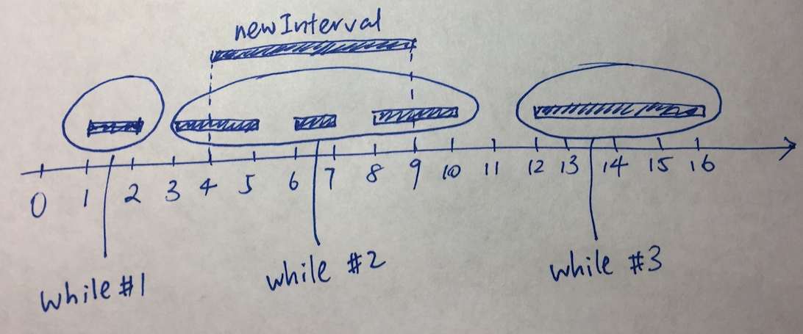

# 57. Insert Interval

## 题目描述

Hard

Given a set of *non-overlapping* intervals, insert a new interval into the intervals (merge if necessary).

You may assume that the intervals were initially sorted according to their start times.

**Example 1:**

```
Input: intervals = [[1,3],[6,9]], newInterval = [2,5]
Output: [[1,5],[6,9]]
```

**Example 2:**

```
Input: intervals = [[1,2],[3,5],[6,7],[8,10],[12,16]], newInterval = [4,8]
Output: [[1,2],[3,10],[12,16]]
Explanation: Because the new interval [4,8] overlaps with [3,5],[6,7],[8,10].
```

**NOTE:** input types have been changed on April 15, 2019. Please reset to default code definition to get new method signature.


## 解题思路：

解题思路比较简单，新建一个数组。

1.首先将与 左侧intervals加入数组。 2.合并中间与加入interval有交互的数组。3.加入右侧没有交互的数组。

> Very easy to understand code as follows.
>
> First, put all intervals that are to the left of the inserted interval.
> Second, merge all intervals that intersect with the inserted interval.
> Finally, put all intervals that are to the right of the inserted interval.
>
> That's it! You are done!
>
> from leetcode.





## 代码实现

```c
#include <cstdio>
#include <vector>
//#include <algorithm>
using namespace std;

class Solution {
public:
    vector<vector<int>> insert(vector<vector<int>>& intervals, vector<int>& newInterval) {
        //printf("aaaaaaaaaa\n");
        vector<vector<int>> ans;
        int index =0;
        while(index<intervals.size() && intervals[index][1] < newInterval[0] ){
            ans.push_back(intervals[index]);
            index++;
        }

        while(index < intervals.size() &&  intervals[index][0] <= newInterval[1] ){ //intervals[index][1] >= newInterval[0] &&
            newInterval[0]=min(intervals[index][0],newInterval[0]);
            newInterval[1]=max(intervals[index][1],newInterval[1]);
            index++;
        }
        ans.push_back(newInterval);
        while(index<intervals.size()){
            ans.push_back(intervals[index]);
            index++;
        }
        return ans;
    }
};


int main(){
    Solution s;
    vector<vector<int>> intervals={{1,2},{3,5},{6,7},{8,10},{12,16}};
    vector<int> newInterval ={4,8};
    s.insert(intervals,newInterval);

    return 0;
}

```

