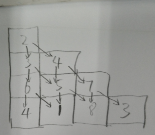

#### [120. 三角形最小路径和](https://leetcode-cn.com/problems/triangle/)

难度中等442收藏分享切换为英文关注反馈

给定一个三角形，找出自顶向下的最小路径和。每一步只能移动到下一行中相邻的结点上。

**相邻的结点** 在这里指的是 `下标` 与 `上一层结点下标` 相同或者等于 `上一层结点下标 + 1` 的两个结点。

 

例如，给定三角形：

```
[
     [2],
    [3,4],
   [6,5,7],
  [4,1,8,3]
]
```

自顶向下的最小路径和为 `11`（即，**2** + **3** + **5** + **1** = 11）。

 

**说明：**

如果你可以只使用 *O*(*n*) 的额外空间（*n* 为三角形的总行数）来解决这个问题，那么你的算法会很加分。

理解下表关系：

看起来是一个三角形：将所有元素往左侧压之后，位置`(i,j)` 只能从正上方 与 右上方 过来：`(i-1, j-1) ` 与`(i-, j-1)`

如下图所示：




## 思路：dfs(存在负值，不好剪枝)（超时）

递归终止条件： 当到达最后一行的时候，递归终止了；

除了最后一行 ，都需要继续向下，递归。

递归过程中，路径长度表回溯；

到达终点需要判断，当前路径长度是否是最短路径；

**可惜：超时；**

```java
class Solution {
    int shortestWay = Integer.MAX_VALUE;
    public int minimumTotal(List<List<Integer>> triangle) {
          dfs(triangle,0,0,0);
          return shortestWay;
    }
    void dfs(List<List<Integer>> triangle, int i , int j, int pathLen) {
         //System.out.println(i+" " +j+" " +pathLen);
         if(i == triangle.size() - 1 ) {
            pathLen += triangle.get(i).get(j);
            shortestWay = Math.min(pathLen, shortestWay);
            return;
         }
         pathLen += triangle.get(i).get(j);
         dfs(triangle, i+1  ,j ,pathLen);
         dfs(triangle, i+1  ,j + 1 ,pathLen);

    }
}
```


## 思路：动态规划算法（good）

动态规划： 定义子问题：`dp[i][j]` 表示到达位置`(i,j) ` 所需要的最短路径。

状态转移方程： `dp[i][j] = min{dp[i-1][j], dp[i-1][j-1]}`;

```java
class Solution { 
    //int shortestWay = Integer.MAX_VALUE;
    public int minimumTotal(List<List<Integer>> triangle) {
          int rows = triangle.size();
          int[] dp = new int[rows];
          dp[0] = triangle.get(0).get(0);
          for(int i = 1; i < rows; i++) {
             dp[i]  = dp[i-1] + triangle.get(i).get(i);
            //System.out.println(dp[i]);
             for(int j = i-1; j > 0;  j--) 
                dp[j] = Math.min(dp[j-1], dp[j]) + triangle.get(i).get(j);
              
              dp[0] = dp[0] + triangle.get(i).get(0);
          }
          
          int minVal = Integer.MAX_VALUE;
          for(int num : dp) 
            minVal = Math.min(num , minVal);
          return minVal;

    }
}
```

