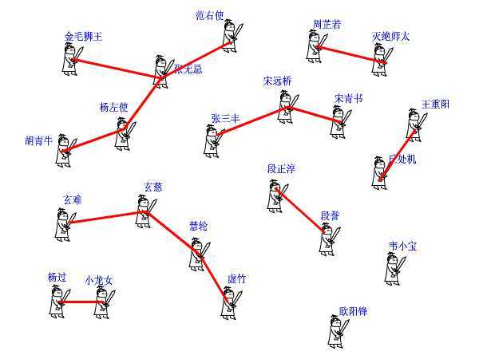
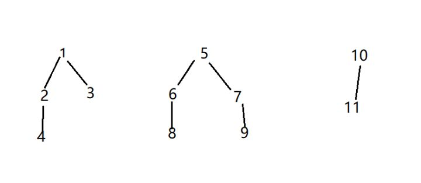

# 并查集waiting

查询递归过程可以压缩路径，代码比较精妙。:+1:

简单的理解和认识了一下，后续需要自己去实现一遍代码。

# 并查集知乎巨巨1

为了更好的理解，后面是网上大神们的理解：

来源：知乎

作者：Name1e5s

题图：Bernard A. Galler，并查集的提出者之一。

------

## 简介

并查集是一种树型的数据结构，用于处理一些不相交集（Disjoint Sets）的合并及查询问题。不相交集，顾名思义，就是交集为空集的一些集合。比如集合 {1,3,5} 和集合 {2,4,6} 就是不相交集。 {2,3,5} 和 {1,3,5} 就不是，因为他们的交集不是空集。该数据结构由Bernard A. Galler和Michael J. Fischer于1964年提出。

对于并查集，主要有如下操作：

1. 合并两个集合（“并”）
2. 判断两个元素是否属于同一个集合。（“查”）

为了能更好地理解这个数据结构，我们不妨看一下一个文风，看起来就很古老的故事(来自[这里](https://link.zhihu.com/?target=https%3A//blog.csdn.net/niushuai666/article/details/6662911))：

> 话说江湖上散落着各式各样的大侠，有上千个之多。他们没有什么正当职业，整天背着剑在外面走来走去，碰到和自己不是一路人的，就免不了要打一架。但大侠们有一个优点就是讲义气，绝对不打自己的朋友。而且他们信奉“朋友的朋友就是我的朋友”，只要是能通过朋友关系串联起来的，不管拐了多少个弯，都认为是自己人。这样一来，江湖上就形成了一个一个的群落，通过两两之间的朋友关系串联起来。而不在同一个群落的人，无论如何都无法通过朋友关系连起来，于是就可以放心往死了打。但是两个原本互不相识的人，如何判断是否属于一个朋友圈呢？
> 我们可以在每个朋友圈内推举出一个比较有名望的人，作为该圈子的代表人物，这样，每个圈子就可以这样命名“齐达内朋友之队”“罗纳尔多朋友之队”……两人只要互相对一下自己的队长是不是同一个人，就可以确定敌友关系了。
> 但是还有问题啊，大侠们只知道自己直接的朋友是谁，很多人压根就不认识队长，要判断自己的队长是谁，只能漫无目的的通过朋友的朋友关系问下去：“你是不是队长？你是不是队长？”这样一来，队长面子上挂不住了，而且效率太低，还有可能陷入无限循环中。于是队长下令，重新组队。队内所有人实行分等级制度，形成树状结构，我队长就是根节点，下面分别是二级队员、三级队员。每个人只要记住自己的上级是谁就行了。遇到判断敌友的时候，只要一层层向上问，直到最高层，就可以在短时间内确定队长是谁了。由于我们关心的只是两个人之间是否连通，至于他们是如何连通的，以及每个圈子内部的结构是怎样的，甚至队长是谁，并不重要。所以我们可以放任队长随意重新组队，只要不搞错敌友关系就好了。于是，门派产生了。




> 假设现在武林中的形势如图所示。虚竹小和尚与周芷若MM是我非常喜欢的两个人物，他们的终极boss分别是玄慈方丈和灭绝师太，那明显就是两个阵营了。我不希望他们互相打架，就对他俩说：“你们两位拉拉勾，做好朋友吧。”他们看在我的面子上，同意了。这一同意可非同小可，整个少林和峨眉派的人就不能打架了。这么重大的变化，可如何实现呀，要改动多少地方？其实非常简单，我对玄慈方丈说：“大师，麻烦你把你的上级改为灭绝师太吧。这样一来，两派原先的所有人员的终极boss都是师太，那还打个球啊！反正我们关心的只是连通性，门派内部的结构不要紧的。”玄慈一听肯定火大了：“我靠，凭什么是我变成她手下呀，怎么不反过来？我抗议！”抗议无效，上天安排的，最大。反正谁加入谁效果是一样的，我就随手指定了一个。

对于并查集还有两种优化：路径压缩和按秩合并

我们继续看上文的故事，对于武林啊，使用路径压缩大致就是相当于这样（依旧来自[这里](https://link.zhihu.com/?target=https%3A//blog.csdn.net/niushuai666/article/details/6662911)）：

> 建立门派的过程是两个人两个人地连接起来的，谁当谁的手下完全随机。最后的树状结构会变成什么胎唇样，我也完全无法预计，一字长蛇阵也有可能。这样查找的效率就会比较低下。最理想的情况就是所有人的直接上级都是掌门，一共就两级结构，只要找一次就找到掌门了。哪怕不能完全做到，也最好尽量接近。这样就产生了路径压缩算法。 设想这样一个场景：两个互不相识的大侠碰面了，想知道能不能揍。 于是赶紧打电话问自己的上级：“你是不是掌门？” 上级说：“我不是呀，我的上级是谁谁谁，你问问他看看。” 一路问下去，原来两人的最终boss都是东厂曹公公。 “哎呀呀，原来是记己人，西礼西礼，在下三营六组白面葫芦娃!” “幸会幸会，在下九营十八组仙子狗尾巴花！” 两人高高兴兴地手拉手喝酒去了。 “等等等等，两位同学请留步，还有事情没完成呢！”我叫住他俩。 “哦，对了，还要做路径压缩。”两人醒悟。 白面葫芦娃打电话给他的上级六组长：“组长啊，我查过了，其习偶们的掌门是曹公公。不如偶们一起及接拜在曹公公手下吧，省得级别太低，以后查找掌门麻环。” “唔，有道理。” 白面葫芦娃接着打电话给刚才拜访过的三营长……仙子狗尾巴花也做了同样的事情。 这样，查询中所有涉及到的人物都聚集在曹公公的直接领导下。每次查询都做了优化处理，所以整个门派树的层数都会维持在比较低的水平上。

而按秩合并，就是（本段由笔者自己瞎编）：

> ...（合并那部分）玄慈一听肯定火大了：“我靠，凭什么是我变成她手下呀，怎么不反过来？我抗议！”我一听这不行啊，万一他要一发火把我顺便削了可不好完，于是我就想了个比较公平的合并方法。和他说：“要不这样吧，你们俩比一比谁手下的人层数少，层数少的那个就变成层数多的那个的下级，你看怎样呀？”玄慈听了觉着还行，就按照我说的做了。

## C 语言实现

在这里，我们使用两个数组来实现带路径压缩和按秩合并策略的并查集合。因此，我们需要使用的声明如下：

```c
int disjoint[1024];
int rank[1024];
```

首先，我们需要一个建立并查集的函数，在此不再说明：

```c
void make_set(void) {
    for(int i = 0; i < 1024; i ++) {
        disjoint[i] = i;
        rank[i] = 0;
    }
}
```

之后就是查找函数（无路径压缩），按照上面的小故事，我们很容易就能写出这个函数：

```c
int find_set(int x) {
    int temp = x;

    while(disjoint[x] != x)
        x = disjoint[x]; // 一路向上寻找上级

    return x;
}
```

加上路径压缩后，代码如下：

```c
int find_set(int x) {
    if(x != disjoint[x])
         disjoint[x] = find_set(disjoint[x]);
     return disjoint[x];
}
```

你甚至能写到一行里：

```c
int find_set(int x){
        return x==disjoint[x]?x:disjoint[x]=find_set(disjoint[x]);
}
```

普通的合并算法：

```c
void union_set(int x,int y)
{
    fx = find_set(x);
    fy = find_set(y);
    if(fy!=fx) // 如果大 BOSS 不一样，就随便合并
       father[fx]=fy;
}
```

按秩（Rank）合并：

```c
void union_set(int x, int y)
{   x = find_set(x);
    y = find_set(y);
    
    if(rank[x] > rank[y])
        disjoint[y] = x;
    else 
    {
        disjoint[x] = y;
        if(rank[x] == rank[y])
            rank[y]++;
    }
}
```

## 附加资料

[这里](https://link.zhihu.com/?target=https%3A//ocw.mit.edu/courses/electrical-engineering-and-computer-science/6-046j-design-and-analysis-of-algorithms-spring-2012/lecture-notes/MIT6_046JS12_lec16.pdf) 有关于并查集的比较详尽的介绍

[这里](https://link.zhihu.com/?target=https%3A//visualgo.net/zh/ufds) 是该数据结构的可视化。

## 习题：

[HDU 1232](https://link.zhihu.com/?target=http%3A//acm.hdu.edu.cn/showproblem.php%3Fpid%3D1232)

[POJ 1611](https://link.zhihu.com/?target=http%3A//poj.org/problem%3Fid%3D1611)

[POJ 2542](https://link.zhihu.com/?target=http%3A//poj.org/problem%3Fid%3D2542)

[PAT-A 1013](https://link.zhihu.com/?target=https%3A//www.patest.cn/contests/pat-a-practise/1013)

# 并查集知乎巨巨2


## 简介

并查集，在一些有N个元素的集合应用问题中，我们通常是在开始时让每个元素构成一个单元素的集合，然后按一定顺序将属于同一组的元素所在的集合合并，其间要反复查找一个元素在哪个集合中。

顾名思义就是有“合并集合”和“查找集合”两种操作的关于数据结构的一种算法。

## 性质

并查集算法不支持分割一个集合。

## 算法思想

用集合中的某个元素来代表这个集合，该元素称为集合的代表元。
一个集合内的所有元素组织成以代表元为根的树形结构。
对于每一个元素 parent[x]指向x在树形结构上的父亲节点。如果x是根节点，则令parent[x] = x。
对于查找操作，假设需要确定x所在的的集合，也就是确定集合的代表元。可以沿着parent[x]不断在树形结构中向上移动，直到到达根节点。

判断两个元素是否属于同一集合，只需要看他们的代表元是否相同即可。

## 路径压缩

每次查找的时候，如果路径较长，则修改信息，以便下次查找的时候速度更快。
为了加快查找速度，查找时将x到根节点路径上的所有点的parent设为根节点，该优化方法称为压缩路径。

使用该优化后，平均复杂度可视为Ackerman函数的反函数，实际应用中可粗略认为其是一个常数。

## 用途

1、维护无向图的连通性。支持判断两个点是否在同一连通块内，和判断增加一条边是否会产生环。
2、用在求解最小生成树的Kruskal算法里。

## 初始化

初始化的时候，一个集合的parent都是这个集合自己的标号。没有跟它同类的集合，那么这个集合的源头只能是自己了。
在每一个单个的集合里面，有三个东西。
1，集合所代表的数据。（这个初始值根据需要自己定义，不固定）
2，这个集合的层次通常用rank表示（一般来说，初始化的工作之一就是将每一个集合里的rank置为0，以点为根的子树的深度）。
3，这个集合的类别parent（有的人也喜欢用set表示）（其实就是一个指针，用来指示这个集合属于那一类，合并过后的集合，他们的parent指向的最终值一定是相同的。）

## 结构体表示法

有的人是建立一个结构体把集合表示出来，如：

```cpp
#define MAX 10000
struct Node
{
    int data;
    int rank;
    int parent;
 }node[MAX];
```

## 数组表示法

有的人则是弄很多相同大小的数组，如：

```cpp
int set[max];//集合index的类别，或者用parent表示
int rank[max];//集合index的层次，通常初始化为0
int data[max];//集合index的数据类型

//初始化集合
void Make_Set(int i)
{
    set[i]=i;//初始化的时候，一个集合的parent都是这个集合自己的标号。没有跟它同类的集合，那么这个集合的源头只能是自己了。
    rank[i]=0;
}
```

一般来说，题目简单用数组，题目复杂用结构体，因为结构体有条理，数组可以少打几个字。

## 查找函数

就是找到parent指针的源头，可以把函数命名为get_parent（或者find_set）
如果集合的parent等于集合的编号（即还没有被合并或者没有同类），那么自然返回自身编号。
如果不同（即经过合并操作后指针指向了源头（合并后选出的rank高的集合））那么就可以调用递归函数：

```cpp
/**
*查找集合i（一个元素是一个集合）的源头（递归实现）。
 如果集合i的父亲是自己，说明自己就是源头，返回自己的标号；
 否则查找集合i的父亲的源头。
 没有压缩路径
**/
int get_parent(int x)
{
    if(node[x].parent==x)
        return x;
    return get_parent(node[x].parent);
}
```

数组的话就是：（没有压缩路径）

```cpp
//查找集合i（一个元素是一个集合）的源头（递归实现）
int Find_Set(int i)
{ 
    //如果集合i的父亲是自己，说明自己就是源头，返回自己的标号
   if(set[i]==i)
       return set[i];
    //否则查找集合i的父亲的源头
    return  Find_Set(set[i]);        
}
```

合并集合函数

```cpp
void Union(int a,int b)
{
    a=get_parent(a);
    b=get_parent(b);
    if(node[a].rank>node[b].rank)
        node[b].parent=a;
    else
    {    
        node[a].parent=b;
        if(node[a].rank==node[b].rank)
            node[b].rank++;
    }
}
```

再给出数组显示的合并函数：

```cpp
void Union(int i,int j)
{
    i=Find_Set(i);
    j=Find_Set(j);
    if(i==j) return ;
    if(rank[i]>rank[j]) set[j]=i;
    else
    {
        if(rank[i]==rank[j]) rank[j]++;   
        set[i]=j;
    }
}
```


# 题目实战

## Description

若某个家族人员过于庞大，要判断两个是否是亲戚，确实还很不容易，给出某个亲戚关系图，求任意给出的两个人是否具有亲戚关系。 规定：x和y是亲戚，y和z是亲戚，那么x和z也是亲戚。如果x,y是亲戚，那么x的亲戚都是y的亲戚，y的亲戚也都是x的亲戚。

## Input

第一行：三个整数n,m,p，（n ![[公式]](并查集笔记.assets/equation.svg) 5000,m ![[公式]](并查集笔记.assets/equation.svg) 5000,p ![[公式]](并查集笔记.assets/equation.svg) 5000），分别表示有n个人，m个亲戚关系，询问p对亲戚关系。
以下m行：每行两个数 ![[公式]](并查集笔记.assets/equation-1570759245487.svg) ， ![[公式]](并查集笔记.assets/equation-1570759245488.svg) ，1 ![[公式]](并查集笔记.assets/equation.svg) ![[公式]](并查集笔记.assets/equation-1570759245487.svg) ， ![[公式]](并查集笔记.assets/equation-1570759245488.svg)![[公式]](并查集笔记.assets/equation.svg) N，表示Mi和Mj具有亲戚关系。
接下来p行：每行两个数Pi，Pj，询问Pi和Pj是否具有亲戚关系。

```text
11 8 6
1 2
1 3
2 4
5 6
5 7
6 8
7 9
10 11

4 6
3 9
5 9
11 6
7 8
3 4
```

## Output

P行，每行一个’Yes’或’No’。表示第i个询问的答案为“具有”或“不具有”亲戚关系。

```text
No
No
Yes
No
Yes
Yes
```

## 分析

初步分析觉得本题是一个图论中判断两个点是否在同一个连通子图中的问题。对于题目中的样例，以人为点，关系为边，建立无向图。
用图的数据结构的最大问题是，我们无法存下多至( ![[公式]](并查集笔记.assets/equation-1570759245563.svg) ![[公式]](并查集笔记.assets/equation-1570759245586.svg) )2 000 000条边的图，后面关于算法时效等诸多问题就免谈了。
用图表示关系过于“奢侈”了。其实本题只是一个对分离集合（并查集）操作的问题。
我们可以给每个人建立一个集合，集合的元素值有他自己，表示最开始时他不知道任何人是它的亲戚。以后每次给出一个亲戚关系a, b，则a和他的亲戚与b和他的亲戚就互为亲戚了，将a所在集合与b所在集合合并。



对于样例数据的操作全过程如下：
输入关系 分离集合
初始状态
(2,4) {2,4}
(5,7) {2,4} {5,7}
(1,3) {1,3} {2,4} {5,7}
(6,8) {1,3} {2,4} {5,7} {6,8}
(1,2) {1,2,3,4} {5,7} {6,8}
(5,6) {1,2,3,4} {5,6,7,8}
(7,9) {1,2,3,4} {5,6,7,8,9}
(10,11) {1,2,3,4} {5,6,7,8,9} {10,11}

最后我们得到3个集合{1,2,3,4}, {5,6,7}, {8,9}，于是判断两个人是否亲戚的问题就变成判断两个数是否在同一个集合中的问题。如此一来，需要的数据结构就没有图结构那样庞大了。
算法需要以下几个子过程：
(1) 开始时，为每个人建立一个集合SUB-Make-Set(x)；
(2) 得到一个关系后a,b，合并相应集合SUB-Union(a,b)；
(3)此外我们还需要判断两个人是否在同一个集合中，这就涉及到如何标识集合的问题。我们可以在每个集合中选一个代表标识集合，因此我们需要一个子过程给出每个集合的代表元SUB-Find-Set(a)。于是判断两个人是否在同一个集合中，即两个人是否为亲戚，等价于判断SUB-Find-Set(a)=SUB-Find-Set(b)。

并查集的“路径压缩”算法：在集合的查找过程中顺便将树的深度降低。采用路径压缩后，每一次查询所用的时间复杂度为增长极为缓慢的[ackerman函数](https://link.zhihu.com/?target=https%3A//baike.baidu.com/item/ackerman%E5%87%BD%E6%95%B0/2750194%3Ffr%3Daladdin)的反函数—α（x）。对于可以想象到的n，α（n）都是在5之内的。

## CODE

```c++
#include<iostream>
#include<cstring>
#include<cstdio>
#include<cstdlib>
using namespace std;
 
int father[50002],a,b,m,n,p;
int find(int x){
if(father[x]!=x)
father[x]=find(father[x]);
/*
x代表例题中的人，father[x]中所存的数代表这一集合中所有人都与一个人有亲戚关系
相当于例题中第一个集合所有的元素都与第一个元素有亲戚关系
搜索时只要找元素所指向的father[x]=x的元素(即父元素)
然后比较两个元素的父元素是否相同就可以判断其关系
*/
return father[x];
}
int main()
{
  int i;
  scanf("%d%d%d",&n,&m,&p);
  for(i=1;i<=n;i++)
    father[i]=i;
  for(i=1;i<=m;i++)
    {
      scanf("%d%d",&a,&b);
      a=find(a);
      b=find(b);
      father[a]=b;
    }
  for(i=1;i<=p;i++)
    {
      scanf("%d%d",&a,&b);
      a=find(a);
      b=find(b);
      if(a==b)
        printf("Yes\n");
      else
        printf("No\n");
    }
  return 0;
}
```


Leetcode 128 最长连续子序列；（困难）；

给定一个未排序的整数数组，找出最长连续序列的长度。

要求算法的时间复杂度为 O(n)。

示例:

输入: [100, 4, 200, 1, 3, 2]
输出: 4
解释: 最长连续序列是 [1, 2, 3, 4]。它的长度为 4。

来源：力扣（LeetCode）
链接：https://leetcode-cn.com/problems/longest-consecutive-sequence

做法1：就是使用并查集；

```java
class Solution {
    //用于记录父节点;
    HashMap<Integer,Integer> fa =new HashMap <>();
    //记录集合元素个数;
    HashMap<Integer,Integer> count =new HashMap <>();
    public int longestConsecutive(int[] nums) {
        int len = nums.length;
        if(len == 0)
            return 0;
        // make_set
        for(int a : nums) {
            fa.put(a,a);
            count.put(a,1);
        }
        int maxRank = 1;
        for(int k : nums) {
            if(fa.containsKey(k+1))
                maxRank = Math.max(merge(k, k+1), maxRank);
        }
        return maxRank;

    }

    public int find(int x) {
        if(fa.get(x) == x) return x;
        int fx =  find(fa.get(x));
        fa.put(x, fx);
        return fx; 
    }
    /*合并两个集合，并且返回合并后集合个数*/
    public int merge(int x, int y) {
        int fx = find(x);
        int fy = find(y);
        if(fx == fy)
            return count.get(fx);
        int tmp = count.get(fx) + count.get(fy);
        if(count.get(fx) > count.get(fy)) {
            fa.put(fy, fx);
            count.put(fx,tmp);
        }
        else {
            fa.put(fx, fy);
            count.put(fy,tmp); 
        }
        return tmp;
   
    }
}
```


