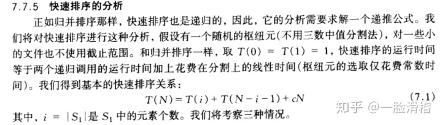
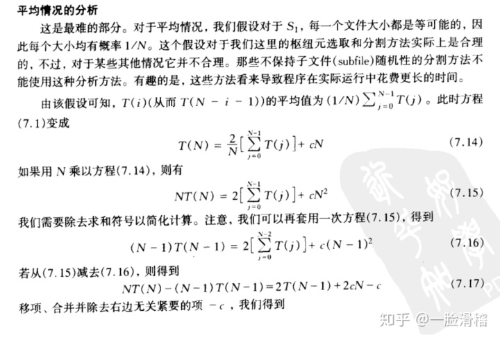
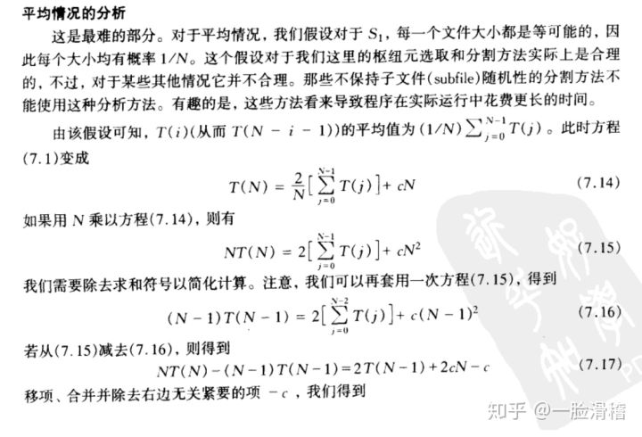
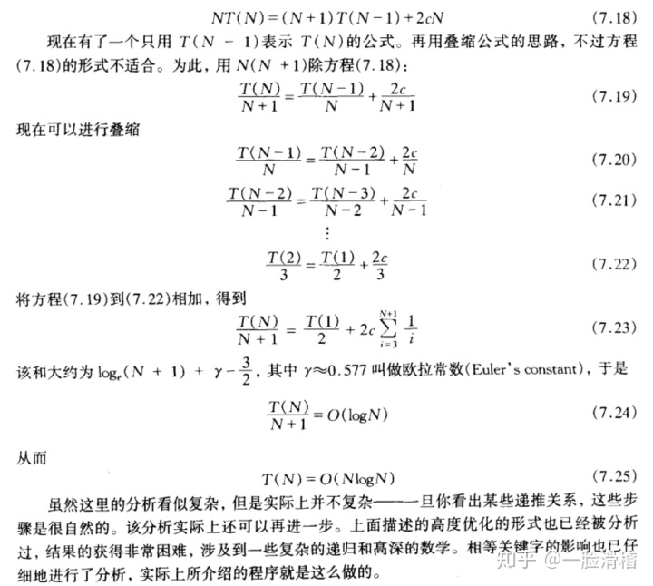
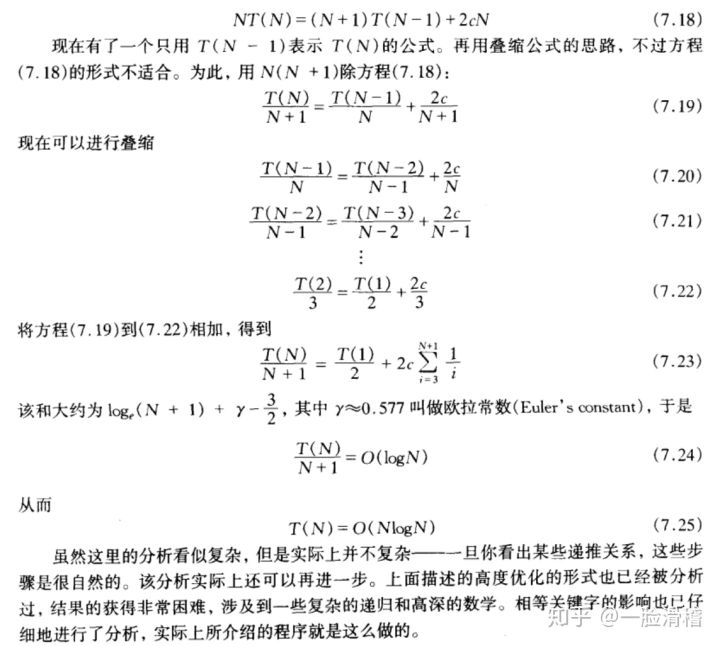
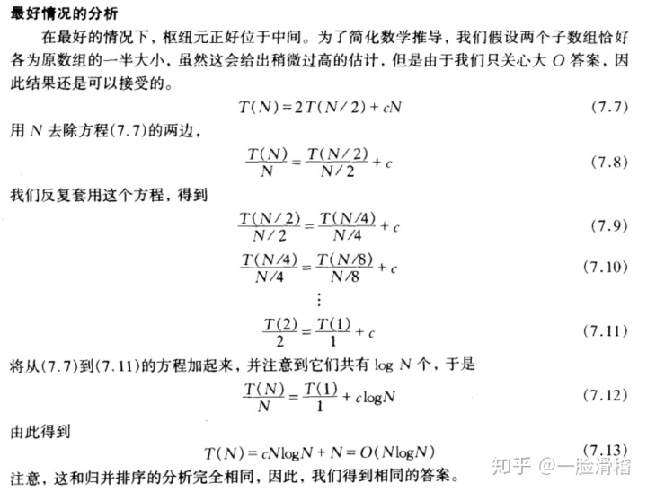
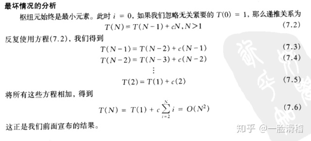
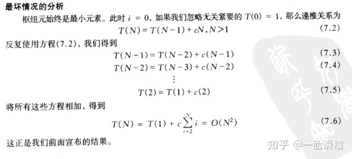

快速排序复杂度证明

作者：一脸滑稽
链接：https://www.zhihu.com/question/22393997/answer/406317544
来源：知乎
著作权归作者所有。商业转载请联系作者获得授权，非商业转载请注明出处。

摘自《数据结构与算法分析——C语言描述》，个人认为讲得还是相当通俗易懂的，而且平均、最好、最坏这三个时间复杂度都有。

## 基本的快速排序关系：

1. 平均时间复杂度：

2. 最好时间复杂度：

3. 最坏时间复杂度：

