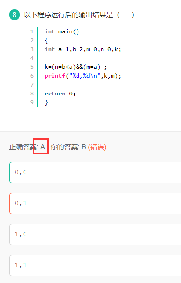
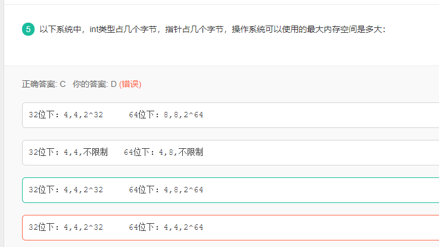
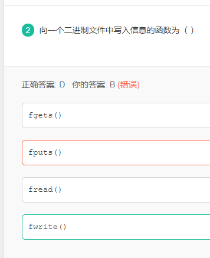

## 数组移动题

补充下面函数代码：
如果两段内存重叠，用`memcpy`函数可能会导致行为未定义。 而memmove函数能够避免这种问题，下面是一种实现方式，请补充代码。 

```C++
#include <iostream>
using namespace std;
void* memmove(void* str1,const void* str2,size_t n)
{
    char* pStr1= (char*) str1;
    char* pStr2=(char*)str2;
    if  ( ) {
        for(size_t i=0;i!=n;++i){
            *(pStr1++)=*(pStr2++);
        }
    }
    else{
        pStr1+=n-1;
        pStr2+=n-1;
        for(size_t i=0;i!=n;++i){
            *(pStr1--)=*(pStr2--);
        }
    }
    return ( );
}
```

正确答案: A  你的答案: A (正确)

```output
pStr1< pStr2   str1
pStr1+n < pStr2   str2
pStr1+n < pStr2 || pStr2+n<pStr1  str2
pStr2+n<pStr1   str1
```


解析1：


黑色曲线表示错误的拷贝方式，红色的曲线表示正确的拷贝方式。

黑色方块表示的是二者内存覆盖的区域

与 pstr*+n 没有关系

第一中选择分支对应的是图 1 中红色曲线的拷贝方式 (方向： pstr2 -> pstr1)

第二中选择分支  else ... 对应的是图 2 中红色曲线的拷贝方式

方向是 pstr2 -> pstr1


解析2：

原型：void *memmove( void* dest, const void* src, size_t count );

头文件：<string.h>

功能：由src所指内存区域复制count个字节到dest所指内存区域。

如果目标区域和源区域有重叠的话，memmove能够保证源串在被覆盖之前将重叠区域的字节拷贝到目标区域中。但复制后src内容会被更改。但是当目标区域与源区域没有重叠则和memcpy函数功能相同。 

结合高票答案的图：

当pStr1< pStr2时，即 pStr1的首地址小于  pStr2的首地址（图1），正序拷贝

当pStr1> pStr2时，即 pStr1的首地址大于  pStr2的首地址（图2），倒叙拷贝


## 运算符优先级错题：




 



