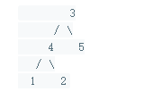
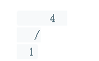

# [面试题26. 树的子结构](https://leetcode-cn.com/problems/shu-de-zi-jie-gou-lcof/)

## 难度中等38

输入两棵二叉树A和B，判断B是不是A的子结构。(约定空树不是任意一个树的子结构)

B是A的子结构， 即 A中有出现和B相同的结构和节点值。

例如:
给定的树 A:


给定的树 B：


返回 true，因为 B 与 A 的一个子树拥有相同的结构和节点值。

**示例 1：**

```
输入：A = [1,2,3], B = [3,1]
输出：false
```

**示例 2：**

```
输入：A = [3,4,5,1,2], B = [4,1]
输出：true
```

**限制：**

```
0 <= 节点个数 <= 10000
```

## 题目模板：

```C++
/**
 * Definition for a binary tree node.
 * struct TreeNode {
 *     int val;
 *     TreeNode *left;
 *     TreeNode *right;
 *     TreeNode(int x) : val(x), left(NULL), right(NULL) {}
 * };
 */
class Solution {
public:
      bool isSubStructure(TreeNode* A, TreeNode* B) {
      }
};
```

解题思路：

判断B树是不是A树的子结构：分为两步；

- 第一步：使用先序遍历 遍历A树；
- 对A树的每颗子树，与B树进行比较；以A为根节点的树是否包含 以B为根节点的树；

```C++
/**
 * Definition for a binary tree node.
 * struct TreeNode {
 *     int val;
 *     TreeNode *left;
 *     TreeNode *right;
 *     TreeNode(int x) : val(x), left(NULL), right(NULL) {}
 * };
 */
class Solution {
public:
     //实现方式1： 在调用isSubStructure过程中，
    //如果B树为空，那么直接也直接就是false;
    //根据题目要求，B树不为空树；如果A树为空，那么就是false;
    //树B是树A的子结构：需要满足一下三种情况之一：
    //1.以A为根节点的子树包含 B树recur(A,B)
    //2.B树是A左子树的子结构；
    //2.B树是A右子树的子结构；
      bool isSubStructure(TreeNode* A, TreeNode* B) {
        bool result =false;
        if(A!=nullptr&&B!=nullptr){
            result = recur(A,B)|| isSubStructure(A->left,B) || isSubStructure(A->right,B);
        }
        return result;
    }
    //判断以A为根树，是否包含以B为根的树；（其中根节点需要对齐）
    //当B为空，则说明B以越过叶子节点，（匹配完毕了）；因此返回true;
    //当B不为空，A为空时，说明已经越过A叶子节点，匹配失败（B还有子结构，但是A中没有了），返回false;
    //当两者都不为空，但是值不相同的时候，说明匹配失败了；
    //两个值相等，则取决于两个的左右子树是否也匹配；
    bool recur(TreeNode* A,TreeNode* B){
        if(B==nullptr) return true;
        if(A==nullptr|| A->val != B->val) return false;
        if(A->val==B->val)
            return recur(A->left,B->left) && recur(A->right,B->right);
        return false;
    }
    
    //剑指offer解析
    bool isSubStructure1(TreeNode* A, TreeNode* B) {
        bool result =false;
        if(A!=nullptr&&B!=nullptr){
            if(A->val == B->val){
                result = doTree1HasTree2(A,B);
            }
            if(!result)
                result=isSubStructure(A->left,B);
            if(!result)
                result=isSubStructure(A->right,B);    
            
        }
        return result;
    }
    // tree1从根开始包含tree2
    bool doTree1HasTree2(TreeNode* t1,TreeNode * t2){
        if(t2==nullptr)
            return true;
        if(t1==nullptr)
            return false;
        if(t1->val != t2->val)
            return false;
        return doTree1HasTree2(t1->left,t2->left)&&doTree1HasTree2(t1->right,t2->right);
    }
};
```

