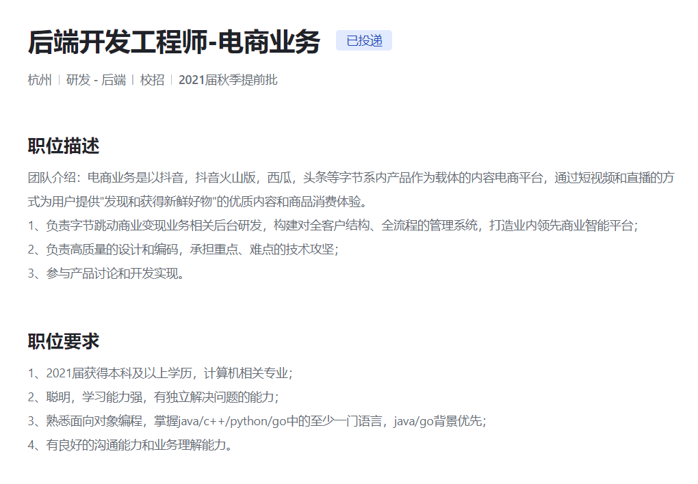

## 投递岗位：字节跳动 > 后端电商业务

**Q: 开始吧**

A：我先简单的进行自我介绍，我是xxx，目前是xx，......(因为没有准备，自我介绍其实有点乱的)

Q：**这个绿城大脑的项目，你负责做了什么？**

A：我负责后端sql语句的编写；

Q: **你对数据库比较熟悉是吧，连表查询有使用过吗~。**

A：这个绿城可视化项目比较简单，表结构也比较简单，链表查询比较少（其实没做过，乱说），不过我在之前维护的职称系统里面，连表查询用的比较多；比如什么左连接，右连接，自然连接。

**Q: 自然连接，语句怎么写。**

A：select xx  yy from a, b where a.x = b.y; (我真是菜啊，连这么个语句就突然有点想不起来了)

**Q: 什么是左连接**

A：类似于两个集合 有部分元素相交，我们取左独有的部分；（回答错了）

**Q: 什么是右连接**

A: 和左连接相反的过程，左连接具体的代码实现；（又忘了）

**Q: 什么是自然连接？**

A：取集合A 与 集合B两个集合所有的部分；

Q: **还知道什么连接？**

A: 其他想不来起来了..

**Q: 你在做数据库的时候，没有遇到过这种情况，数据库表中某个字段来自于其他表中的字段、**

A: 我没能理解它想问什么，自顾自说了一堆，我遇到过类似的情况，我是通过java代码读取表中数据，然后在内存中统计，再写入表中。

**Q: 操作系统学过的吧，解释一下什么是死锁；**

A：我直接描述了一个场景，两个或者两个以上的进程，出现类似于，进程1 占用资源A， 后需要资源A ； 进程2，占用资源B后，需要资源A；A 与 B同时需要对方所占有的资源，对方却不释放。

**Q: 你描述了一种死锁的场景，你能总结一下发生死锁，操作系统发生死锁需要哪些条件吗？**

A：首先需要两个以上的资源。。总结不出来了。

**Q: 进程与线程有什么区别？**

首先线程是操作系统进行调度的基本单位，每个进程有自己的内存，一个进程可以有多个线程，多个线程共享内存空间；从数据结构的角度上来说，就是有没有共享内存的区别？ （这边回答的稀烂）；

**Q:  计算机网络熟悉吗？ UDP 和TCP区别**

A: UDP 是用户数据包协议，是无连接的，不提供可靠交付的。TCP是建立连接的，提供可靠交付的。

我真是菜，基本问题都出现了问题 

**A: UDP和TCP哪个首部字段更长一些？**

TCP, TCP首部字段更长，TCP协议，TCP协议更加复杂，提供拥塞控制机制，提供滑动窗口机制，可靠传输，这些功能都需要首部字段进行提供；（回答的时候，其实没回答的这么好，我就说了TCP协议复杂。。然后又拥塞避免）

**Q : 你既然提到了拥塞避免，那么拥塞避免的具体算法，你知道吗？**

A:  这个忘记了...

Q: **然后给了一道题目**：**顺时针打印矩阵**

A: 写了半天，写出来了过了简单的案例，然后面试官的案例过不了。

**Q: 你在调试一下，输入4行，5列**

A: 调试了一会，发现有个变量 -- 被我脑残写成了++  (但是还是有指针异常)

A: 有指针越界了，但是

**Q: 描述一下思路：**

A： 描述。。。。

Q: 描述的还是比较清楚的，从结果是对的，但是边界上没有控制好。

Q; 你有什么问题吗？

A: 我听说，字节跳动都是以go语言作为主要后端言语，我如果进了需要转岗吗？

**Q: 字节90%后端都是，golang,  我们有很多都是java转golang的， 你有什么问题吗？**

A： 没有什么问题。

Q: 请问这次面试会不会影响后面的秋招？

**A: 这个我不知道，我只是来负责这次面试的人。**

Q: 请问如果这次面试通过了，后面还有次面试、

A: 你指的是包括HR面试吗？

Q: 是的；

**A：思考了一会，没说什么？**

Q: 没什么问题了

**A: 好，今年就到了这里了，感谢你的参与，不好意思，让你等我半小**

Me: 没什么问题，非常感谢面试官，能给我一个面试的机会，我就很开心了，我比较差哈~

 

**Summary:**

自己不怎么看你使用什么编程语言，只要你基础足够扎实。

足够说明了，操作系统，计算机网络，数据库的重要性；

特别是 进程与线程，TCP与UDP;