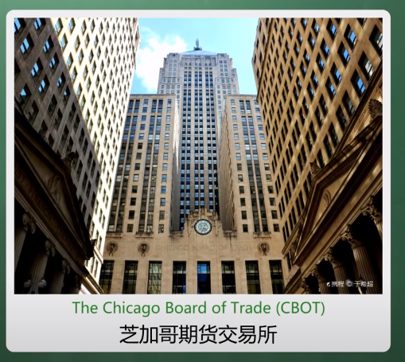

# 期货基本

## 一.远期合约

区别于现货：一手交钱，一手交货；

### 1.1 荷兰郁金香狂热  江户幕府时代：稻米

 套期保值：

这一年：

`将军` 将订单的一部分钱 交给`农民`，`农名`将交易合约给将军；

第二年：

`将军`根据这份合约，交易获取稻米；

将军害怕明年的时候，稻米价格上涨；

农名害怕明年的时候，稻米价格下跌；

### 1.2 问题 “毁约“ 、“质量”、交易不便；

毁约： 将军方毁约，农名毁约； 一年后，将军根据市场价格和毁约消耗的钱，计算得到毁约之后，更加能够获取收益；

质量：明年的东西质量无法保证；

交易不便：比如农民A 生病了，无法干活无法生产粮食了，农民A想把合约交易给农民B；

## 二、标准期货合约

将远期合约标准化；

2.1 1865 年 芝加哥（芝加哥期货交易所)  创建了第一份标准期货合约

- 规定了 质量， 数量
- 规定了交割的时间，地点
- 规定了允许场内交易

### 举例说明：

#### “WTI原油期货”  是一份合同

轻质低硫原油 1000桶  每月20-25日  库欣（交易地点）；

唯一没有确定价格；

不需要自己去买卖原油 就产生了投机交易；

## 三、期货投机

`期货合约的价 = 单价*合约规模`

`20美元 * 1000 = 20000 美元`  这2万美元，不是你打给我，我打给你的；

这里的意思是：在每月的25号，以2万美元的价格交易；

#### 2 开仓，平仓；

------------------------------------------------------

​                         开仓 价格P1

卖（空）方 ------------------>   买（多）方

​					<------------------

​					   平仓  P2  	·

**开仓：**有一天呢，空方 将一个合约卖给了多方 ，称为开仓；

表明：

- 多方  会以2万美元你的价格来购买1K桶原油，只是还没有交货而已；

- 空方 约定卖出了1K桶油，它约定价格是2万美元；（但是空方其实不一定有原油，到那个时候也不一定交的了货）；

过一段时间会两者都会平仓：

若出现价格 :`P1 <P2`  , 多方胜利，空方败了；

若出现价格：`P1>P2` 多方败了，空方胜利；

## 四 、保证金交易制度

| 日期             | 假设10%     | 甲方（多方） | 乙方（空） |
| ---------------- | ----------- | ------------ | ---------- |
|                  | 价格20000元 | 2000元保证金 | 2000元     |
| 第二天，油价上涨 | 21000元     | 3000元       | 1000元     |
| 乙追加1100元     |             |              | 2100元     |
| 第三天，油价上涨 | 25000元     | 7000元       | -1900元    |

4月20左右 某第一天，  甲方将会在5月， 以 20000美元的价格，从乙出购入 1千桶原油 的 合约；

假设第二天油价上涨到了21000元，（我可以以2万元的价格买到一千桶油，但是现在1千桶油的价格是2.1  万元 ）

所以甲赚了1K元，因为价格上涨，甲的这份合约就值钱了；

这时候，甲的账户里 3000元，乙账户1000元；

这时候乙账户 已经不够当前价格的10%， 保证金不够，需要追加保证金，追加1100元；

假设第三天油价上涨到了25000元，

油价再次上涨，甲的手里的合约又值钱了

这时候，甲账户里7000元，乙账户里-1900元；

这时候乙账户 已经不够当前价格的10%， 保证金不够，需要追加保证金，追加4400元；

平仓**

好了这时候，乙已经没有钱了， 不再追加；这时候强行平仓；

甲买的时候以 P1 = 20000元的价格，从乙处购入原油合约；

现在乙以P2 = 25000元的价格，回购原油合约；

**导致结果** 

甲方：赚了5000元，乙方亏损5000元；

最后甲的账户，就变变成7000元（原来2000是自己的），乙的账户就会变成 - 1900元（初始金额2000，追加金额1100，欠期货公司-1900）；

**这 就会出现这么情况：你不仅本金赔光，而且出现倒欠期货公司钱的情况；**

期货的杠杆 比较大：你可能因为一个波动而赚很多的钱；

你可能只持有2000本金，**却赚了5000块**；

你也可能持有2000本金，**你不光 赔光所有本金，还倒欠期货公司3000块的情况**；

==**期货是一念天堂，一念地狱的；**==

期货不能长期持有，

股票可以长期持有，跌了可以不管它，有朝一日会涨回来；

你比如说石油，石油价格狂跌，比方说我卖点原油我存着，以后石油涨价了我再买掉不行吗？

**不行**

期货有一个到期日和交割，这么一个说法；

## 五、到期日和交割

就是期货定义的，什么日期，到什么地方交易多少东西；

如果你没有这个能力的话，你需要做一下几种工作之一；

（1）平仓：就是原来你买了，就把它给卖出去；如果你卖了，就把它给买回来；不管价格是多少；

（2）移仓换月：我们买的是5月份的，将5月份的平仓；继续买入6月份的；（一般发生在交易日最后几天）

==原油宝== 出现了问题：正好在交易日结束的时候，流动性没有了，你想平，没人卖给你；

（3）前两种都不做的情况下，会交割（实物交割，改金）

- 多方：以某个价格获取1000桶油；如果你持有多单，你需要要做这件事，这是责任；（这边是原油宝）

现在呢，我不想要原油啊，我本身是一个炒期货的投机者，我不想到美国库欣那提原油走，我也没有这个设备；

那么我会在合约到期之前平仓，将原油卖出去；

卖20美元没人要 ！！

我卖10美元，还是没人要！！！

5美元！！

0.01美元！

这时候指望着空方接单，空方和多方的地位是一样的（空方，需要付出某个价格 提供1000桶原油）；

但是这时候，你不知道这些空方到底是干嘛的？

也许空方背后就是有大型石油公司支持的，它们就是有油；

空方说：我不怕，我有油，大不了到时候交割，我到时候把原油给你不就行了吗？

多方：你给我油，我工具去拉，也我没地方放啊 ? 现在，美国库欣的那些原油罐都充满了。 

多方不取走不行吗？

不行，这属于合约到时间，没有交割，期货交易所会罚钱的 ！

多方，找运油车把它运走，运油车价格可不便宜；

多方，将原油像牛奶一样倒在地上？ 那就要被政府罚死了；

但是，空方又不接单，怎么办？多方只能继续往下压价

于是价格就变成了   - 37,63美元

**-37.63美元    什么意思呢？** 

谁接了我这个单，你不光可以拿走1000桶原油，而且每一桶油我还额外的附赠你 37.68美元；你可以拿这个钱去储存于运输这个油；

于是：空方就 勉为其难接受了，双方就平仓了

## 六. 投资者案例

投资者 以1万美元的价格 在WTI在0.01美元的时候，买了1,000.000桶油

心说： 太划算了，我只花了0.01美元的价格，就买了一桶油；

如果涨价长到了0.02美元，就翻倍了；

加入涨不上去也没有关系，我一万美元拿了1万桶油，还有比这更划算的买卖吗？

结果一觉醒来，

价格由0.01美元，下降到了 -37.6美元  每桶；

你账户的余额，变成了**-3763万美元**   疯掉了

原因是因为：我们对规矩没有特别清楚，期货是美国人发明的，我们想要和美国人玩期货，必须了解期货的规矩；

四月中旬的时候，美国芝加哥期货交易所就说了，原油期货价格可能会跌成负值；

跌成负的，会出现什么技术问题？出现什么金融风险？你是不是进行了充分考虑；

期货是一个非常专业的领域，如果你一点专业知识都不懂，想要凭借这炒股票的经验去抄期货的话，可能会配的倾家荡产；