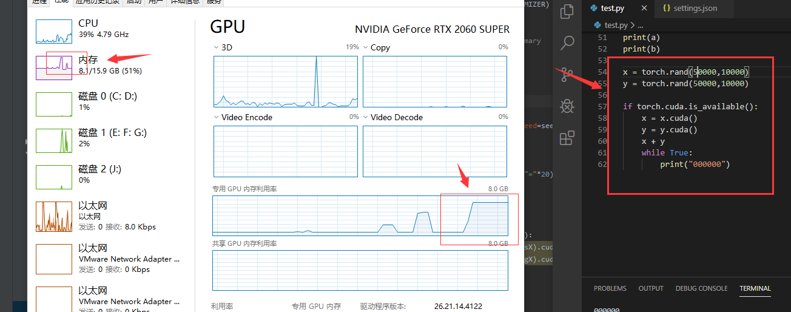
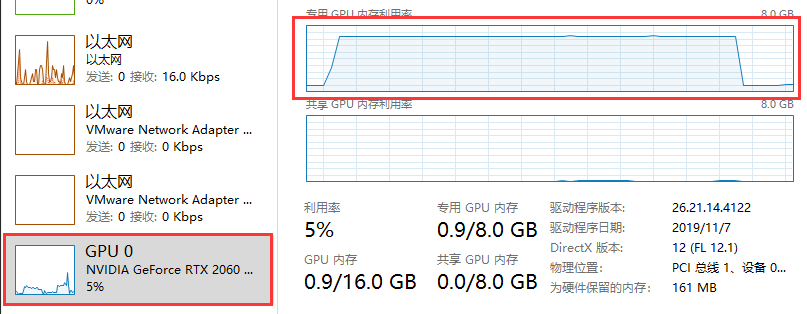
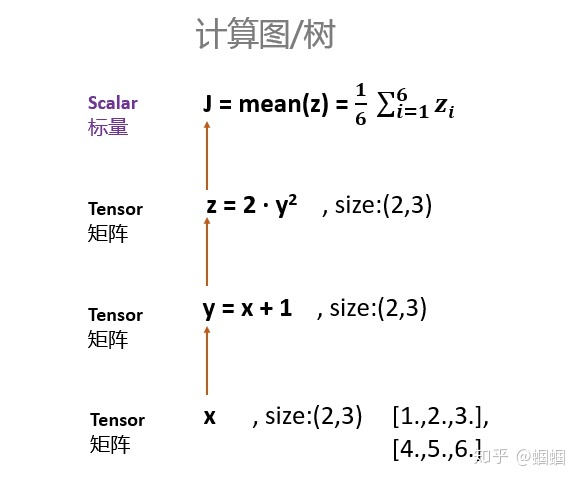
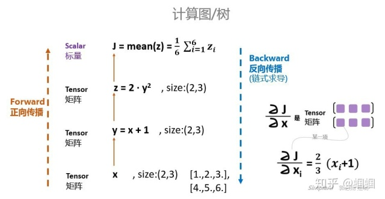
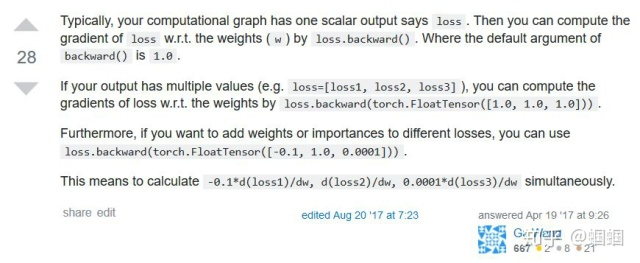
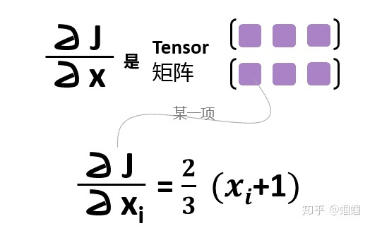
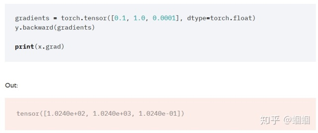
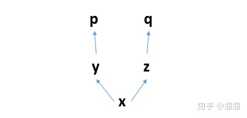
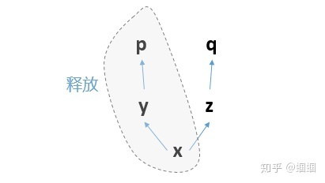

## CUDA

将Tensor转换为GPU的Tensor，从而享受GPU带来的加速运算

```python
x = torch.rand(50000,10000)
y = torch.rand(50000,10000)
if torch.cuda.is_available():
    x = x.cuda()
    y = y.cuda()
    x + y
    while True:
        print("000000")
```

你可能发现GPU没有提升很多，原因是x与y太小且，运算也被比较简单，并且将数据从内存转移到显存还需要花费不少额外的开销。

GPU的优势在大规模数据和复杂运行才能体现出来。







### 反向传播

`autograd` 自动微分：通过反向传播求导。

对最后的偏差公式，对某个权重求导：

隐藏层`->`  输出层权值更新：

`w5,w6,w7,w8` 权值更新：

输入层`->`隐藏层(隐藏层`->` 隐藏层)的权值更新：


## Tensor


## Torch.auograd.Variable

\# Variable 这个变量主要有三个属性：

\# data 保存Variabale包含的Tensor

\# grad 保存data对应的梯度，grad也是一个Variable,不是Tensor 形状了data一样

\# grad_fn ： 指向一个Function对象，这个函数对象用来反向计算输入的梯度

```python
In [47]: y.grad_fn
Out[47]: <SumBackward0 at 0x14f2458d448>

In [48]: y.backward()

In [49]: y = x.sum()

In [50]: x.grad

In [51]: y = x.sum()

In [52]: y
Out[52]: tensor(8.2179)

In [53]: y = x1.sum()
In [54]: y
Out[54]: tensor(4., grad_fn=<SumBackward0>)

In [57]: y = x1.sum()
In [59]: x1.grad
Out[59]: 
tensor([[1., 1.],
        [1., 1.]])

In [60]: y.backward()
In [61]: x1.grad
Out[61]: 
tensor([[2., 2.],
        [2., 2.]])

In [62]: y.backward()
In [63]: y.grad
In [64]: x1.grad
Out[64]: 
tensor([[3., 3.],
        [3., 3.]])

In [65]: x1.grad.data.zero_()
Out[65]: 
tensor([[0., 0.],
        [0., 0.]])

In [66]: y.backward()
In [67]: x.grad
In [68]: x1.grad
Out[68]: 
tensor([[1., 1.],
        [1., 1.]])

```

> 注意 grad在反向传播的过程中是累加的（accumulated）,每次反向传播，梯度都会累加之前的梯度，所以反向传播之前需要把梯度清零。

Variable 和Tensor具有近乎一致的接口，在实际使用过程中可以无缝切换。

>  backward函数是反向求导数，使用链式法则求导，如果对非标量y求导，函数需要额外指定grad_tensors，grad_tensors的shape必须和y的相同。 


大佬的知乎专栏：

来源：知乎专栏

 https://zhuanlan.zhihu.com/p/51385110 

作者：蝈蝈

> 听麻麻说，偷偷收藏而不感谢是不礼貌的，至少应该点个赞~我觉得麻麻说的对！


> 不断地被人安利PyTorch，终于忍不住诱惑决定入坑了。
> 当我翻看PyTorch官网的时候，一下子就爱上了它那清晰的文档和友好的入门指南。所以决定好好地系统性地把PyTorch学一学。所以，记一份适合自己的更加清晰简明的笔记，把基础打牢固，就很有必要了。
> 这份笔记的目的，主要是**方便随时查阅**，不必去看详细的冗长的原始文档。也方便跟我一样的小白可以**迅速入门，快速实践**。同时，我来记录笔记的过程中，也会**补充深度学习相关的知识**，在学习PyTorch框架的时候，也学习/复习深度学习。
> **本篇是PyTorch简明笔记第[2]篇.**

构建深度学习模型的基本流程就是：搭建计算图，求得损失函数，然后计算损失函数对模型参数的导数，再利用梯度下降法等方法来更新参数。

搭建计算图的过程，称为“正向传播”，这个是需要我们自己动手的，因为我们需要设计我们模型的结构。由损失函数求导的过程，称为“反向传播”，求导是件辛苦事儿，所以自动求导基本上是各种深度学习框架的基本功能和最重要的功能之一，PyTorch也不例外。

我们今天来体验一下PyTorch的自动求导吧，好为后面的搭建模型做准备。

## **一、设置Tensor的自动求导属性**

所有的tensor都有`.requires_grad`属性，都可以设置成自动求导。具体方法就是在定义tensor的时候，让这个属性为True：
`x = tensor.ones(2,4,requires_grad=True)`

```text
In [1]: import torch
In [2]: x = torch.ones(2,4,requires_grad=True)
In [3]: print(x)
tensor([[1., 1., 1., 1.],
        [1., 1., 1., 1.]], requires_grad=True)
```

只要这样设置了之后，后面由x经过运算得到的其他tensor，就都有`equires_grad=True`属性了。
可以通过`x.requires_grad`来查看这个属性。

```text
In [4]: y = x + 2In [5]: print(y)
tensor([[3., 3., 3., 3.],
        [3., 3., 3., 3.]], grad_fn=<AddBackward>)

In [6]: y.requires_grad
Out[6]: True
```

如果想改变这个属性，就调用`tensor.requires_grad_()`方法：

```text
In [22]: x.requires_grad_(False)
Out[22]:
tensor([[1., 1., 1., 1.],
        [1., 1., 1., 1.]])

In [21]: print(x.requires_grad,y.requires_grad)False True
```

这里，**注意区别**`tensor.requires_grad`和`tensor.requires_grad_()`两个东西，前面是调用变量的属性值，后者是调用内置的函数，来改变属性。

## **二、来求导吧**

下面我们来试试自动求导到底怎么样。

我们首先定义一个计算图（计算的步骤）：

```text
In [28]: x = torch.tensor([[1.,2.,3.],[4.,5.,6.]],requires_grad=True)
In [29]: y = x+1
In [30]: z = 2*y*y
In [31]: J = torch.mean(z)
```

这里**需要注意**的是，**要想使x支持求导，必须让x为浮点类型**，也就是我们给初始值的时候要**加个点：“.”**。不然的话，就会报错。
即，不能定义[1,2,3]，而应该定义成[1.,2.,3.]，前者是整数，后者才是浮点数。

上面的计算过程可以表示为：




**好了，重点注意的地方来了！**

x、y、z都是tensor，但是size为（2,3）的矩阵。但是J是对z的每一个元素加起来求平均，所以J是标量。

> **求导，只能是【标量】对标量，或者【标量】对向量/矩阵求导！**

所以，上图中，只能J对x、y、z求导，而z则不能对x求导。
我们不妨试一试：

- PyTorch里面，求导是调用**`.backward()`**方法。**直接调用backward()方法，会计算对计算图叶节点的导数。**
- 获取求得的导数，用**`.grad`**方法。

试图z对x求导：

```text
In [31]: z.backward()
# 会报错：
Traceback (most recent call last)
<ipython-input-31-aa814b0a8cba> in <module>()
----> 1 z.backward()
RuntimeError: grad can be implicitly created only for scalar outputs
```

正确的应该是J对x求导：

```text
In [33]: J.backward()

In [34]: x.grad
Out[34]:
tensor([[1.3333, 2.0000, 2.6667],
        [3.3333, 4.0000, 4.6667]])
```

检验一下，求的是不是对的。
J对x的导数应该是什么呢？


检查发现，导数就是：
[[1.3333, 2.0000, 2.6667],
[3.3333, 4.0000, 4.6667]]

总结一下，构建计算图（正向传播，Forward Propagation）和求导（反向传播，Backward Propagation）的过程就是：




## **三、关于`backward`函数的一些其他问题：**

## 1. 不是标量也可以用backward()函数来求导？

在看文档的时候，有一点我半天没搞懂：
他们给了这样的一个例子：


我在**前面不是说“只有标量才能对其他东西求导”么？**它这里的y是一个tensor，是一个向量。按道理不能求导呀。**这个参数gradients是干嘛的？**
但是，如果看看backward函数的说明，会发现，里面确实有一个gradients参数：


从说明中我们可以了解到：

- 如果你要求导的是一个**标量**，那么**gradients默认为None**，所以前面可以直接调用`J.backward()`就行了
- 如果你要求导的是一个**张**量，那么**gradients应该传入一个Tensor**。那么这个时候是什么意思呢？

在StackOverflow有一个解释很好：




一般来说，我是对标量求导，比如在神经网络里面，我们的`loss`会是一个标量，那么我们让`loss`对神经网络的参数`w`求导，直接通过`loss.backward()`即可。

但是，有时候我们可能会有多个输出值，比如loss=[loss1,loss2,loss3]，那么我们可以**让loss的各个分量分别对x求导**，这个时候就采用：
`loss.backward(torch.tensor([[1.0,1.0,1.0,1.0]]))`

如果你想**让不同的分量有不同的权重**，那么就赋予gradients不一样的值即可，比如：
`loss.backward(torch.tensor([[0.1,1.0,10.0,0.001]]))`

这样，我们使用起来就更加灵活了，虽然也许多数时候，我们都是直接使用`.backward()`就完事儿了。

## 2. 一个计算图只能backward一次

**一个计算图在进行反向求导之后，为了节省内存，这个计算图就销毁了。**
如果你想再次求导，就会报错。

比如你定义了计算图：


你先求p求导，那么这个过程就是反向的p对y求导，y对x求导。
求导完毕之后，这三个节点构成的计算子图就会被释放：


那么计算图就只剩下z、q了，已经不完整，无法求导了。
**所以这个时候，无论你是想再次运行`p.backward()`还是`q.backward()`，都无法进行**，报错如下：

> RuntimeError: **Trying to backward through the graph a second time, but the buffers have already been freed.** Specify retain_graph=True when calling backward the first time.

好，怎么办呢？

遇到这种问题，一般两种情况：

**1. 你的实际计算，确实需要保留计算图，不让子图释放。**
那么，就更改你的backward函数，添加参数`retain_graph=True`，重新进行backward，这个时候你的计算图就被保留了，不会报错。
但是这样会**吃内存！**，尤其是，你在大量迭代进行参数更新的时候，很快就会内存不足，memory out了。

**2. 你实际根本没必要对一个计算图backward多次，而你不小心多跑了一次backward函数。**
通常，你要是在IPython里面联系PyTorch的时候，因为你会反复运行一个单元格的代码，所以很容易一不小心把backward运行了多次，就会报错。这个时候，你就检查一下代码，防止backward运行多次即可。

> 好了，现在我们已经深刻了解了自动求导，知道怎么使用backward()函数，并通过.grad取出变量的导数了。后面的笔记会记录，如何利用前面的知识，搭建一个真正可以跑起来的模型，做出一个小的图片分类器。
> 上篇文章：
> [PyTorch简明笔记[1\]-Tensor的初始化和基本操作](https://link.zhihu.com/?target=http%3A//mp.weixin.qq.com/s%3F__biz%3DMzU5MzcwODE3OQ%3D%3D%26mid%3D2247483839%26idx%3D1%26sn%3D7ccbe3a49dc6f6310a2218d7ee69d538%26chksm%3Dfe0d1443c97a9d55cf0cca770a7f51ca2d47747bf3afd56b9c7c18555756029590f1f3377740%26scene%3D21%23wechat_redirect)


作者：蝈蝈


> 听麻麻说，偷偷收藏而不感谢是不礼貌的，至少应该点个赞~我觉得麻麻说的对！


> 不断地被人安利PyTorch，终于忍不住诱惑决定入坑了。
> 当我翻看PyTorch官网的时候，一下子就爱上了它那清晰的文档和友好的入门指南。所以决定好好地系统性地把PyTorch学一学。所以，记一份适合自己的更加清晰简明的笔记，把基础打牢固，就很有必要了。
> 这份笔记的目的，主要是**方便随时查阅**，不必去看详细的冗长的原始文档。也方便跟我一样的小白可以**迅速入门，快速实践**。同时，我来记录笔记的过程中，也会**补充深度学习相关的知识**，在学习PyTorch框架的时候，也学习/复习深度学习。
> **本篇是PyTorch简明笔记第[2]篇.**

构建深度学习模型的基本流程就是：搭建计算图，求得损失函数，然后计算损失函数对模型参数的导数，再利用梯度下降法等方法来更新参数。

搭建计算图的过程，称为“正向传播”，这个是需要我们自己动手的，因为我们需要设计我们模型的结构。由损失函数求导的过程，称为“反向传播”，求导是件辛苦事儿，所以自动求导基本上是各种深度学习框架的基本功能和最重要的功能之一，PyTorch也不例外。

我们今天来体验一下PyTorch的自动求导吧，好为后面的搭建模型做准备。

## **（1）、设置Tensor的自动求导属性**

所有的tensor都有`.requires_grad`属性，都可以设置成自动求导。具体方法就是在定义tensor的时候，让这个属性为True：
`x = tensor.ones(2,4,requires_grad=True)`

```text
In [1]: import torch
In [2]: x = torch.ones(2,4,requires_grad=True)
In [3]: print(x)
tensor([[1., 1., 1., 1.],
        [1., 1., 1., 1.]], requires_grad=True)
```

只要这样设置了之后，后面由x经过运算得到的其他tensor，就都有`equires_grad=True`属性了。
可以通过`x.requires_grad`来查看这个属性。

```text
In [4]: y = x + 2In [5]: print(y)
tensor([[3., 3., 3., 3.],
        [3., 3., 3., 3.]], grad_fn=<AddBackward>)

In [6]: y.requires_grad
Out[6]: True
```

如果想改变这个属性，就调用`tensor.requires_grad_()`方法：

```text
In [22]: x.requires_grad_(False)
Out[22]:
tensor([[1., 1., 1., 1.],
        [1., 1., 1., 1.]])

In [21]: print(x.requires_grad,y.requires_grad)False True
```

这里，**注意区别**`tensor.requires_grad`和`tensor.requires_grad_()`两个东西，前面是调用变量的属性值，后者是调用内置的函数，来改变属性。

## **（2）、来求导吧**

下面我们来试试自动求导到底怎么样。

我们首先定义一个计算图（计算的步骤）：

```text
In [28]: x = torch.tensor([[1.,2.,3.],[4.,5.,6.]],requires_grad=True)
In [29]: y = x+1In [30]: z = 2*y*y
In [31]: J = torch.mean(z)
```

这里**需要注意**的是，**要想使x支持求导，必须让x为浮点类型**，也就是我们给初始值的时候要**加个点：“.”**。不然的话，就会报错。
即，不能定义[1,2,3]，而应该定义成[1.,2.,3.]，前者是整数，后者才是浮点数。

上面的计算过程可以表示为：


**好了，重点注意的地方来了！**

x、y、z都是tensor，但是size为（2,3）的矩阵。但是J是对z的每一个元素加起来求平均，所以J是标量。

> **求导，只能是【标量】对标量，或者【标量】对向量/矩阵求导！**

所以，上图中，只能J对x、y、z求导，而z则不能对x求导。
我们不妨试一试：

- PyTorch里面，求导是调用**`.backward()`**方法。**直接调用backward()方法，会计算对计算图叶节点的导数。**
- 获取求得的导数，用**`.grad`**方法。

试图z对x求导：

```text
In [31]: z.backward()
# 会报错：
Traceback (most recent call last)
<ipython-input-31-aa814b0a8cba> in <module>()
----> 1 z.backward()
RuntimeError: grad can be implicitly created only for scalar outputs
```

正确的应该是J对x求导：

```text
In [33]: J.backward()

In [34]: x.grad
Out[34]:
tensor([[1.3333, 2.0000, 2.6667],
        [3.3333, 4.0000, 4.6667]])
```

检验一下，求的是不是对的。
J对x的导数应该是什么呢？




检查发现，导数就是：
[[1.3333, 2.0000, 2.6667],
[3.3333, 4.0000, 4.6667]]

总结一下，构建计算图（正向传播，Forward Propagation）和求导（反向传播，Backward Propagation）的过程就是：


## （3）、关于`backward`函数的一些其他问题：**

## 1. 不是标量也可以用backward()函数来求导？

在看文档的时候，有一点我半天没搞懂：
他们给了这样的一个例子：




我在**前面不是说“只有标量才能对其他东西求导”么？**它这里的y是一个tensor，是一个向量。按道理不能求导呀。**这个参数gradients是干嘛的？**
但是，如果看看backward函数的说明，会发现，里面确实有一个gradients参数：


从说明中我们可以了解到：

- 如果你要求导的是一个**标量**，那么**gradients默认为None**，所以前面可以直接调用`J.backward()`就行了
- 如果你要求导的是一个**张**量，那么**gradients应该传入一个Tensor**。那么这个时候是什么意思呢？

在StackOverflow有一个解释很好：


一般来说，我是对标量求导，比如在神经网络里面，我们的`loss`会是一个标量，那么我们让`loss`对神经网络的参数`w`求导，直接通过`loss.backward()`即可。

但是，有时候我们可能会有多个输出值，比如loss=[loss1,loss2,loss3]，那么我们可以**让loss的各个分量分别对x求导**，这个时候就采用：
`loss.backward(torch.tensor([[1.0,1.0,1.0,1.0]]))`

如果你想**让不同的分量有不同的权重**，那么就赋予gradients不一样的值即可，比如：
`loss.backward(torch.tensor([[0.1,1.0,10.0,0.001]]))`

这样，我们使用起来就更加灵活了，虽然也许多数时候，我们都是直接使用`.backward()`就完事儿了。

## 2. 一个计算图只能backward一次

**一个计算图在进行反向求导之后，为了节省内存，这个计算图就销毁了。**
如果你想再次求导，就会报错。

比如你定义了计算图：




你先求p求导，那么这个过程就是反向的p对y求导，y对x求导。
求导完毕之后，这三个节点构成的计算子图就会被释放：




那么计算图就只剩下z、q了，已经不完整，无法求导了。
**所以这个时候，无论你是想再次运行`p.backward()`还是`q.backward()`，都无法进行**，报错如下：

> RuntimeError: **Trying to backward through the graph a second time, but the buffers have already been freed.** Specify retain_graph=True when calling backward the first time.

好，怎么办呢？

遇到这种问题，一般两种情况：

**1. 你的实际计算，确实需要保留计算图，不让子图释放。**
那么，就更改你的backward函数，添加参数`retain_graph=True`，重新进行backward，这个时候你的计算图就被保留了，不会报错。
但是这样会**吃内存！**，尤其是，你在大量迭代进行参数更新的时候，很快就会内存不足，memory out了。

**2. 你实际根本没必要对一个计算图backward多次，而你不小心多跑了一次backward函数。**
通常，你要是在IPython里面联系PyTorch的时候，因为你会反复运行一个单元格的代码，所以很容易一不小心把backward运行了多次，就会报错。这个时候，你就检查一下代码，防止backward运行多次即可。

> 好了，现在我们已经深刻了解了自动求导，知道怎么使用backward()函数，并通过.grad取出变量的导数了。后面的笔记会记录，如何利用前面的知识，搭建一个真正可以跑起来的模型，做出一个小的图片分类器。
> 上篇文章：
> [PyTorch简明笔记[1\]-Tensor的初始化和基本操作](https://link.zhihu.com/?target=http%3A//mp.weixin.qq.com/s%3F__biz%3DMzU5MzcwODE3OQ%3D%3D%26mid%3D2247483839%26idx%3D1%26sn%3D7ccbe3a49dc6f6310a2218d7ee69d538%26chksm%3Dfe0d1443c97a9d55cf0cca770a7f51ca2d47747bf3afd56b9c7c18555756029590f1f3377740%26scene%3D21%23wechat_redirect)


代码：

```python
In [2]: import torch

In [3]: import torch as t

In [4]: import torch.autograd.Variable as Variable
---------------------------------------------------------------------------
ModuleNotFoundError                       Traceback (most recent call last)
<ipython-input-4-9b0db498bfcf> in <module>
----> 1 import torch.autograd.Variable as Variable

ModuleNotFoundError: No module named 'torch.autograd.Variable'

In [5]: from  torch.autograd import Variable

In [6]: x = Variable(t.tensor([1., 2., 3.],[4., 5., 6.,]),requires_grad = True)
---------------------------------------------------------------------------
TypeError                                 Traceback (most recent call last)
<ipython-input-6-12d16dd7d09c> in <module>
----> 1 x = Variable(t.tensor([1., 2., 3.],[4., 5., 6.,]),requires_grad = True)

TypeError: tensor() takes 1 positional argument but 2 were given

In [7]: x = Variable(t.tensor([[1., 2., 3.],[4., 5., 6.,]]),requires_grad = True)

In [8]: y = x + 1

In [9]: z = y*y*2

In [10]: y
Out[10]: 
tensor([[2., 3., 4.],
        [5., 6., 7.]], grad_fn=<AddBackward0>)

In [11]: z
Out[11]: 
tensor([[ 8., 18., 32.],
        [50., 72., 98.]], grad_fn=<MulBackward0>)

In [12]: J=t.mean(z)

In [13]: J
Out[13]: tensor(46.3333, grad_fn=<MeanBackward0>)

In [14]: J.backward()

In [15]: x.grad
Out[15]: 
tensor([[1.3333, 2.0000, 2.6667],
        [3.3333, 4.0000, 4.6667]])
```

对x已经进行过一次求导了（展示我和大佬一样这个过程称为求导）。在对`x`已经进行求导过之后，再对`y`求导会出错。

在默认的情况下，图在求过导之后就已经释放掉了。

