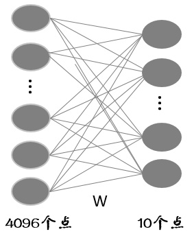
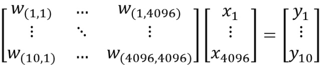

# torch.nn.Linear()函数的理解

```python
import torch

x = torch.randn(128, 20)  # 输入的维度是（128，20）
m = torch.nn.Linear(20, 30)  # 20,30是指维度
output = m(x)
print('m.weight.shape:\n ', m.weight.shape)
print('m.bias.shape:\n', m.bias.shape)
print('output.shape:\n', output.shape)


```

```output
m.weight.shape:
  torch.Size([30, 20])
m.bias.shape:
 torch.Size([30])
output.shape:
 torch.Size([128, 30])
ans.shape:
 torch.Size([128, 30])
True
————————————————
```


aa

# torch.mm(input,torch.t(m.weight))+m.bias 等价于下面的

ans = torch.mm(x, m.weight.t()) + m.bias   
print('ans.shape:\n', ans.shape)

print(torch.equal(ans, output))
————————————————
版权声明：本文为CSDN博主「Who is abc」的原创文章，遵循CC 4.0 BY-SA版权协议，转载请附上原文出处链接及本声明。
原文链接：https://blog.csdn.net/m0_37586991/article/details/87861418

作者：YW998
链接：https://zhuanlan.zhihu.com/p/31158737
来源：知乎
著作权归作者所有。商业转载请联系作者获得授权，非商业转载请注明出处。


最近在学习的过程中，发现一些概念会频繁的出现，在这里我说下对这些概念的简单理解。

- **全连接层**

说到全连接层，大家马上就能反应到，CNN的最后一层大多是全连接层，全连接层可以实现最终的分类。那么为什么要叫全连接层呢？全连接层有什么特点呢？

假设全连接层的输入是个4096维的列向量，一般我们把这个向量叫做特征向量（卷积层提取到的特征的输出），经过全连接层得到一个10维的列向量输出（也就是10分类每一类别的评分）。我们如果把输入和输出都看成一个个节点的话，节点与节点之间的关系可以用下图来表示：



可以看出，10个节点中每一个节点的输出都是通过4096个节点的输入得到的，也就是说，每一个输出节点受所有的输入节点影响，这样就会有 ![[公式]](nn.Linear的理解.assets/equation.svg) 个连接，每个连接上都会对应一个权重，则全连接层要训练 ![[公式]](https://www.zhihu.com/equation?tex=4096%5Ctimes10) 个权重。之所以称之为全连接层，就是由于每一个输出节点与每一个输入节点都有连接。写成矩阵的形式为：



看这个矩阵的话，可以认为每一行的权重对应着一个类别的分类器，由于是10分类问题，所以有10行，即对应10个分类器。

当然，还有另一种情况，就是输入不是一个行向量，而是一个特征图。假设这个特征图的shape为 ![[公式]](nn.Linear的理解.assets/equation.svg) ，也就是说长宽分别为7，深度为1024的特征图。当我用shape为 ![[公式]](nn.Linear的理解.assets/equation.svg) 的卷积窗进行无pad卷积时得到 ![[公式]](nn.Linear的理解.assets/equation.svg) 的输出，这一层我们也称为全连接层，至于为什么我们在讲卷积层的时候说。