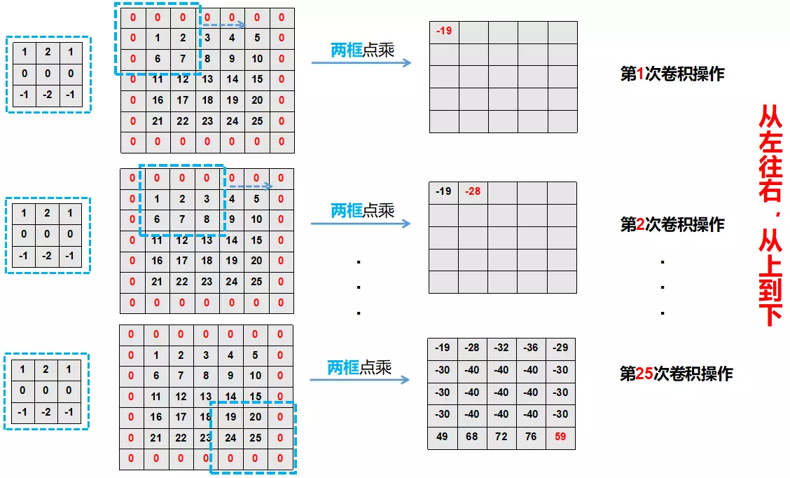
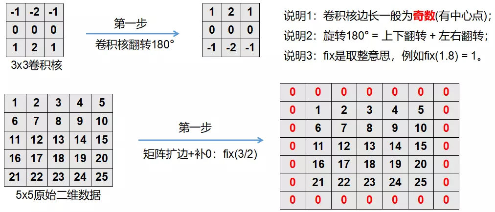
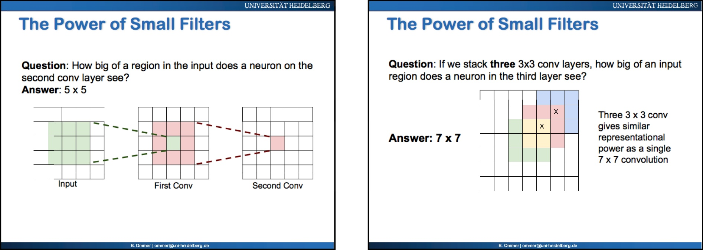
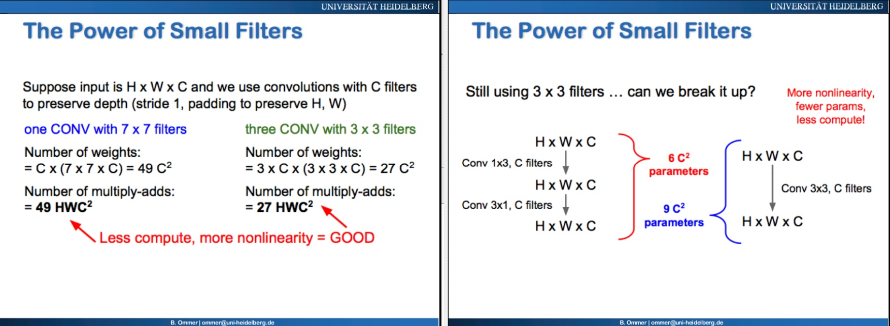
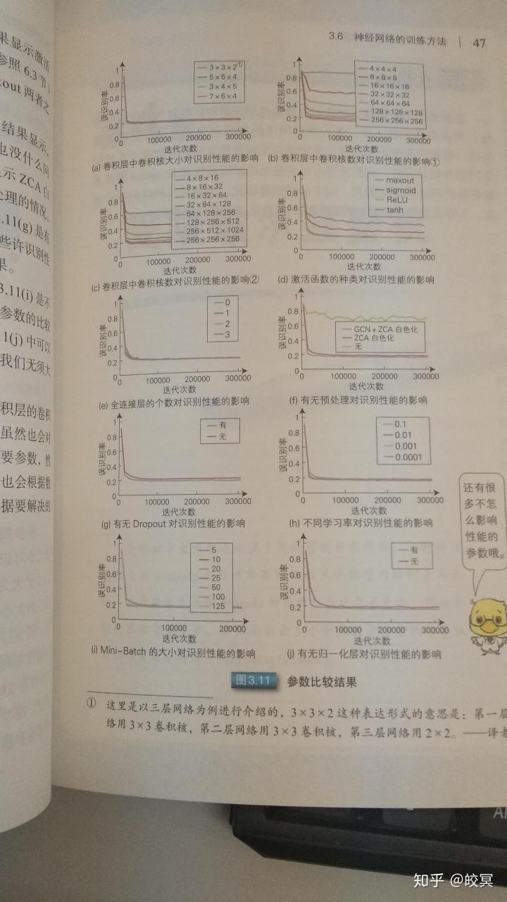

# 二维卷积的原理与手动编程实现（转载）

来源：[胜负55开](https://www.jianshu.com/u/6f36f0c99dac)

前言

二维卷积的使用非常广泛，不论是出现处理还是深度学习都有涉及。但是目前网上大多罗列公式，把其实简单的二维卷积操作搞的很复杂。本文用在不使用任何的公式情况下，明白二维卷积的使用方法，并能够用Matlab编程实现。

# 二维卷积实现

二维卷积实现可以分为两大步。一是预处理：将卷积核翻转180°，将原始数据扩边；二是滑动卷积计算。下面按这两个步骤分别说明：

## 预处理

如图1所示即看的很明白。对卷积核翻转180°就是"**上下翻转+左右翻转**"；对原始数据的扩边其实就是为了"**补0**"好算，扩边括多大呢？就看原始数据"**左上角**"那个点，卷积核是3x3，那么左顶点一周也就要扩成3x3(卷积核中心和左顶点对齐后可以做"**点乘**")，也就是上、下各括边"**fix(3/2) = 1**"。


图1：二维卷积操作预处理

## 滑动卷积计算

滑动卷积计算，其实就是对应的"**两个小矩阵**"的"**点乘并求和**"。"**滑动**"是指：卷积核沿着"**扩边后的原始数据**"从左到右，从上到下进行。如图2所示：



图2：滑动卷积计算

完成上面两步，二维卷积就做完了！是不是很简单？根本不需要看复杂的公式~
既然清楚了理论基础，那就用Matlab实践一下。


```matlab
clc; clear;

x = [-1 -2 -1;0 0 0;1 2 1];  % 卷积核——必须是方阵且为奇数行/列
data = [1 2 3 4 5;6 7 8 9 10;11 12 13 14 15;16 17 18 19 20;21 22 23 24 25];  % 原始数据

zidai = conv2(data,x,'same');  % matlab自带的二维卷积函数

x = rot90(rot90(x));  % 新的卷积核

% 核的尺寸
size_x = size(x);
row_x = size_x(1);  % 核的行数
col_x = size_x(2);  % 核的列数
% 数据的尺寸
size_data = size(data);
row_data = size_data(1);  % 数据的行数
col_data = size_data(2);  % 数据的列数

% 核的中心元素:
centerx_row = round(row_x/2);
centerx_col = round(col_x/2);
centerx = x(centerx_row,centerx_col);

% 对原始数据扩边:
data_tmp = zeros(row_data+row_x-1,col_data+row_x-1);
data_tmp(centerx_row:centerx_row+row_data-1,centerx_row:centerx_row+col_data-1) = data;
data_k = data_tmp;
% 扩边后新数据矩阵尺寸:
size_data_k = size(data_k);
row_data_k = size_data_k(1);
col_data_k = size_data_k(2);

% m = centerx_row:row_data+row_x-2
% 开始卷积计算: m n 是新数据矩阵的正常索引
result = zeros(row_data_k,col_data_k);
% m n一般卷积步长都是1
for m = centerx_row:centerx_row+row_data-1
    for n = centerx_row:centerx_row+col_data-1
        % tt是临时与卷积核大小相同的数据中的部分矩阵:
        tt = data_k(m-(centerx_row-1):m+(centerx_row-1),n-(centerx_row-1):n+(centerx_row-1));
        % juan是中间每一次卷积计算求和的中间量:
        juan = sum(x.*tt);
        result(m,n) = sum(juan(:));
    end
end

% 求掉之前扩边的0:
result = result(centerx_row:centerx_row+row_data-1,centerx_row:centerx_row+col_data-1)
```

说明：手动实现的matlab程序其实很简单很好理解，可直接运行。


# 二维卷积的原理与手动编程实现

[](https://www.jianshu.com/u/6f36f0c99dac)

[胜负55开](https://www.jianshu.com/u/6f36f0c99dac)关注

0.2882019.03.22 20:09:28字数 439阅读 1,430

# 前言

二维卷积的使用非常广泛，不论是出现处理还是深度学习都有涉及。但是目前网上大多罗列公式，把其实简单的二维卷积操作搞的很复杂。本文用在不使用任何的公式情况下，明白二维卷积的使用方法，并能够用Matlab编程实现。

# 二维卷积实现

二维卷积实现可以分为两大步。一是预处理：将卷积核翻转180°，将原始数据扩边；二是滑动卷积计算。下面按这两个步骤分别说明：

## 预处理

如图1所示即看的很明白。对卷积核翻转180°就是"**上下翻转+左右翻转**"；对原始数据的扩边其实就是为了"**补0**"好算，扩边括多大呢？就看原始数据"**左上角**"那个点，卷积核是3x3，那么左顶点一周也就要扩成3x3(卷积核中心和左顶点对齐后可以做"**点乘**")，也就是上、下各括边"**fix(3/2) = 1**"。



图1：二维卷积操作预处理

## 滑动卷积计算

滑动卷积计算，其实就是对应的"**两个小矩阵**"的"**点乘并求和**"。"**滑动**"是指：卷积核沿着"**扩边后的原始数据**"从左到右，从上到下进行。如图2所示：


图2：滑动卷积计算

完成上面两步，二维卷积就做完了！是不是很简单？根本不需要看复杂的公式~
既然清楚了理论基础，那就用Matlab实践一下。


```matlab
clc; clear;

x = [-1 -2 -1;0 0 0;1 2 1];  % 卷积核——必须是方阵且为奇数行/列
data = [1 2 3 4 5;6 7 8 9 10;11 12 13 14 15;16 17 18 19 20;21 22 23 24 25];  % 原始数据

zidai = conv2(data,x,'same');  % matlab自带的二维卷积函数

x = rot90(rot90(x));  % 新的卷积核

% 核的尺寸
size_x = size(x);
row_x = size_x(1);  % 核的行数
col_x = size_x(2);  % 核的列数
% 数据的尺寸
size_data = size(data);
row_data = size_data(1);  % 数据的行数
col_data = size_data(2);  % 数据的列数

% 核的中心元素:
centerx_row = round(row_x/2);
centerx_col = round(col_x/2);
centerx = x(centerx_row,centerx_col);

% 对原始数据扩边:
data_tmp = zeros(row_data+row_x-1,col_data+row_x-1);
data_tmp(centerx_row:centerx_row+row_data-1,centerx_row:centerx_row+col_data-1) = data;
data_k = data_tmp;
% 扩边后新数据矩阵尺寸:
size_data_k = size(data_k);
row_data_k = size_data_k(1);
col_data_k = size_data_k(2);

% m = centerx_row:row_data+row_x-2
% 开始卷积计算: m n 是新数据矩阵的正常索引
result = zeros(row_data_k,col_data_k);
% m n一般卷积步长都是1
for m = centerx_row:centerx_row+row_data-1
    for n = centerx_row:centerx_row+col_data-1
        % tt是临时与卷积核大小相同的数据中的部分矩阵:
        tt = data_k(m-(centerx_row-1):m+(centerx_row-1),n-(centerx_row-1):n+(centerx_row-1));
        % juan是中间每一次卷积计算求和的中间量:
        juan = sum(x.*tt);
        result(m,n) = sum(juan(:));
    end
end

% 求掉之前扩边的0:
result = result(centerx_row:centerx_row+row_data-1,centerx_row:centerx_row+col_data-1)
```

说明：手动实现的matlab程序其实很简单很好理解，可直接运行。


# 二维卷积的原理与手动编程实现

[](https://www.jianshu.com/u/6f36f0c99dac)

[胜负55开](https://www.jianshu.com/u/6f36f0c99dac)关注

0.2882019.03.22 20:09:28字数 439阅读 1,430

# 前言

二维卷积的使用非常广泛，不论是出现处理还是深度学习都有涉及。但是目前网上大多罗列公式，把其实简单的二维卷积操作搞的很复杂。本文用在不使用任何的公式情况下，明白二维卷积的使用方法，并能够用Matlab编程实现。

# 二维卷积实现

二维卷积实现可以分为两大步。一是预处理：将卷积核翻转180°，将原始数据扩边；二是滑动卷积计算。下面按这两个步骤分别说明：

## 预处理

如图1所示即看的很明白。对卷积核翻转180°就是"**上下翻转+左右翻转**"；对原始数据的扩边其实就是为了"**补0**"好算，扩边括多大呢？就看原始数据"**左上角**"那个点，卷积核是3x3，那么左顶点一周也就要扩成3x3(卷积核中心和左顶点对齐后可以做"**点乘**")，也就是上、下各括边"**fix(3/2) = 1**"。


图1：二维卷积操作预处理

## 滑动卷积计算

滑动卷积计算，其实就是对应的"**两个小矩阵**"的"**点乘并求和**"。"**滑动**"是指：卷积核沿着"**扩边后的原始数据**"从左到右，从上到下进行。如图2所示：


图2：滑动卷积计算

完成上面两步，二维卷积就做完了！是不是很简单？根本不需要看复杂的公式~
既然清楚了理论基础，那就用Matlab实践一下。


```matlab
clc; clear;

x = [-1 -2 -1;0 0 0;1 2 1];  % 卷积核——必须是方阵且为奇数行/列
data = [1 2 3 4 5;6 7 8 9 10;11 12 13 14 15;16 17 18 19 20;21 22 23 24 25];  % 原始数据

zidai = conv2(data,x,'same');  % matlab自带的二维卷积函数

x = rot90(rot90(x));  % 新的卷积核

% 核的尺寸
size_x = size(x);
row_x = size_x(1);  % 核的行数
col_x = size_x(2);  % 核的列数
% 数据的尺寸
size_data = size(data);
row_data = size_data(1);  % 数据的行数
col_data = size_data(2);  % 数据的列数

% 核的中心元素:
centerx_row = round(row_x/2);
centerx_col = round(col_x/2);
centerx = x(centerx_row,centerx_col);

% 对原始数据扩边:
data_tmp = zeros(row_data+row_x-1,col_data+row_x-1);
data_tmp(centerx_row:centerx_row+row_data-1,centerx_row:centerx_row+col_data-1) = data;
data_k = data_tmp;
% 扩边后新数据矩阵尺寸:
size_data_k = size(data_k);
row_data_k = size_data_k(1);
col_data_k = size_data_k(2);

% m = centerx_row:row_data+row_x-2
% 开始卷积计算: m n 是新数据矩阵的正常索引
result = zeros(row_data_k,col_data_k);
% m n一般卷积步长都是1
for m = centerx_row:centerx_row+row_data-1
    for n = centerx_row:centerx_row+col_data-1
        % tt是临时与卷积核大小相同的数据中的部分矩阵:
        tt = data_k(m-(centerx_row-1):m+(centerx_row-1),n-(centerx_row-1):n+(centerx_row-1));
        % juan是中间每一次卷积计算求和的中间量:
        juan = sum(x.*tt);
        result(m,n) = sum(juan(:));
    end
end

% 求掉之前扩边的0:
result = result(centerx_row:centerx_row+row_data-1,centerx_row:centerx_row+col_data-1)
```

说明：手动实现的matlab程序其实很简单很好理解，可直接运行。

  

  


  