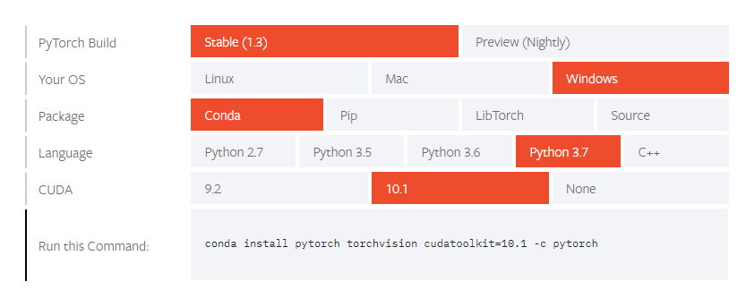
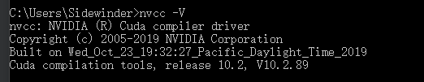

PyTorch是torch的Python版本实现：

PyTorch 

PyTorch的官网：

## 安装：

https://pytorch.org/get-started/locally/ 

conda 是Anaconda 自带的包管理器，删除了pip安装，可以使用conda 进行安装。

需要选择包管理器conda版本，Python版本，CUDA版本：



这边推荐使用的是IPython 和 Jupyter Notebook这个两个工具：

```cmd
nvcc -V
```



```python
 device = torch.device("cuda:0" if torch.cuda.is_available() else "cpu")
 print(device)
```

