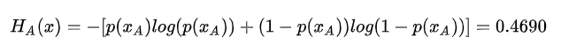
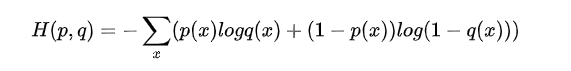
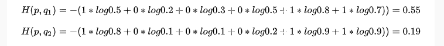
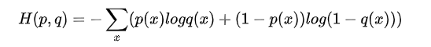
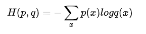

# Pytorch常用的交叉熵损失函数CrossEntropyLoss()详解

> 来源：**[AINLPer](https://links.jianshu.com/go?to=https%3A%2F%2Fmp.weixin.qq.com%2Fs%3F__biz%3DMzUzOTgwNDMzOQ%3D%3D%26mid%3D2247484340%26idx%3D2%26sn%3Dd504eb63dcb0ea2961b7a96e497c8aa1%26chksm%3Dfac39468cdb41d7e9e40b0ec35cd85d0aa5eafe020b5f338d33a55fde981942aa2dfb9bfbb78%26token%3D1710163228%26lang%3Dzh_CN%23rd)**微信公众号
> 编辑: ShuYini
> 校稿: ShuYini
> 时间: 2019-12-22

### 引言

    在使用pytorch深度学习框架，计算损失函数的时候经常回到这么一个个函数：

> nn.CrossEntropyLoss()

    该损失函数结合了)和)两个函数。它在做分类（具体几类）训练的时候是非常有用的。在训练过程中，对于每个类分配权值，可选的参数权值应该是一个1D张量。当你有一个不平衡的训练集时，这是是非常有用的。那么针对这个函数，下面将做详细的介绍。

### 什么是交叉熵？

    **交叉熵主要是用来判定实际的输出与期望的输出的接近程度**，为什么这么说呢，举个例子：在做分类的训练的时候，如果一个样本属于第K类，那么这个类别所对应的的输出节点的输出值应该为1，而其他节点的输出都为0，即[0,0,1,0,….0,0]，这个数组也就是样本的Label，是神经网络最期望的输出结果。也就是说用它来衡量网络的输出与标签的差异，利用这种差异经过反向传播去更新网络参数。

### 交叉熵原理？

在说交叉熵之前，先说一下**信息量**与**熵**。
    **信息量：**它是用来衡量一个事件的不确定性的；一个事件发生的概率越大，不确定性越小，则它所携带的信息量就越小。假设X是一个离散型随机变量，其取值集合为X，概率分布函数为%3DP(X%3Dx)%2Cx%E2%88%88X)，我们定义事件的信息量为：%3D%E2%88%92log(p(x_0)))
当%3D1)时，熵将等于0，也就是说该事件的发生不会导致任何信息量的增加。

    **熵：**它是用来衡量一个系统的混乱程度的，代表一个系统中信息量的总和；信息量总和越大，表明这个系统不确定性就越大。
    举个例子：假如小明和小王去打靶，那么打靶结果其实是一个0-1分布，X的取值有{0：打中，1：打不中}。在打靶之前我们知道小明和小王打中的先验概率为10%，99.9%。根据上面的信息量的介绍，我们可以分别得到小明和小王打靶打中的信息量。但是如果我们想进一步度量小明打靶结果的不确定度，这就需要用到熵的概念了。那么如何度量呢，那就要采用**期望**了。我们对所有可能事件所带来的信息量求期望，其结果就能衡量小明打靶的不确定度：


与之对应的，小王的熵（打靶的不确定度）为：


虽然小明打靶结果的不确定度较低，毕竟十次有9次都脱靶；但是小王打靶结果的不确定度更低，1000次射击只有1次脱靶，结果相当的确定。

    **交叉熵：**它主要刻画的是实际输出（概率）与期望输出（概率）的距离，也就是交叉熵的值越小，两个概率分布就越接近。假设概率分布p为期望输出，概率分布q为实际输出，)为交叉熵，则



 那么该公式如何表示，举个例子，假设N=3，期望输出为

)

，实际输出

)

，

)

，那么：

****

通过上面可以看出，q2与p更为接近，它的交叉熵也更小。

### Pytorch中的CrossEntropyLoss()函数

    Pytorch中计算的交叉熵并不是采用



这种方式计算得到的，而是交叉熵的另外一种方式计算得到的：



它是交叉熵的另外一种方式。
   

 Pytorch中CrossEntropyLoss()函数的主要是将softmax-log-NLLLoss合并到一块得到的结果。
    1、Softmax后的数值都在0~1之间，所以ln之后值域是负无穷到0。
    2、然后将Softmax之后的结果取log，将乘法改成加法减少计算量，同时保障函数的单调性
    3、NLLLoss的结果就是把上面的输出与Label对应的那个值拿出来(下面例子中就是：将log_output\logsoftmax_output中与y_target对应的值拿出来)，去掉负号，再求均值。

下面是我仿真写的一个例子：

```import
import torch.nn as nn
x_input=torch.randn(3,3)#随机生成输入
print('x_input:\n',x_input)
y_target=torch.tensor([1,2,0])#设置输出具体值
print('y_target\n',y_target)

#计算输入softmax，此时可以看到每一行加到一起结果都是1
softmax_func=nn.Softmax(dim=1)
soft_output=softmax_func(x_input)
print('soft_output:\n',soft_output)

#在softmax的基础上取log
log_output=torch.log(soft_output)
print('log_output:\n',log_output)

#对比softmax与log的结合与nn.LogSoftmaxloss(负对数似然损失)的输出结果，发现两者是一致的。
logsoftmax_func=nn.LogSoftmax(dim=1)
logsoftmax_output=logsoftmax_func(x_input)
print('logsoftmax_output:\n',logsoftmax_output)

#pytorch中关于NLLLoss的默认参数配置为：reducetion=True、size_average=True
nllloss_func=nn.NLLLoss()
nlloss_output=nllloss_func(logsoftmax_output,y_target)
print('nlloss_output:\n',nlloss_output)

#直接使用pytorch中的loss_func=nn.CrossEntropyLoss()看与经过NLLLoss的计算是不是一样
crossentropyloss=nn.CrossEntropyLoss()
crossentropyloss_output=crossentropyloss(x_input,y_target)
print('crossentropyloss_output:\n',crossentropyloss_output)
```

最计算得到的结果为：


```css
x_input:
 tensor([[ 2.8883,  0.1760,  1.0774],
        [ 1.1216, -0.0562,  0.0660],
        [-1.3939, -0.0967,  0.5853]])
y_target
 tensor([1, 2, 0])
soft_output:
 tensor([[0.8131, 0.0540, 0.1329],
        [0.6039, 0.1860, 0.2102],
        [0.0841, 0.3076, 0.6083]])
log_output:
 tensor([[-0.2069, -2.9192, -2.0178],
        [-0.5044, -1.6822, -1.5599],
        [-2.4762, -1.1790, -0.4970]])
logsoftmax_output:
 tensor([[-0.2069, -2.9192, -2.0178],
        [-0.5044, -1.6822, -1.5599],
        [-2.4762, -1.1790, -0.4970]])
nlloss_output:
 tensor(2.3185)
crossentropyloss_output:
 tensor(2.3185)
```

    通过上面的结果可以看出，直接使用pytorch中的loss_func=nn.CrossEntropyLoss()计算得到的结果与softmax-log-NLLLoss计算得到的结果是一致的。

