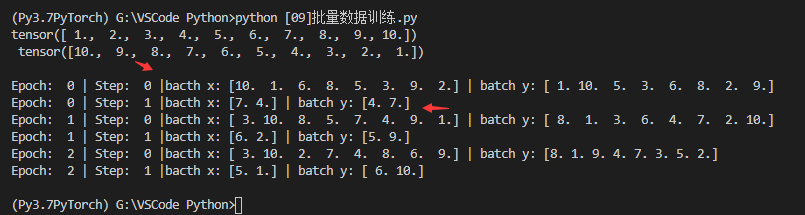
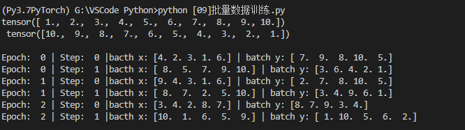
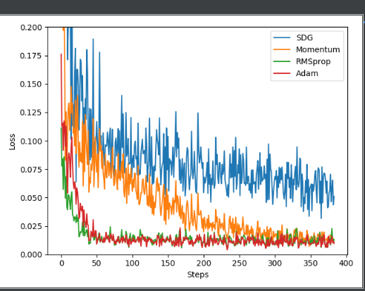

## [09]批量数据训练

使用dataLoader 进行小批量数据训练

```python
import torch

import torch.utils.data as Data
# 有时候你的是数据非常的大
#  minibatch 

if __name__ =='__main__':
    BATCH_SIZE = 8
    x = torch.linspace(1,10,10)
    y = torch.linspace(10,1,10)
    print(x,'\n',y,'\n') 
    # 定义一个数据库
    # 告诉数据库，训练的数据是x,训练的目标是y
    # torch_dataset = Data.TensorDataset(data_tensor=x,target_tensor=y)
    torch_dataset = Data.TensorDataset(x, y)  # 新版本去掉了《参数名称》
    loader = Data.DataLoader(
        dataset = torch_dataset,
        batch_size = BATCH_SIZE,
        shuffle=True, # 是否需要打乱
        num_workers=2   # 两个线程还是进程来提取数据
    )

    # 就是相当于有n个训练样本，batch_size为m,则每个epoch都要进行n/m个step

    # 将这个批数据训练3次
    for epoch in range(3):
        # 每一次整体训练，我们都会有一个 
        for step, (batch_x,batch_y) in enumerate(loader):   # enumerate()会把元组，链表转变成(index,value)
            #  train.....
            print('Epoch: ', epoch,'| Step: ',step, '|bacth x:',
            batch_x.numpy(),'| batch y:', batch_y.numpy())
```

batch_size = 8的时候，一共数据样本是10，只能第一个step取8,第二个取2.





普通的训练：将全部数据放进去训练。

SGD: 随机梯度下降：

学习效率：`W +=-Learning rate*dx`

`AdaGrad:`

`RMSProp`

## [10]Optimize 优化器

```python
import torch
import torch.utils.data as Data
import torch.nn.functional as F
from torch.autograd import Variable
import matplotlib.pyplot as plt


class Model(torch.nn.Module):
    def __init__(self):
        super(Model, self).__init__()
        self.hidden = torch.nn.Linear(1, 20)
        self.predit = torch.nn.Linear(20, 1)

    def forward(self, x):
        x = F.relu(self.hidden(x))     # activation function for hidden layer
        x = self.predit(x)
        return x


# hyper parameters 超参数
LR = 0.01
BATCH_SIZE = 32
EPOCH = 12

if __name__=='__main__':
    # unsequeeze 转变成 1000*1的矩阵，感觉就是一维向量变成矩阵
    x = torch.unsqueeze(torch.linspace(-1, 1, 1000), dim=1)
    y = x.pow(2) + 0.1 * torch.normal(torch.zeros(*x.size()))
    # print(x,'\n',y)
    # plot dataset
    # plt.scatter(x.numpy(), y.numpy())
    # plt.show()

    torch_dataset = Data.TensorDataset(x, y)  # 新版本去掉了《参数名称》
    loader = Data.DataLoader(
        dataset=torch_dataset,
        batch_size=BATCH_SIZE,
        shuffle=True,  # 是否需要打乱
        num_workers=2   # 两个线程还是进程来提取数据
    )
    # class Net(torch.nn.Module):
    #     def __init__(self, n_feature, n_hidden, n_output):
    #         super(Net,self).__init__()
    #         self.hidden = torch.nn.Linear(n_feature, n_hidden)
    #         self.predict = torch.nn.Linear(n_hidden,n_output)
    #
    #     def forward(self,x):
    #         x = torch.relu(self.hidden(x)) # 激励函数嵌套，隐藏层信息
    #         x = self.predict(x) # 预测值没有使用激励函数
    #         return x


    # different nets
    model_SGD = Model()
    model_Momentum = Model()
    model_RMSprop = Model()
    model_Adam = Model()
    models_his = [model_SGD, model_Momentum, model_RMSprop, model_Adam]

    print(model_SGD.parameters())
    opt_SGD = torch.optim.SGD(model_SGD.parameters(), lr=LR)
    opt_Momentum = torch.optim.SGD(model_Momentum.parameters(), lr=LR, momentum=0.8)
    opt_RMSprop = torch.optim.RMSprop(model_RMSprop.parameters(), lr=LR, alpha=0.9)
    opt_Adam = torch.optim.Adam(model_Adam.parameters(), lr=LR, betas=(0.9, 0.99))

    optimizers = [opt_SGD, opt_Momentum, opt_RMSprop, opt_Adam]

    loss_func = torch.nn.MSELoss()
    Losses_his = [[], [], [], []]  # record loss

    for epoch in range(EPOCH):
        print('epoch:', epoch)
        for step, (bacth_x, batch_y) in enumerate(loader):
            b_x = bacth_x
            b_y = batch_y

            for model, opt, l_his in zip(models_his, optimizers, Losses_his):
                output = model(b_x)  # get output for every net(model)
                loss = loss_func(output, b_y)  # compute loss for every model
                opt.zero_grad()  # clear gradients for net train
                loss.backward()  # backpropagation ,compute gradients
                opt.step()  # apply gradients
                # l_his.append(loss.data[0])  # loss recorder
                l_his.append(loss.item())
    labels = ['SDG', 'Momentum', 'RMSprop', 'Adam']
    for i, l_his in enumerate(Losses_his):
        plt.plot(l_his, label=labels[i])
    plt.legend(loc='best')
    plt.xlabel('Steps')
    plt.ylabel('Loss')
    plt.ylim((0, 0.2))
    plt.show()

    print('___')
```

训练结果：




