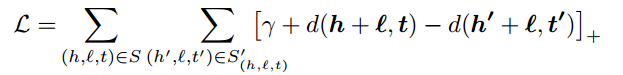
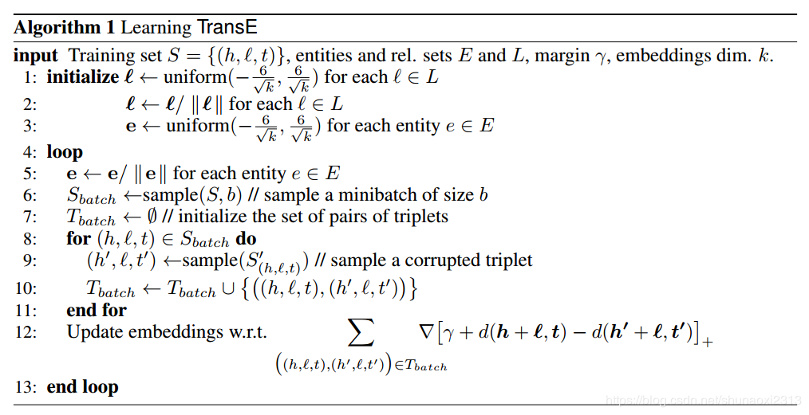

## 表示学习

 **表示学习**旨在学习一系列低维稠密向量来表征语义信息，而**知识表示学习**是面向知识库中实体和关系的表示学习。当今大规模知识库（或称知识图谱）的构建为许多NLP任务提供了底层支持，但由于其规模庞大且不完备，如何高效存储和补全知识库成为了一项非常重要的任务，这就依托于知识表示学习。 

`transE`算法就是一个非常经典的知识表示学习，用分布式表示（distributed representation）来描述知识库中的三元组。想象一下，这类表示法既**避免了庞大的树结构构造**，**又能通过简单的数学计算获取语义信息**，因此成为了当前表示学习的根基。 

### 1 `transE`算法原理

​      我们知道知识图谱中的事实是用三元组 (h,l,t) 表示的，那么如何用低维稠密向量来表示它们，才能得到这种依赖关系呢？`transE`算法的思想非常简单，它受word2vec平移不变性的启发，希望`h+l≈t`（此为归纳偏差？）。

​       光有这一个约束可不够。想让`h+l≈t`，如何设置**损失函数**是个关键。我们发现表示学习都没有明显的监督信号，也就是不会明确告诉模型你学到的表示正不正确，那么想要快速收敛就得引入“相对”概念，即相对负例来说，正例的打分要更高，方法学名“negative sampling”。

负采样理解：

损失函数设计如下：

  

其中`(h′,l,t′)`称为corrupted triplet ，是随机替换头或尾实体得到（非同时，其实也可以替换relation）。γ为margin。细看发现这就是SVM的soft margin损失函数，所以可以说，`transE`针对给定三元组进行二分类任务，其中负例是通过替换自行构造的，目标是使得最相近的正负例样本距离最大化。

**corrupted triplet** 是损坏的三元组，**margin是什么：**  在CSS中翻译为内边距。

SVM的soft margin又是什么

 论文中算法的具体实现：`2013`

 

​       其中距离度量方式有L1范数和L2范数两种。在测试时，以一个三元组为例，用语料中所有实体替换当前三元组的头实体计算距离d(h′+l,t)，将结果按升序排序，用正确三元组的排名情况来评估学习效果（同理对尾实体这样做）。度量标准选择hits@10和mean rank，前者代表命中前10的次数/总查询次数，后者代表正确结果排名之和/总查询次数。`

`hits@10` 命中前10的次数/总查询次数

`mean rank` 后者代表正确结果排名之和/总查询次数。

​      还有一点值得一提，文中给了两种测试结果raw和filter，其动机是我们在测试时通过替换得到的三元组并不一定就是负例，可能恰巧替换对了（比如（奥巴马，总统，美国）被替换成了（特朗普，总统，美国）），那么它排名高也是正确的，把当前三元组挤下去也正常。（存疑：这样的话训练时是否也应当过滤corrupted triplet呢） 所以测试时在替换后要检查一下新三元组是否出现在训练集中，是的话就删掉，这就是filter训练方法（不检查的是raw）。

特点：

`transE`模型学习的是一对一的关系，不适合一对多或者多对一关系
Following an energy-based framework, the energy of a triplet is equal to d(h + l, t) for some dissimilarity measure d, which we take to be either the L1 or the L2-norm
模型目标是要使得实体之间有关系的实体（即正样本）之间的d值尽可能小，而不具有关系的样实体之间(负样本)之间的d值尽可能大，d值可以采用 L1 or the L2-norm

d 值可以选择L1或者L2类型：


```python
import codecs
import random
import math
import numpy as np
import copy
import time

entity2id = {}
relation2id = {}


def data_loader(file):
    file1 = file + "train.txt"
    file2 = file + "entity2id.txt"
    file3 = file + "relation2id.txt"

    with open(file2, 'r') as f1, open(file3, 'r') as f2:
        lines1 = f1.readlines()
        lines2 = f2.readlines()
        for line in lines1:
            line = line.strip().split('\t')
            if len(line) != 2:
                continue
            entity2id[line[0]] = line[1]

        for line in lines2:
            line = line.strip().split('\t')
            if len(line) != 2:
                continue
            relation2id[line[0]] = line[1]

    entity_set = set()
    relation_set = set()
    triple_list = []

    with codecs.open(file1, 'r') as f:
        content = f.readlines()
        for line in content:
            triple = line.strip().split("\t")
            if len(triple) != 3:
                continue

            h_ = entity2id[triple[0]]
            t_ = entity2id[triple[1]]
            r_ = relation2id[triple[2]]

            triple_list.append([h_,t_,r_])

            entity_set.add(h_)
            entity_set.add(t_)

            relation_set.add(r_)

    return entity_set, relation_set, triple_list

def distanceL2(h,r,t):
    #为方便求梯度，去掉sqrt
    return np.sum(np.square(h + r - t))

def distanceL1(h,r,t):
    return np.sum(np.fabs(h+r-t))

class TransE:
    def __init__(self,entity_set, relation_set, triple_list,
                 embedding_dim=100, learning_rate=0.01, margin=1,L1=True):
        self.embedding_dim = embedding_dim
        self.learning_rate = learning_rate
        self.margin = margin
        self.entity = entity_set
        self.relation = relation_set
        self.triple_list = triple_list
        self.L1=L1

        self.loss = 0

    def emb_initialize(self):
        relation_dict = {}
        entity_dict = {}

        for relation in self.relation:
            # ：从一个均匀分布[low,high)中随机采样，注意定义域是左闭右开，即包含low，不包含high. 采样样本数目：
            r_emb_temp = np.random.uniform(-6/math.sqrt(self.embedding_dim) ,
                                           6/math.sqrt(self.embedding_dim) ,
                                           self.embedding_dim)
            relation_dict[relation] = r_emb_temp / np.linalg.norm(r_emb_temp,ord=2)      # 临时向量/ ||第二范数||    np.linalg.norm求 这个临时向量的范数 2范数

        for entity in self.entity:
            e_emb_temp = np.random.uniform(-6/math.sqrt(self.embedding_dim) ,
                                        6/math.sqrt(self.embedding_dim) ,
                                        self.embedding_dim)
            entity_dict[entity] = e_emb_temp / np.linalg.norm(e_emb_temp,ord=2)

        self.relation = relation_dict
        self.entity = entity_dict

    def train(self, epochs):
        nbatches = 400  # 
        batch_size = len(self.triple_list) // nbatches    # ‘ // ’ 表示整数除法   三元组总的个数/ nbatches = batch_size
        print("batch size: ", batch_size)
        for epoch in range(epochs):
            start = time.time()
            self.loss = 0

            for k in range(nbatches):                       # 循环 nbatches次
                # Sbatch:list
                Sbatch = random.sample(self.triple_list, batch_size) # 随机采样 batch_size个
                # 
                Tbatch = []

                for triple in Sbatch:                           # 对于每个三元组
                    # 每个triple选3个负样例
                    # for i in range(3):
                    corrupted_triple = self.Corrupt(triple)    # 进行替换生成负例
                    if (triple, corrupted_triple) not in Tbatch:    # 判断负例在这次Sbacth中没有生成过
                        Tbatch.append((triple, corrupted_triple))   # 负
                self.update_embeddings(Tbatch)


            end = time.time()
            print("epoch: ", epoch , "cost time: %s"%(round((end - start),3)))
            print("loss: ", self.loss)

            #保存临时结果
            if epoch % 20 == 0:
                with codecs.open("entity_temp", "w") as f_e:
                    for e in self.entity.keys():
                        f_e.write(e + "\t")
                        f_e.write(str(list(self.entity[e])))
                        f_e.write("\n")
                with codecs.open("relation_temp", "w") as f_r:
                    for r in self.relation.keys():
                        f_r.write(r + "\t")
                        f_r.write(str(list(self.relation[r])))
                        f_r.write("\n")

        print("写入文件...")
        with codecs.open("entity_50dim_batch400", "w") as f1:
            for e in self.entity.keys():
                f1.write(e + "\t")
                f1.write(str(list(self.entity[e])))
                f1.write("\n")

        with codecs.open("relation50dim_batch400", "w") as f2:
            for r in self.relation.keys():
                f2.write(r + "\t")
                f2.write(str(list(self.relation[r])))
                f2.write("\n")
        print("写入完成")

    # 随机替换头实体和尾实体
    def Corrupt(self,triple):
        corrupted_triple = copy.deepcopy(triple)
        seed = random.random()              # 返回一个随机值[0,1)
        if seed > 0.5:
            # 替换head
            rand_head = triple[0]
            while rand_head == triple[0]:
                rand_head = random.sample(self.entity.keys(),1)[0]
            corrupted_triple[0]=rand_head

        else:
            # 替换tail
            rand_tail = triple[1]
            while rand_tail == triple[1]:
                rand_tail = random.sample(self.entity.keys(), 1)[0]
            corrupted_triple[1] = rand_tail
        return corrupted_triple

    # 更新嵌入entity relation是一个集合，triple是一个链表
    # triple 是一个数组[head,relation,tail]
    def update_embeddings(self, Tbatch):
        # 拷贝之前的嵌入
        copy_entity = copy.deepcopy(self.entity)
        copy_relation = copy.deepcopy(self.relation)

        for triple, corrupted_triple in Tbatch:
            # 取copy里的vector累积更新
            h_correct_update = copy_entity[triple[0]]
            t_correct_update = copy_entity[triple[1]]
            relation_update = copy_relation[triple[2]]

            h_corrupt_update = copy_entity[corrupted_triple[0]]
            t_corrupt_update = copy_entity[corrupted_triple[1]]

            # 取原始的vector计算梯度
            h_correct = self.entity[triple[0]]
            t_correct = self.entity[triple[1]]
            relation = self.relation[triple[2]]

            h_corrupt = self.entity[corrupted_triple[0]]
            t_corrupt = self.entity[corrupted_triple[1]]

            if self.L1:
                dist_correct = distanceL1(h_correct, relation, t_correct)
                dist_corrupt = distanceL1(h_corrupt, relation, t_corrupt)
            else:
                dist_correct = distanceL2(h_correct, relation, t_correct)
                dist_corrupt = distanceL2(h_corrupt, relation, t_corrupt)

            err = self.hinge_loss(dist_correct, dist_corrupt)

            if err > 0:
                self.loss += err

                grad_pos = 2 * (h_correct + relation - t_correct)
                grad_neg = 2 * (h_corrupt + relation - t_corrupt)

                if self.L1:
                    for i in range(len(grad_pos)):
                        if (grad_pos[i] > 0):
                            grad_pos[i] = 1
                        else:
                            grad_pos[i] = -1

                    for i in range(len(grad_neg)):
                        if (grad_neg[i] > 0):
                            grad_neg[i] = 1
                        else:
                            grad_neg[i] = -1

                # head系数为正，减梯度；tail系数为负，加梯度
                h_correct_update -= self.learning_rate * grad_pos
                t_correct_update -= (-1) * self.learning_rate * grad_pos

                # corrupt项整体为负，因此符号与correct相反
                if triple[0] == corrupted_triple[0]:  # 若替换的是尾实体，则头实体更新两次
                    h_correct_update -= (-1) * self.learning_rate * grad_neg
                    t_corrupt_update -= self.learning_rate * grad_neg

                elif triple[1] == corrupted_triple[1]:  # 若替换的是头实体，则尾实体更新两次
                    h_corrupt_update -= (-1) * self.learning_rate * grad_neg
                    t_correct_update -= self.learning_rate * grad_neg

                #relation更新两次
                relation_update -= self.learning_rate*grad_pos
                relation_update -= (-1)*self.learning_rate*grad_neg


        #batch norm
        for i in copy_entity.keys():
            copy_entity[i] /= np.linalg.norm(copy_entity[i])
        for i in copy_relation.keys():
            copy_relation[i] /= np.linalg.norm(copy_relation[i])

        # 达到批量更新的目的
        self.entity = copy_entity
        self.relation = copy_relation

    def hinge_loss(self,dist_correct,dist_corrupt):
        return max(0,dist_correct-dist_corrupt+self.margin)


if __name__=='__main__':
    file1 = "FB15k\\"
    entity_set, relation_set, triple_list = data_loader(file1)
    print("load file...")
    print("Complete load. entity : %d , relation : %d , triple : %d" % (len(entity_set),len(relation_set),len(triple_list)))

    transE = TransE(entity_set, relation_set, triple_list,embedding_dim=50, learning_rate=0.01, margin=1,L1=True)
    
    
    transE.emb_initialize()
    transE.train(epochs=1001)
```


 https://www.jianshu.com/p/ac603764b2a3 


