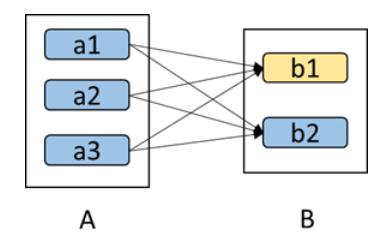

# Spark环境配置配置（来源b站视频教程）

机器部署

在多台linux上安装JDK

下载安装包，上传带一台机器上进行解压

tar -zxvf spark-xxx-  -xxx   -C  /usr/local

 

配置spark

在spark安装目录conf 目录重命名

cd conf/

mv spark-env.sh.template spark-env.sh

vi spark-env.sh

在配置文件中加入：

export JAVA_HOME =/usr/java/jdkxxxx

export SPARK_MASTEER_IP =master

export SPARK_MASTER_PORT=7077

 

重命名slaves.temple文件为slaves

在改文件中添加子节点所在的位置（worker节点）

slave1

slave2

xxxx

保存退出

将配置好的文件发送到其他节点上，

scp -r spark/xxx/xxxx   node2:/usr/local/

等等

 

集群配置完毕之后，在master节点上启动spark集群

 start-all.sh启动集群

 

通过输入命令jps

主节点上有：Master JPS

工作节点上有：Worker

 

注意要在Master节点上，必须通过SSH免秘钥形式，登录Work节点。

sbin/start-master.sh :

sbin/start-slaves.sh:

sbin/start-all.sh

sbin/stop-master.sh

sbin/stop-slaves.sh

sbin/stop-all.sh

 

## 版本参数解释：


## Spark启动模式

Spark-shell 

 

启动一个单机版的。观察启动哪些进程

spark-shell --master   spark://master:7077

 

spark-shell --master   spark://master:7077  --executor-memory 512m

--total-executor-cores 1

此时会启动spark-shell，任务本来就是一个spark任务 

这时候启动的进程：

jps

master

sparksubmit

## spark的宽依赖窄依赖-腾讯云资讯

1 RDD的依赖关系及容错1.1 RDD的依赖关系


RDD的依赖关系分为两种：窄依赖(Narrow Dependencies)与宽依赖(Wide Dependencies，源码中称为Shuffle Dependencies)

依赖有2个作用，其一用来解决数据容错的高效性；其二用来划分stage。

 

窄依赖：每个父RDD的一个Partition最多被子RDD的一个Partition所使用（1:1 或 n:1）。例如map、filter、union等操作都会产生窄依赖；

子RDD分区通常对应常数个父RDD分区(O(1)，与数据规模无关。

 

宽依赖：一个父RDD的Partition会被多个子RDD的Partition所使用，例如groupByKey、reduceByKey、sortByKey等操作都会产生宽依赖；（1:m 或 n:m）

（子RDD分区通常对应所有的父RDD分区(O(n)，与数据规模有关）

 

相比于宽依赖，窄依赖对优化很有利 ，主要基于以下两点：

1、宽依赖往往对应着shuffle操作，需要在运行过程中将同一个父RDD的分区传入到不同的子RDD分区中，中间可能涉及多个节点之间的数据传输；而窄依赖的每个父RDD的分区只会传入到一个子RDD分区中，通常可以在一个节点内完成转换。

2、当RDD分区丢失时（某个节点故障），spark会对数据进行重算。

Ø 对于窄依赖，由于父RDD的一个分区只对应一个子RDD分区，这样只需要重算和子RDD分区对应的父RDD分区即可，所以这个重算对数据的利用率是100%的；

Ø 对于宽依赖，重算的父RDD分区对应多个子RDD分区，这样实际上父RDD 中只有一部分的数据是被用于恢复这个丢失的子RDD分区的，另一部分对应子RDD的其它未丢失分区，这就造成了多余的计算；更一般的，宽依赖中子RDD分区通常来自多个父RDD分区，极端情况下，所有的父RDD分区都要进行重新计算。

Ø 如下图所示，b1分区丢失，则需要重新计算a1,a2和a3，这就产生了冗余计算(a1,a2,a3中对应b2的数据)。



 

区分这两种依赖很有用。首先，窄依赖允许在一个集群节点上以流水线的方式（pipeline）计算所有父分区。例如，逐个元素地执行map、然后filter操作；而宽依赖则需要首先计算好所有父分区数据，然后在节点之间进行Shuffle，这与MapReduce类似。第二，窄依赖能够更有效地进行失效节点的恢复，即只需重新计算丢失RDD分区的父分区，而且不同节点之间可以并行计算；而对于一个宽依赖关系的Lineage图，单个节点失效可能导致这个RDD的所有祖先丢失部分分区，因而需要整体重新计算。

 

【误解】之前一直理解错了，以为窄依赖中每个子RDD可能对应多个父RDD,当子RDD丢失时会导致多个父RDD进行重新计算，所以窄依赖不如宽依赖有优势。而实际上应该深入到分区级别去看待这个问题，而且重算的效用也不在于算的多少，而在于有多少是冗余的计算。窄依赖中需要重算的都是必须的，所以重算不冗余。

 

窄依赖的函数有：map、filter、union、join(父RDD是hash-partitioned )、mapPartitions、mapValues

宽依赖的函数有：groupByKey、join(父RDD不是hash-partitioned )、partitionBy

 

1.2 依赖样例

依赖的继承关系：


 

val rdd1 = sc.parallelize(1 to 10, 1)

val rdd2 = sc.parallelize(11 to 20, 1)

val rdd3 = rdd1.union(rdd2)

rdd3.dependencies.size

// 长度为2，值为rdd1、rdd2，意为rdd3依赖rdd1、rdd2

rdd3.dependencies

// 结果：


rdd3.dependencies(0).rdd.collect

// 打印rdd1的数据

rdd3.dependencies(1).rdd.collect

// 打印rdd2的数据

rdd3.dependencies(3).rdd.collect

// 数组越界，报错

 哪些RDD Actions对应shuffleDependency？下面的join（r5）好像就没有shuffleDependency

```scala
val r1 = sc.parallelize(List("dog", "salmon", "salmon", "rat", "elephant"))
val r2 = r1.keyBy(_.length)
val r3 = sc.parallelize(List("dog","cat","gnu","salmon","rabbit","turkey","wolf","bear","bee"))
val r4 = r3.keyBy(_.length)
val r5 = r2.join(r4)
```

回答：join不一定会有shuffleDependency，上面的操作中就没有。

redueceByKey会产生shuffleDependency。

注意上面操作中的keyBy，和我的想象不太一样。要注意一下。

keyBy：与map操作较为类似，给每个元素增加了一个key

 

以下这个例子有点意思：


```scala
val r1 = sc.textFile("hdfs:///user/hadoop/data/block_test1.csv")
r1
val r2 = r1.dependencies(0).rdd
r2.partitions.size
r2.preferredLocations(r2.partitions(0))
r2.preferredLocations(r2.partitions(3))
```

 

有意思的地方在于（查找依赖、优先位置）：

1、r1的类型为MapPartitionsRDD

2、r1依赖于r2，如果没有这个赋值语句是看不出来的。r2的类型为：HadoopRDD

3、可以检索r2各个分区的位置，该hdfs文件系统的副本数设置为2

 

1.3 RDD的容错（lineage、checkpoint）

一般来说，分布式数据集的容错性有两种方式：数据检查点和记录数据的更新（CheckPoint Data，和Logging The Updates）。

面向大规模数据分析，数据检查点操作成本很高，需要通过数据中心的网络连接在机器之间复制庞大的数据集，而网络带宽往往比内存带宽低得多，同时还需要消耗更多的存储资源。

因此，Spark选择记录更新的方式。但是，如果更新粒度太细太多，那么记录更新成本也不低。因此，RDD只支持粗粒度转换，即只记录单个块上执行的单个操作（记录如何从其他RDD转换而来，即lineage），然后将创建RDD的一系列变换序列（每个RDD都包含了他是如何由其他RDD变换过来的以及如何重建某一块数据的信息。因此RDD的容错机制又称“血统(Lineage)”容错）记录下来，以便恢复丢失的分区。

Lineage本质上很类似于数据库中的重做日志（Redo Log），只不过这个重做日志粒度很大，是对全局数据做同样的重做进而恢复数据。

 

Lineage容错原理：在容错机制中，如果一个节点死机了，而且运算窄依赖，则只要把丢失的父RDD分区重算即可，不依赖于其他节点。而宽依赖需要父RDD的所有分区都存在，重算就很昂贵了。可以这样理解开销的经济与否：在窄依赖中，在子RDD的分区丢失、重算父RDD分区时，父RDD相应分区的所有数据都是子RDD分区的数据，并不存在冗余计算。在宽依赖情况下，丢失一个子RDD分区重算的每个父RDD的每个分区的所有数据并不是都给丢失的子RDD分区用的，会有一部分数据相当于对应的是未丢失的子RDD分区中需要的数据，这样就会产生冗余计算开销，这也是宽依赖开销更大的原因。因此如果使用Checkpoint算子来做检查点，不仅要考虑Lineage是否足够长，也要考虑是否有宽依赖，对宽依赖加Checkpoint是最物有所值的。

 

Checkpoint机制。在以下2种情况下，RDD需要加检查点：

Ø DAG中的Lineage过长，如果重算，则开销太大（如在多次迭代中）

Ø 在宽依赖上做Checkpoint获得的收益更大

 

由于RDD是只读的，所以Spark的RDD计算中一致性不是主要关心的内容，内存相对容易管理，这也是设计者很有远见的地方，这样减少了框架的复杂性，提升了性能和可扩展性，为以后上层框架的丰富奠定了强有力的基础。

在RDD计算中，通过检查点机制进行容错，传统做检查点有两种方式：通过冗余数据和日志记录更新操作。在RDD中的doCheckPoint方法相当于通过冗余数据来缓存数据，而之前介绍的血统就是通过相当粗粒度的记录更新操作来实现容错的。

检查点（本质是通过将RDD写入Disk做检查点）是为了通过lineage做容错的辅助，Lineage过长会造成容错成本过高，这样就不如在中间阶段做检查点容错，如果之后有节点出现问题而丢失分区，从做检查点的RDD开始重做Lineage，就会减少开销。

 

1.4 checkpoint与cache的关系

1、从本质上说：checkpoint是容错机制；cache是优化机制

2、checkpoint将数据写到共享存储中（hdfs）；cache通常是内存中

3、运算时间很长或运算量太大才能得到的 RDD，computing chain 过长或依赖其他 RDD 很多的RDD，需要做checkpoint。会被重复使用的（但不能太大）RDD，做cache。

实际上，将 ShuffleMapTask 的输出结果存放到本地磁盘也算是 checkpoint，只不过这个checkpoint 的主要目的是去 partition 输出数据。

4、RDD 的checkpoint 操作完成后会斩断lineage，cache操作对lineage没有影响。

 

checkpoint 在 Spark Streaming中特别重要，spark streaming 中对于一些有状态的操作，这在某些 stateful 转换中是需要的，在这种转换中，生成 RDD 需要依赖前面的 batches，会导致依赖链随着时间而变长。为了避免这种没有尽头的变长，要定期将中间生成的 RDDs 保存到可靠存储来切断依赖链，必须隔一段时间进行一次checkpoint。

 

cache 和 checkpoint 是有显著区别的，缓存把 RDD 计算出来然后放在内存中， 但是RDD 的依赖链（相当于数据库中的redo 日志），也不能丢掉，当某个点某个 executor 宕了，上面cache 的RDD就会丢掉，需要通过依赖链重放计算出来，不同的是，checkpoint 是把 RDD 保存在 HDFS中，是多副本可靠存储，所以依赖链就可以丢掉了，即斩断了依赖链，是通过复制实现的高容错。

 

注意：checkpoint需要把 job 重新从头算一遍，最好先cache一下，checkpoint就可以直接保存缓存中的 RDD 了，就不需要重头计算一遍了，对性能有极大的提升。

 

1.5 checkpoint的使用与流程

checkpoint 的正确使用姿势

```scala
val data = sc.textFile("/tmp/spark/1.data").cache() // 注意要cache
sc.setCheckpointDir("/tmp/spark/checkpoint")
data.checkpoint  
data.count
```

//问题：cache和checkpoint有没有先后的问题；有了cache可以避免第二次计算，我在代码中可以看见相关的说明！！！

使用很简单， 就是设置一下 checkpoint 目录，然后再rdd上调用 checkpoint 方法， action 的时候就对数据进行了 checkpoint

 

checkpoint 写流程

RDD checkpoint 过程中会经过以下几个状态，

[ Initialized –> marked for checkpointing –> checkpointing in progress –> checkpointed ] 


