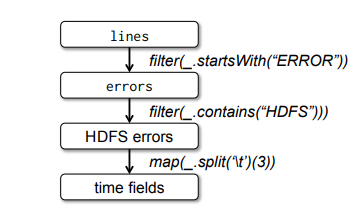
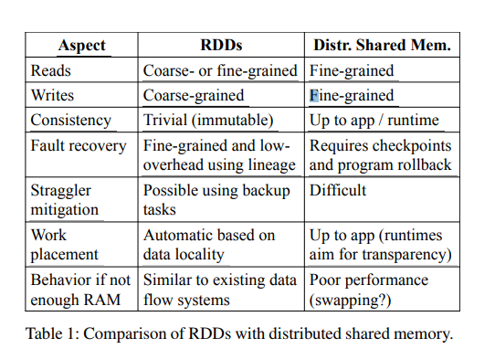

# Resilient Distributed Datasets: A Fault-Tolerant Abstraction for In-Memory Cluster Computing

Resilient Distributed Datasets: A Fault-Tolerant Abstraction for In-Memory Cluster Computing

弹性分布式数据集 ：基于内存集群计算容错性抽象

 

Abstract 

摘要

​          We present Resilient Distributed Datasets (RDDs), a distributed memory abstraction that lets programmers perform in-memory computations on large clusters in a fault-tolerant manner. 

本文提出了弹性分布式数据集（RDDs），是一种分布式内存抽象，允许通过一种容错方式，在大规模的集群上

执行基于内存的计算。

 

RDDs are motivated by two types of applications that current computing frameworks handle inefficiently: iterative algorithms and interactive data mining tools. 

当前的计算框架对迭代计算和交换式的数据挖掘工具的不高效处理驱动产生了弹性分布式数据集（RDDs）。

 

In both cases, keeping data in memory can improve performance by an order of magnitude.

在这两种情况下，将数据保存在内存中性能将会提高一个数量级。

 

To achieve fault tolerance efficiently, RDDs provide a restricted form of shared memory, based on coarsegrained transformations rather than fine-grained updates to shared state. 

为了实现高效的容错性，弹性分布式数据集（RDDs）提供了一种受限制的共享内存形式，基于对共享状态的粗颗粒的转变而不是细颗粒的更新。

 

However, we show that RDDs are expressive enough to capture a wide class of computations, including recent specialized programming models for iterative jobs, such as Pregel, and new applications that these models do not capture. 

尽管如此，弹性分布式数据集（RDDs）还是能够表示各种类型的计算，包括了最近专用迭代工作的编程模块，比如pregel ~~~

 

We have implemented RDDs in a system called Spark, which we evaluate through a variety of user applications and benchmarks.

我们 在一个叫spark的系统中实现了弹性分布式数据集（RDDs），我通过大量的用户应用程序和基准进行评估。

 

## 1 Introduction 

## 1 引言

Cluster computing frameworks like MapReduce [10] and Dryad [19] have been widely adopted for large-

scale data analytics. 

像基于MapReduce and Dryad 集群计算框架 已经被大规模的数据计算所采用的。

 

These systems let users write parallel computations using a set of high-level operators, without having to worry about work distribution and fault tolerance.

这些系统让使用者 使用 大量高级运算符 能够写出并行计算程序，不用担心任务分配和容错性。

 

 Although current frameworks provide numerous abstractions for accessing a cluster’s computational resources, they lack abstractions for leveraging distributed memory. 

尽管这些框架都提供了许多访问集群计算资源的抽象，他但们缺少对分布式内存利用的抽象。

 

This makes them inefficient for an important class of emerging applications: those that reuse intermediate results across multiple computations. 

这使得它们对于这一类重要的新兴应用变得效率很低下：这类应用在多元计算中重用中间结果 。

 

Data reuse is common in many iterative machine learning and graph algorithms, including PageRank, K-means clustering, and logistic regression. 

数据复用在很多的迭代的机器学习 ，图像算法，包括PageRank, K-means clustering 以及逻辑回归中很常见。

 

Another compelling use case is interactive data mining, where a user runs multiple adhoc queries on the same subset of the data. 

另一个引入注目的使用案例就是交换式的数据挖掘，用户在相同的数据子集中运行特殊的查询。

 

Unfortunately, in most current frameworks, the only way to reuse data between computations (e.g., between two MapReduce jobs) is to write it to an external stable storage system, e.g., a distributed file system.

不幸的是，在当前大多数的框架中，唯一的数据重用方式是在两次计算之间的数据（比如在两个MapReduce jobs之间）是将它写到外部稳定的存储系统之上，比如一个分布式文件系统 上。

 

 This incurs substantial overheads due to data replication, disk I/O, and serialization, which can dominate application execution times.

这将会导致大量的开销，归因于数据的复制，磁盘的I/O和序列化 ，也是这些主导程序执行时间。

 

Recognizing this problem, researchers have developed specialized frameworks for some applications that require data reuse. 

认识到了这个问题之后，研究人员已经研发了对于需要数据复用的应用的特殊框架。

 

For example, Pregel [22] is a system for iterative graph computations that keeps intermediate data in memory, while HaLoop [7] offers an iterative MapReduce interface. 

举例，Pregel 是一个迭代图像计算的系统，它将中间数据保存在内存中，而然HaLoop  提供了迭代的MapReduce接口。

 

However, these frameworks only support specific computation patterns (e.g., looping a series of MapReduce steps), and perform data sharing implicitly for these patterns. 

然而，这种框架只支持特殊的计算模式，（比如循环一系列的MapReduce步骤）和对于这些模式执行隐式的执行数据共享。

 

They do not provide abstractions for more general reuse, e.g., to let a user load several datasets into memory and run ad-hoc queries across them. 

它们没有提供对于更普遍的复用的抽象，比如让一个使用者加载一些数据集到内存中，然后对其执行特殊的查询。

 

In this paper, we propose a new abstraction called resilient distributed datasets (RDDs) that enables efficient data reuse in a broad range of applications. 

在本文中，我们提出一种称为弹性分布式数据集(RDDs)新的抽象概念，它能够使得在广泛的应用中进行高效的数据复用。

 

RDDs are fault-tolerant, parallel data structures that let users explicitly persist intermediate results in memory, control their partitioning to optimize data placement , and manipulate them using a rich set of operators. 

弹性分布式数据集(RDDs)具有容错性，并行的数据结构 ，这使得用户们能够明确地将中间结果存储在内存中，控制它们的分区来最优化数据的放置，使用丰富的运算符来操作它们。

 

The main challenge in designing RDDs is defining a programming interface that can provide fault tolerance efficiently.

在设计 弹性分布式数据集(RDDs)的主要挑战是定义一个可以提供高效容错性的编程接口。

 

 Existing abstractions for in-memory storage on clusters, such as distributed shared memory [24], keyvalue stores [25], databases, and Piccolo [27], offer an interface based on fine-grained updates to mutable state (e.g., cells in a table).

集群内存现有抽象，比如分布式共享内存，键值存储，数据库，Piccolo，提供了一个基于对可变状态进行细颗粒的更新的接口。

 

 With this interface, the only ways to provide fault tolerance are to replicate the data across machines or to log updates across machines. 

使用此接口，提供容错性的唯一方式是跨机器复制数据，或者记录跨机器数据更新。

 

Both approaches are expensive for data-intensive workloads, as they require copying large amounts of data over the cluster network, whose bandwidth is far lower than that of RAM, and they incur substantial storage overhead.

两种方式对于数据密集型的负载来说是代价高昂的，因为它们需要通过集群网络拷贝大量数据，集群网络的带宽远远比内存小的多，它们导致了大量的存储开销。

 

 In contrast to these systems, RDDs provide an interface based on coarse-grained transformations (e.g., map, filter and join) that apply the same operation to many data items.

与这些系统相反的是，弹性分布式数据集(RDDs)提供了一种基于粗粒度变换（比如映射, 过滤 和 连接）的接口，其将相同的操作应用于许多数据项。

 

 This allows them to efficiently provide fault tolerance by logging the transformations used to build a dataset (its lineage) rather than the actual data.

 

这允许它们通过记录用于构建数据集（它的血统）的转换而不是实际数据来高效地提供容错性。

 

1 If a partition of an RDD is lost, the RDD has enough information about how it was derived from other RDDs to recompute just that partition. 

1 如果一个 RDD弹性分布式数据集的一个分区丢失了，弹性分布式数据集 RDD 有着足够的信息说明它是如何从其他的

 RDDS中派生出来的，所以只要重新计算这个分区就可以了。

 

Thus, lost data can be recovered, often quite quickly, without requiring costly replication. 

因此，数据丢失能够恢复，通常是非常快的，不需要代价高昂的复制。

 

Although an interface based on coarse-grained transformations may at first seem limited, RDDs are a good fit for many parallel applications, because these applications naturally apply the same operation to multiple data items.

尽管基于粗粒度转换的接口第一眼看起来似乎很受限制， RDD弹性分布式数据集很适合于许多并行的应用，因为这些应用程序自然地将相同的操作运用于多个数据项。

 

 Indeed, we show that RDDs can efficiently express many cluster programming models that have so far been proposed as separate systems, including MapReduce, DryadLINQ, SQL, Pregel and HaLoop, as well as new applications that these systems do not capture, like interactive data mining. 

事实上，我们证明了RDDs 能够有效的表示到目前为止已经被提出作为一个独立系统，包括MapReduce, DryadLINQ, SQL, Pregel and HaLoop，也包括了这些系统没能捕获的应用程序，比如交互性数据挖掘。

 

The ability of RDDs to accommodate computing needs that were previously met only by introducing new frameworks is, we believe, the most credible evidence of the power of the RDD abstraction. 

RDDs能够满足之前我们只能通过引入新的计算框架才能解决的计算需求，我们相信，这是RDD抽象能力最可信的证明。

 

We have implemented RDDs in a system called Spark, which is being used for research and production applications at UC Berkeley and several companies. 

我们在一个叫做 Spark的系统中实现了RDDs，其已经正在加州大学伯克利分校和许多公司被应用于研究和产品应用程序中。

 

Spark provides a convenient language-integrated programming interface similar to DryadLINQ [31] in the Scala programming language [2].

Spark 提供了一个方便的语言集成的编程接口，类似于 在Scala编程语言中的DryadLINQ 。

 

 In addition, Spark can be used interactively to query big datasets from the Scala interpreter. 

另外， Spark还能交换式地用来在Scala 解释器中 查询大规模数据集。

 

We believe that Spark is the first system that allows a general-purpose programming language to be used at interactive speeds for in-memory data mining on clusters.

我们认为Spark是第一个允许通用编程语言，以交互速度在集群的内存中进行数据挖局的系统。

 

 We evaluate RDDs and Spark through both microbenchmarks and measurements of user applications.

我们通过为用户应用程序的微基准和测量评估了RDDs和Spark。 

 

 We show that Spark is up to 20× faster than Hadoop for iterative applications, speeds up a real-world data analytics report by 40×, and can be used interactively to scan a 1 TB dataset with 5–7s latency.

我们证明对于迭代应用Spark比Hadoop 快了20多倍，加速一个真实世界的数据分析报告达到40多倍，可以被用来交换式的扫描1 TB数据集有 5–7s 延迟。

 

 More fundamentally, to illustrate the generality of RDDs, we have implemented the Pregel and HaLoop programming models on top of Spark, including the placement optimizations they employ, as relatively small libraries (200 lines of code each).

更根本的是，为了说明 RDDs的通用性，我们在Spark基础上实现了Pregel and HaLoop 编程模型，包括了它们所使用的布局优化，作为相对较小的库（每个库大概200行代码）。

 

 This paper begins with an overview of RDDs (§2) and Spark (§3).

这篇文章开篇概述了RDDs (§2) 和 Spark(§3)。

 

 We then discuss the internal representation of RDDs (§4), our implementation (§5), and experimental results (§6).

我们然后讨论了 RDDs 的内部表示法，我们的实现，以及实验结果。

 Finally, we discuss how RDDs capture several existing cluster programming models (§7), survey related work (§8), and conclude. 

最后，我们讨论 RDDs 是如何实现捕获了现有的集群编程模型，关于调查先关的工作，以及总结。

 

## 2 Resilient Distributed Datasets (RDDs)

**2** **弹性分布式数据集**

 This section provides an overview of RDDs.

这部分提供了RDDs.的预览。

 

 We first define RDDs (§2.1) and introduce their programming interface in Spark (§2.2). 

我们首先定义了RDDs 和介绍了Spark中的编程接口。

We then compare RDDs with finer-grained shared memory abstractions (§2.3). Finally, we discuss limitations of the RDD model (§2.4).

我将RDDs与 细粒度的共享内存抽象进行了对比。最后，讨论了RDDs模型的局限性。

**2.1 RDD Abstraction**

 Formally, an RDD is a read-only, partitioned collection of records. 

正式来说，一个弹性分布式数据集RDD 是一个只读，分区的记录集合。

RDDs can only be created through deterministic operations on either (1) data in stable storage or (2) other RDDs. 

RDDs 只能通过对稳定存储中或者是其它RDDs中的确定性操作来创建。 

We call these operations transformations to differentiate them from other operations on RDDs. 

我们将这些操作称为转换，用来区分其它在RDDs 上的运算。

Examples of transformations include map, filter, and join.  RDDs do not need to be materialized at all times.

“转换”的例子包括了映射，筛选，连接。RDDs不需要一直具体化。

 Instead, an RDD has enough information about how it was derived from other datasets (its lineage) to compute its partitions from data in stable storage. 

相反，一个RDD有足够的信息关于它是如何从其它数据集派生的（它的血统），从稳定的存储数据中计算自己的分区。

This is a powerful property: in essence, a program cannot reference an RDD that it cannot reconstruct after a failure.

这是一个强大的属性，本质上，程序无法引用一个失败之后无法重新创建的RDD。

 Finally, users ca control two other aspects of RDDs: persistence and partitioning. 

最后，使用者可以控制RDDs的两个方面： 持久化和划分。

Users can indicate which RDDs they will reuse and choose a storage strategy for them (e.g., in-memory storage). 

用户们可以指出哪些RDDs 他们想要重用 和为它们选择一个存储策略（比如基于内存存储）。

They can also ask that an RDD's elements be partitioned across machines based on a key in each record.

他们（使用者）可以要求根据每个记录中键值将 RDD的元素划分到不同的机器上。

 This is useful for placement optimizations, such as ensuring that two datasets that will be joined together are hash-partitioned in the same way. 

这对于布局优化，例如确定两个将会连接在一起的数据集会通过相同的方式被哈希划分。

**2.2 Spark Programming Interface**

**2.2** **Spark**  **编程接口**

 RDDs

 Spark exposes RDDs through a language-integrated API similar to DryadLINQ [31] and FlumeJava [8], where each dataset is represented as an object and transformations are invoked using methods on these objects.

 Spark通过一个语言集成API 类似DryadLINQ [31] 和 FlumeJava 公开RDDs ，其中每个数据集都表示为一个对象，这些对象的方法调用转换对象。

Programmers start by defining one or more RDDs through transformations on data in stable storage (e.g., map and filter). 

程序员通过将“转换”稳定的存储数据定义一个或者多个 RDDs（比如映射，过滤）。

They can then use these RDDs in actions, which are operations that return a value to the application or export data to a storage system. 

他们（使用者）可以在操作中使用这些 RDDs，这些操作是向应用程序返回值或者导出数据到存储系统中。

Examples of actions include count (which returns the number of elements in the dataset), collect (which returns the elements themselves), and save (which outputs the dataset to a storage system). 

操作的例子包括了统计（统计元素的个数），收集（返回元素其本身），保存（输出数据集到一个存货系统）

Like DryadLINQ, Spark computes RDDs lazily the first time they are used in an action, so that it can pipeline transformations.

像 DryadLINQ, Spark第一次操作RDDs 时，会采用惰性计算，这样就可以使用管道进行转换处理。

 In addition, programmers can call a persist method to indicate which RDDs they want to reuse in future operations.

此外，编程人员可以调用持久化方法明确指出那一个RDDs他们想要在将来操作中重用。 

Spark keeps persistent RDDs in memory by default, but it can spill them to disk if there is not enough RAM. 

Spark 默认情况下将RDDs 默认地存储在磁盘中，但是如果没有足够的内存它也可能溢出到磁盘上。

Users can also request other persistence strategies, such as storing the RDD only on disk or replicating it across machines, through flags to persist.

使用者也可以设置他们的持久化策略，比如存储RDD到磁盘或者跨机器复制RDD，通过标志持久化。

 Finally, users can set a persistence priority on each RDD to specify which in-memory data should spill to disk first. 

最后，使用者在每个RDD上设置持久化优先级，来指定内存中的哪些数据会先溢出到磁盘中。

 

**2.2.1 Example: Console Log Mining**

**2.2.1** **案例****:** **控制台日志挖掘**

 

 Suppose that a web service is experiencing errors and an operator wants to search terabytes of logs in the Hadoop filesystem (HDFS) to find the cause. 

假设一个web服务发生错误，并且操作员希望在Hadoop文件系统中搜索千兆级别的日志以找出原因。

Using Spark, the operator can load just the error messages from the logs into RAM  and query them interactively. She would first type the following Scala code:

使用Spark，操作员可以跨越一组节点将日志中的错误信息加载到内存中，然后交互式的对它们进行查询。她首先应该输入下列的Scala 代码：

 

##  

Figure 1: Lineage graph for the third query in our example. Boxes represent RDDs and arrows represent transformations. 

图1：我们例子中三次查询的系谱图。盒子代表了 RDDs 以及 箭头代表“转换”。

 

lines = spark.textFile("hdfs://...") 

errors = lines.filter(_.startsWith("ERROR"))

errors.persist() 

 Line 1 defines an RDD backed by an HDFS file (as a collection of lines of text), while line 2 derives a filtered RDD from it.

第一行定义了一个建立在一个HDFS文件（作为一个文本文件行集合）之上的RDD，而第二行从中派生出一个经过过滤的RDD。

Line 3 then asks for errors to persist in memory so that it can be shared across queries. 

第三行然后要求持久化在内存中持久化，这样以便于在查询之间共享它。

Note that the argument to filter is Scala syntax for a closure. At this point, no work has been performed on the cluster. However, the user can now use the RDD in actions, e.g., to count the number of messages: 

请注意，筛选器的参数是闭包的Scala语法。此时，还没有任务在集群上执行。然而，使用者可以现在在操作中使用RDD，比如统计消息的数目。

errors.count() 

The user can also perform further transformations on the RDD and use their results, as in the following lines:

使用者可以在这些RDD的基础和它们的结果上进行进一步的转换，就像下面的数行一样：

// Count errors mentioning MySQL: 

//查询在错误信息中提及MySQL行数。

errors.filter(_.contains("MySQL")).count() 

// Return the time fields of errors mentioning

//返回

 // HDFS as an array (assuming time is field 、

//作为一个数组假设时间作为一个字段

// number 3 in a tab-separated format): 

//制表符分隔格式

errors.filter(_.contains("HDFS")) 

.map(_.split(’\t’)(3)) 

.collect()

 

After the first action involving errors runs, Spark will store the partitions of errors in memory, greatly speeding up subsequent computations on it. 

在第一次调用errors以后， Spark将会把错误的部分存储在内存中，从而大大加快了对它的随后的计算。

Note that the base RDD, lines, is not loaded into RAM. 

请注意，最基础的RDD（ lines ）没有加载进入内存中。

This is desirable because the error messages might only be a small fraction of the data (small enough to fit into memory). 

这是最理想的，因为错误信息可能只是数据其中的一小部分（足够的小能够合适装入内存中）。

 

Finally, to illustrate how our model achieves fault tolerance, we show the lineage graph for the RDDs in our third query in Figure 1.

最后，为了证明我们的模型实现了容错性，我们我们展示了关于我们在图一中第三次查询的RDDs的谱系图。

 In this query, we started with errors, the result of a filter on lines, and applied a further filter and map before running a collect. 

在这个查询中，我们从错误(筛选器的行上结果)开始，并在运行Collect之前应用了进一步的筛选器和映射。

The Spark scheduler will pipeline the latter two transformations and send a set of tasks to compute them to the nodes holding the cached partitions of errors. 

Spark调度程序通过管道连接两个转换 流水线处理，并发送一组任务到缓存 errors错误分区节点来计算机它们。

In addition, if a partition of errors is lost, Spark rebuilds it by applying a filter on only the corresponding partition of lines. 

此外，如果errors的分区（部分）丢失了， Spark通过仅在相应的lines分区上应用筛选器来从新构建errors分区。



表1 RDDs和分布式共享内存的差异 

**2.3 Advantages of the RDD Model**

**2.3 RDD****弹性分布式数据集模型的优势**

To understand the benefits of RDDs as a distributed memory abstraction, we compare them against distributed shared memory (DSM) in Table 1.

为了理解RDDs作为分布式内存的抽象，我们在表1中比较了 将它与分布式共享内存DSM进行了比较。

 In DSM systems, applications read and write to arbitrary locations in a global address space. 

在分布式共享内存的系统中，应用程序对全局地址空间的任意位置读写。


Note that under this definition, we include not only traditional shared memory systems [24], but also other systems where applications make fine-grained writes to shared state, including Piccolo [27], which provides a shared DHT, and distributed databases.

请注意，根据这个定义，我们不仅包括传统的共享内存系统，也包括了应用程序会对共享内存状态进行细粒度读写的其它系统，包括了提供了共享的PHT的Piccolo，分布式数据库。

 DSM is a very general abstraction, but this generality makes it harder to implement in an efficient and faulttolerant manner on commodity clusters. 

DSM 是一个非常通用的抽象，但是它的通用性使得它难以在商品集群中以有效和容错的方式实现。

The main difference between RDDs and DSM is that RDDs can only be created (“written”) through coarse-grained transformations, while DSM allows reads and writes to each memory location.

RDDs and DSM 的主要区别是 RDDs 只能通过粗粒度转换来创建，而 DSM允许通过读写任意的位置。

3 This restricts RDDs to applications that perform bulk writes, but allows for more efficient fault tolerance.

这将RDDs限制为执行批量导入的应用程序，但是允许更有效的容错性。

 In particular, RDDs do not need to incur the overhead of checkpointing, as they can be recovered using lineage.

特别是， RDDs不必增加检查点的开销，他们可以通过谱系图恢复。

4 Furthermore, only the lost partitions of an RDD need to be recomputed upon failure, and they can be recomputed in parallel on different nodes, without having to roll back the whole program. 

此外，只有RDD 丢失的分区在失败时重新计算，它们能再不同的节点中并行计算，不需要回滚整个程序。

A second benefit of RDDs is that their immutable nature lets a system mitigate slow nodes (stragglers) by running backup copies of slow tasks as in MapReduce [10]. 

RDDs的第二个优势就是 不可变的特性使系统通过运行慢速任务的拷贝副本减轻慢速节点的影响，就像在MapReduce中说做的那样。

Backup tasks would be hard to implement with DSM, as the two copies of a task would access the same memory locations and interfere with each other's updates.

备份任务是很难在DSM 中实现的，因为两个备份任务会访问相同的内存位置彼此干扰对方的更新操作。

Finally, RDDs provide two other benefits over DSM. 

最后，RDDs提供了比DSM.更多的两个优点。

First, in bulk operations on RDDs, a runtime can schedule tasks based on data locality to improve performance. 

首先，在RDDs上的批量操作运算中，运行时可以根据数据的局部性调整调度任务来提高性能。

Second, RDDs degrade gracefully when there is not enough memory to store them, as long as they are only being used in scan-based operations. Partitions that do not fit in RAM can be stored on disk and will provide similar performance to current data-parallel systems.

其次，如果没有足够的内存来存储它们，RDDs会缓慢的降级，只要它们只使用基于扫描的操作。不适合存储在内存中的分区可以存储到磁盘，也能提供与并行数据系统相似的性能。

**2.4 Applications Not Suitable for RDDs**

As discussed in the Introduction, RDDs are best suited for batch applications that apply the same operation to all elements of a dataset.

正如在引言中所讨论的那样， RDDs 很适合  对数据集中的所有元素应用相同的操作的批处理应用。

 In these cases, RDDs can efficiently remember each transformation as one step in a lineage graph and can recover lost partitions without having to log large amounts of data.

在这些情况下，RDDs能够将每次转换作为一部记录到谱系图中，并且能够不用通记录大量的数据就能恢复丢失的部分（分区）。

 RDDs would be less suitable for applications that make asynchronous fine-grained updates to shared state, such as a storage system for a web application or an incremental web crawler. 

 RDDs不适合哪些需要异步对共享状态进行细粒度更细的应用，比如web应用程序的存储系统或者是增量式的爬虫应用。


For these applications, it is more efficient to use systems that perform traditional update logging and data checkpointing, such as databases, RAMCloud [25], Percolator [26] and Piccolo [27]. 

对于这些应用，使用传统的更细记录和数据检查点应用，比如数据库应用，RAMCloud [25], Percolator [26] and Piccolo [27]，会更加有效。

Our gOal is to provide an efficient programming model for batch analytics and leave these asynchronous applications to specialized systems. 

我们的目标是为批量数据分析提供高效的额编程模型，将这些异步应用程序留个特殊系统。

## 3 Spark Programming Interface

**3 Spark** **编程接口**

Spark provides the RDD abstraction through a language-integrated API similar to DryadLINQ [31] in Scala [2], a statically typed functional programming language for the Java VM. 

Spark 通过 一种编程语言集成式的API提供了 RDD，类似于 Scala中的DryadLINQ ，一种用于

Java VM上的静态类型化的函数式编程语言。

We chose Scala due to its combination of conciseness (which is convenient for interactive use) and efficiency (due to static typing). 

我们选择Scala归因于它的简洁（对于交换式使用很方便）和高效（归因于静态类型）。

However, nothing about the RDD abstraction requires a functional language.

然后，RDD的抽象不需要函数式编程。

 To use Spark, developers write a driver program that connects to a cluster of workers, as shown in Figure 2.

为了使用Spark，开发者写一个连接集群上所有工作点的集群信息驱动程序。

 The driver defines one or more RDDs and invokes actions on them. 

驱动定义一个或者是多个RDDs，然后在它们上面调用方法。

Spark code on the driver also tracks the RDDs’lineage. 

在Spark驱动上的代码可以追踪 RDDs的血统。

The workers are long-lived processes that can store RDD partitions in RAM across operations.

这些工作程序（xxx）是长时间存在的进程，它们在操作中能够将RDD 分区分区存储在RAM中。

 As we showed in the log mining example in Section 2.2.1, users provide arguments to RDD operations like map by passing closures (function literals). 

正如我们在2.2.1节中日志挖局案例一样，用户给RDD 操作提供参数，比如通过提供闭包（函数）的映射操作。

Scala represents each closure as a Java object, and these objects can be serialized and loaded on another node to pass the closure across the network.

Scala将每个函数闭包表示为 Java对象，这些对象可以被序列化 和 加载到其它节点 来通过网络传递闭包。

Scala also saves any variables bound in the closure as fields in the Java object.

Scala还能将绑定在闭包中的任何变量存储为Java对象。

 For example, one can write code like 

var x = 5; rdd.map(_ + x)

 to add 5 to each element of an RDD. 

5 RDDs themselves are statically typed objects parametrized by an element type. 

RDDs 其本身 是通过元素参数化的静态类型对象

For example, RDD[Int] is an RDD of integers.

距离来说，RDD[Int] 是一个整型的RDD。

 However, most of our examples omit types since Scala supports type inference.

然后，大多数我们的例子省略了类型，因为 Scala 支持类型推断。

 Although our method of exposing RDDs in Scala is conceptually simple, we had to work around issues with Scala’s closure objects using reflection [33].

虽然我们在Scala中公开RDD的方法在概念上很简单，但我们必须使用反射[33]来解决Scala闭包对象的问题。

 We also needed more work to make Spark usable from the Scala interpreter, as we shall discuss in Section 5.2. Nonetheless, we did not have to modify the Scala compiler. 

我们也需要做更多的工作，才能从Scala的解释器中使用Spark.正如我们在5.2节中所讨论的那样。尽管如此，我们并不需要修改编译器。

**3.1 RDD Operations in Spark**

**3.1** **在****Spark****中的****RDD** **操作**

![Transformations  Actions  map(f : T U)  filter(f : T Bool)  flatMap(f : T Seq[U])  sample (fraction : Float)  groupByKey()  reduceByKey(f : (V , V) V)  union()  join()  cogroup()  crossProduct()  map Values(f : V W)  sort(c : Comparator[K])  partitionBy(p : Partitioner[K])  count()  collect()  reduce(f : (T, T) T)  lookup(k : K)  save(path : String)  RDD[T] RDD[U]  RDD[T] RDD[T]  RDD[T] RDD[U]  RDD[T] RDD[T] (Deterministic sampling)  V)] Seq[V])]  RDD[T]  (Seq[V], Seq[W]))]  V)] W)] (Preserves partitioning)  RDD[T] Long  RDD[T] seq[T]  RDD[T] T  RDD[(K, V)] Seq[V] (On hash/range partitioned RDDs)  Outputs RDD to a storage system, e.g., HDFS ](file:///C:/Users/SIDEWI~1/AppData/Local/Temp/msohtmlclip1/01/clip_image003.png)

Table 2: Transformations and actions available on RDDs in Spark. Seq[T] denotes a sequence of elements of type T.

Table 2 lists the main RDD transformations and actions available in Spark. 

表格2 中列出了 在Spark中主要几种 RDD转换和操作。

We give the signature of each operation, showing type parameters in square brackets. 

我们给了每个操作署名，在方括号中显示类型参数。

Recall that transformations are lazy operations that define a new RDD, while actions launch a computation to return a value to the program or write data to external storage. 

回想一下，转换是定义一个新的RDD的惰性操作，而 操作启动一个计算机以向程序返回一个值或者将数据写到外部存储器中 

Note that some operations, such as join, are only available on RDDs of key-value pairs. 

请注意，一些操作，例如连接，它们对于一些键值的RDDs是可行的。

 

Also, our function names are chosen to match other APIs in Scala and other functional languages; 

同样，我们的函数名称被选择用来匹配 Scala中的其它API 和其它函数式编程语言。

 

for example, map is a one-to-one mapping, while flatMap maps each input value to one or more outputs (similar to the map in MapReduce). 

例如，映射map是一对一的映射，然而flatMap 将每个输出值到一个或者多个输出（类似于 MapReduce中的map）。

 

In addition to these operators, users can ask for an RDD to persist.

除了这些操作以外，用户可以要求 RDD进行初始化。

 

 Furthermore, users can get an RDD’s partition order, which is represented by a Partitioner class, and partition another dataset according to it. 

此外，用户可以获得 RDD的分区顺序，这个分区顺序有一个Partitioner类表示，并且根据它对其它数据集进行分区（划分）。

 

Operations such as groupByKey, reduceByKey and sort automatically result in a hash or range partitioned RDD. 

操作例如groupByKey, reduceByKey and sort 自动生成散列或者是范围分区的RDD。 

 

**3.2 Example Applications**

**3.2** **例子应用程序**

 

We complement the data mining example in Section 2.2.1 with two iterative applications: logistic regression and PageRank. 

我们用两个迭代应用：logistic回归和PageRank 补充了2.2.1节中数据挖掘的实例。

The latter also showcases how control of RDDs’ partitioning can improve performance.

后面两个如何控制分区可以提高性能。

**3.2.1 Logistic Regression**

**3.2.1 Logistic** **回归**

Many machine learning algorithms are iterative in nature because they run iterative optimization procedures, such as gradient descent, to maximize a function. 

很多机器学习本质是迭代的，因为它们运行迭代优化过程，比如梯度下降，最大化函数。

 

They can thus run much faster by keeping their data in memory. 

通过将数据存储在内存中，它们能够运行的更快。

 

As an example, the following program implements logistic regression [14], a common classification algorithm that searches for a hyperplane w that best separates two sets of points (e.g., spam and non-spam emails). 

例如，一下程序实现了logistic回归，一个常见的分离算法，为了搜索两组点的最佳分离超平面w。

 

The algorithm uses gradient descent: it starts w at a random value, and on each iteration, it sums a function of w over the data to move w in a direction that improves it. 

算法使用了梯度下降算法，用一个随机数初始化w，并且在迭代过程中，它将w的函数和数据相加，沿着改善w的方向移动w。

```scala
val points = spark.textFile(...)

 .map(parsePoint).persist()

 var w = // random initial vector 

for (i <- 1 to ITERATIONS) {

 val gradient = points.map{ p =>

 p.x * (1/(1+exp(-p.y*(wp.x)))-1)*p.y 

}.reduce((a,b) => a+b) 

w -= gradient

 } 
```

We start by defining a persistent RDD called points as the result of a map transformation on a text file that parses each line of text into a Point object. 

我们通过定义一个名为points的RDD持久化节点，作为文本文件的转换结果。将每行转换为一个Point对象。

 We then repeatedly run map and reduce on points to compute the gradient at each step by summing a function of the current w. 

我们然后反复地在这些点运行map和reduce，通过将在当前的w上增加一个函数来计算每一步的梯度。

 Keeping points in memory across iterations can yield a 20× speedup, as we show in Section

6.1.

通过迭代保持点在内存中可以产出20多倍 的速度，正向我们在6.1中看到的那样。

**3.2.2 PageRank**

**3.2.2 PageRank**

 A more complex pattern of data sharing occurs in PageRank [6]. 

一个更加复杂的数据共享模式发生在PageRank.

 The algorithm iteratively updates a rank for each document by adding up contributions from documents that link to it.

这算法将连接到该文档的贡献相加来迭代更细每个文档的等级。

  On each iteration, each document sends a contribution of r/n to its neighbors, where r is its rank and n is its number of neighbors. 

对于每次迭代，每个文档发送 r/n的贡献给它的邻居，其中r是本身的等级，n是它邻居的个数。

 It then updates its rank to α/N + (1 − α)∑ci , where the sum is over the contributions it received and N is the total number of documents. 

它然后会更新它自己的等级到α/N + (1 − α)∑ci，求和是它所接受到的贡献的和，其中N是文档的数目。

 We can write PageRank in Spark as follows: 

注释【2】

Although individual RDDs are immutable, it is possible to implement mutable state by having multiple RDDs to represent multiple versions of a dataset. We made RDDs immutable to make it easier to describe lineage graphs, but it would have been equivalent to have our abstraction be versioned datasets and track versions in lineage graphs.

注释【3】

3Note that reads on RDDs can still be fine-grained. For example, an application can treat an RDD as a large read-only lookup table. 

注释【4】

4 In some applications, it can still help to checkpoint RDDs with long lineage chains, as we discuss in Section 5.4. However, this can be done in the background because RDDs are immutable, and there is no need to take a snapshot of the whole application as in DSM.

 

 