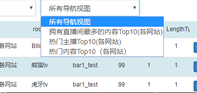
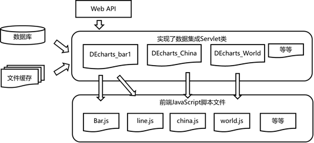
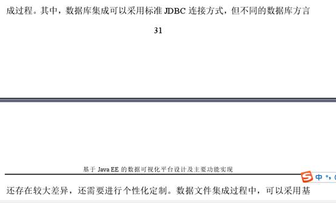

# 毕业设计

## 问题

问题1 : 这个程序好像只能在myeclipse自带的Tomcat下运行，没法自己下载的tomcat8,7下运行。

问题2 这个legend 这边写死了会很奇怪，就是假设只有一种数据，我想让它的每根柱子颜色不一样，就很难实现。

问题3：比如插入一级视图（直播网站分析-热门主播），然后再插入导航视图（直播网站分析+熊猫TV分析）这边因为导航视图之前没有，就得自己去填写

## 弹幕表

```SQL
CREATE TABLE `douyudanmu_3` (
   `cid` varchar(50) CHARACTER SET utf8 NOT NULL,
    `uid` int(11) NOT NULL,
   `nn` varchar(50) DEFAULT NULL,
   `txt` varchar(200) DEFAULT NULL,
   `level` int(11) DEFAULT NULL,
   `nl` int(11) DEFAULT NULL,
  `bnn` varchar(45) CHARACTER SET utf8 DEFAULT NULL,
   `bl` int(11) DEFAULT NULL,
  `ct` int(11) DEFAULT NULL,
  `cst` datetime DEFAULT NULL,
  `txt_divide` varchar(200) DEFAULT NULL,
  PRIMARY KEY (`cid`)
) ENGINE=InnoDB DEFAULT CHARSET=utf8mb4;
```

 1.热门直播内容（综合）

```SQL
use internet_data;
SELECT cname,sum(person_num) as '观看人数'  
FROM zhibojian
group by cname
having sum(person_num)>100000
order by sum(person_num) desc
```

2热门的主播（综合）：》综合》10万才算

```SQL
select concat(left(id,2),':',nickName) as '主播',person_num as '人数'
from zhibojian 
where person_num>100000
order by person_num desc
```

3. BIliBili热门直播内容

```SQL
SELECT cname,sum(person_num) as '观看人数'  
FROM zhibojian
where id  like 'BZ%'
group by cname
having sum(person_num)>10000
order by sum(person_num) desc
```

 4.熊猫tv人们直播内容

```sql
SELECT cname,sum(person_num) as '观看人数'  
FROM zhibojian
where id  like 'XM%'
group by cname
having sum(person_num)>10000
order by sum(person_num) desc
```

5. 热门的主播（各网站）：》1万人就算热门

```SQL
use internet_data;
select concat(left(id,2),':',nickName) as '主播',person_num as '人数'
from zhibojian
where person_num>10000 and id like 'BZ%'
order by person_num desc
```

 6.直播人数最多的内容Top15

```sql
select cname ,count(*) as room_num
from zhibojian
group by cname
order by count(*) desc
limit 15
```

7.BiliBili中直播人数最多的内容Top15

```sql
select cname ,count(*) as room_num
from zhibojian
where id like 'BZ%'
group by cname
order by count(*) desc
limit 15
```

8某时间点，几个直播网站人数对比

```sql
use internet_data;
select left(id,2) as '平台', sum(person_num) as '人数'
from zhibojian
group by  left(id,2)

```

 9 弹幕数量随时间的变化

```sql
select DATE_FORMAT(cst,'%H:%i') as '时间', count(*)  as '弹幕数量' 
from douyudanmu_1
group by DATE_FORMAT(cst,'%H:%i')

```

 10.弹幕来自的终端类型

```sql
use internet_data;
select concat('终端类型',ct) as '终端类型',count(*) as '弹幕数量'
from douyudanmu_1
group by ct  

```

 11.直播间用户的徽章分析

```sql
select  case when bnn = '' then '其他' else bnn end as '徽章',count(distinct(uid)) as '数量' 
from douyudanmu_1
group by bnn
order by count(distinct(uid))  desc

```

 12 直播间关键词词云

```sql
select txt_divide
from douyudanmu_1

```

 13 某直播网站人数最多几款内容

```sql
use internet_data;
SELECT cname,sum(person_num) as '观看人数'  
FROM zhibojian
where id like 'BZ%'
group by cname
order by sum(person_num) desc
limit 10

```

 直播内容

```sql
use internet_data;
select concat(left(id,2),':',nickName) as '主播',person_num as '人数'
from zhibojian
where id like 'HY%'
order by person_num desc
limit 10

```

```xml
<element flag="201851919391" title="斗鱼绝地求生房间API分析" subtitle="斗鱼绝地求生房间API分析"> 

    <legend>人气</legend>  

 	<api value="http://open.douyucdn.cn/api/RoomApi/live/jdqs"/>  

 	<explain>斗鱼绝地求生房间API分析</explain>

</element>  

```


 


## RESTful API的是实现

Tab资源的

 Get /V1.0/tabs  ? offset= ? page =? 

Offset 默认为0， page 默认我5

Post /V1.0/tabs/___ (没有主键很烦)

## 状态码&错误码

| 状态码 | 含义                  | 说明                                 |
| ------ | --------------------- | ------------------------------------ |
| 200    | OK                    | 请求成功                             |
| 201    | CREATED               | 创建成功                             |
| 202    | ACCEPTED              | 更新成功                             |
| 400    | BAD REQUEST           | 请求的地址不存在或者包含不支持的参数 |
| 401    | UNAUTHORIZED          | 未授权                               |
| 403    | FORBIDDEN             | 被禁止访问                           |
| 404    | NOT FOUND             | 请求的资源不存在                     |
| 500    | INTERNAL SERVER ERROR | 内部错误                             |


| 错误码 | 错误信息           | 含义                                               | status code |
| ------ | ------------------ | -------------------------------------------------- | ----------- |
| 999    | unknow_error       | 未知错误                                           | 400         |
| 1000   | need_permission    | 需要权限                                           | 403         |
| 1001   | uri_not_found      | 资源不存在                                         | 404         |
| 1002   | Parameter_error    | 参数错误                                           | 400         |
| 1003   | Resource_exit      | 资源以及存在                                       | 409         |
| 1004   | has_ban_word       | 输入有违禁词                                       | 400         |
| 1005   | input_too_short    | 输入为空，或者输入字数不够                         | 400         |
| 1006   | target_not_fount   | 相关的对象不存在，比如回复帖子时，发现小组被删掉了 | 400         |
| 1007   | need_captcha       | 需要验证码，验证码有误                             | 403         |
| 1008   | image_unknow       | 不支持的图片格式                                   | 400         |
| 1009   | image_wrong_format | 照片格式有误(仅支持JPG,JPEG,GIF,PNG或BMP)          | 400         |
| 1010   | image_wrong_ck     | 访问私有图片ck验证错误                             | 403         |
| 1011   | image_ck_expired   | 访问私有图片ck过期                                 | 403         |
| 1012   | title_missing      | 题目为空                                           | 400         |
| 1013   | desc_missing       | 描述为空                                           | 400         |
|        |                    |                                                    |             |

```java
public int read(byte b[], int off, int len) throws IOException {
    if (b == null) {
        throw new NullPointerException();
    } else if (off < 0 || len < 0 || len > b.length - off) {
        throw new IndexOutOfBoundsException();
    } else if (len == 0) {
        return 0;
 }
public synchronized int read(byte b[], int off, int len)
 throws IOException  {
  	getBufIfOpen(); // Check for closed stream
 	if ( (off | len | (off + len) | (b.length - (off + len) ) ) < 0 ) {
	 throw new IndexOutOfBoundsException();
   	} else if (len == 0) {
         return 0;
    }
}

```




