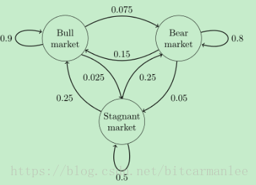

# 马尔科夫链
## 1.什么是马尔可夫链
马尔可夫链(Markov chain)又称离散时间马尔可夫链（discrete-time Markov chain），因俄国数学家安德烈·马尔可夫（俄语：Андрей Андреевич Марков）得名，为状态空间中经过从一个状态到另一个状态的转换的随机过程。

## 2.一个经典的马尔科夫链实例

>这个马尔科夫链是表示股市模型的，共有三种状态：牛市（Bull market）, 熊市（Bear market）和横盘（Stagnant market）。每一个状态都以一定的概率转化到下一个状态。比如，牛市以0.025的概率转化到横盘的状态。这个状态概率转化图可以以矩阵的形式表示。如果我们定义矩阵阵P某一位置P(i, j)的值为P(j|i)，即从状态i变为状态j的概率。另外定义牛市、熊市、横盘的状态分别为0、1、2，这样我们得到了马尔科夫链模型的状态转移矩阵为：
